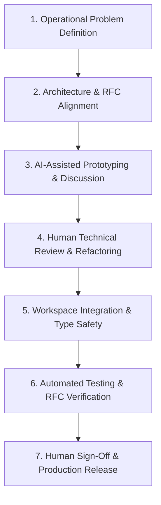

# Development Philosophy

## TL;DR

This document describes how NOGGlass is engineered, how Artificial Intelligence is used during development, and where human responsibility remains. Engineering decisions are made exclusively by human engineers—Marcelo Gondim and André Dias. AI serves as a productivity amplifier, not a decision-maker.

---

# About the Authors

NOGGlass is co-authored and maintained by **Marcelo Gondim** and **André Dias**.

Marcelo Gondim brings more than 30 years of professional experience in Internet infrastructure, Linux systems, routing protocols (BGP, OSPF), telecommunications, and production network operations for Internet Service Providers (ISPs). André Dias brings extensive software engineering experience in modern systems programming, cloud architecture, and secure software development lifecycles.

NOGGlass was born out of real-world operational challenges encountered when managing Autonomous Systems (ASNs), edge routers, and BGP routing tables in production environments. We build practical, production-hardened software that solves real networking problems without unnecessary operational overhead.

---

# Why We Publish Free and Open Source Software (GPLv3)

We believe that software engineering is one of the most effective vehicles for sharing technical knowledge and strengthening community resilience.

In telecommunications and Internet routing, openness, interoperability, and verifiable security are essential. Publishing NOGGlass under the GNU General Public License v3 (GPLv3) ensures that:
- The software remains free for all network operators, engineers, and researchers.
- Improvements, bug fixes, and hardware vendor drivers are shared back with the community.
- Edge router security and diagnostic transparency are never locked behind proprietary barriers.

Software engineering extends beyond writing lines of code: it represents the synthesis of domain expertise, architectural judgment, operational discipline, and long-term commitment to stability and security.

---

# Core Engineering Principles

Every component of NOGGlass is built around non-negotiable engineering principles:

1. **The Router is Sacred:** Production edge routers carry critical transit traffic. A diagnostic tool must never destabilize the control plane, exhaust router CPU/RAM, or expose management credentials.
2. **Deterministic Security and Type Safety:** Raw user inputs are strictly deserialized and validated into strongly typed Rust data structures before reaching any execution boundary, eliminating command injection by design.
3. **Self-Contained Single Binary:** NOGGlass compiles into an autonomous, statically linked binary with embedded UI assets, eliminating multi-runtime sprawl (Node.js, Python, external web servers) and keeping runtime memory footprint under 35 MB.
4. **Human Ownership of Technical Decisions:** Engineering decisions are made and validated exclusively by humans.

---

# AI-Assisted Development

Artificial Intelligence is used throughout the development of NOGGlass as an engineering assistant and productivity multiplier.

Its purpose is to accelerate implementation, assist in exploring alternative algorithms, identify edge cases, and automate repetitive tasks.

AI assists the authors by:
- Proposing draft parser routines and regular expressions for vendor CLI outputs.
- Suggesting refactorings and idiomatic Rust patterns.
- Assisting in compiler diagnostic analysis and lifetime resolution.
- Drafting test suites, documentation outlines, and translations.
- Reviewing code for known Common Weakness Enumerations (CWE) and security risks.

AI provides suggestions and exploratory implementations. It does **not** make architectural or operational engineering decisions.

---

# Development Workflow

NOGGlass adheres to a disciplined engineering workflow:

1. **Problem Definition:** Operational requirements, vendor CLI behavior, and protocol constraints are defined based on real production network experience.
2. **Architecture and Design:** System design, crate boundaries, data models (`BgpPath`, `RpkiStatus`), and security limits are designed before coding.
3. **AI Assistance:** AI is leveraged to prototype routines, explore data structure trade-offs, or draft test fixtures.
4. **Technical Review:** Every line of code is reviewed, refactored, or rewritten to meet strict safety and readability standards.
5. **Integration:** Accepted implementations are integrated into the workspace with consistent error handling and zero compiler warnings.
6. **Validation:** Code is tested with unit tests, integration tests against RFC-compliant documentation prefixes (RFC 5737, RFC 6996), and doc tests.
7. **Release:** Published releases are signed off and verified in remote testbeds.

---

# Human Responsibility

The authors assume full and sole responsibility for NOGGlass:
- Software architecture and crate organization.
- Concurrency and rate limiting models.
- Cryptographic choices and secret management.
- Parser correctness and vendor compatibility.
- Security audit remediation and bug fixes.
- Maintenance, community support, and roadmap evolution.

Artificial Intelligence cannot be held accountable for software stability or security. We are.

---

# Transparency and Commitment

We openly acknowledge the use of AI tools in our engineering process. Utilizing AI does not diminish technical rigor, domain depth, or personal accountability; rather, it allows experienced engineers to build higher quality software more efficiently while maintaining absolute control over the final product.

We hope NOGGlass serves the global network operator community (NOGs), regional ISPs, and network engineers as a reliable, secure, and modern diagnostic platform.
