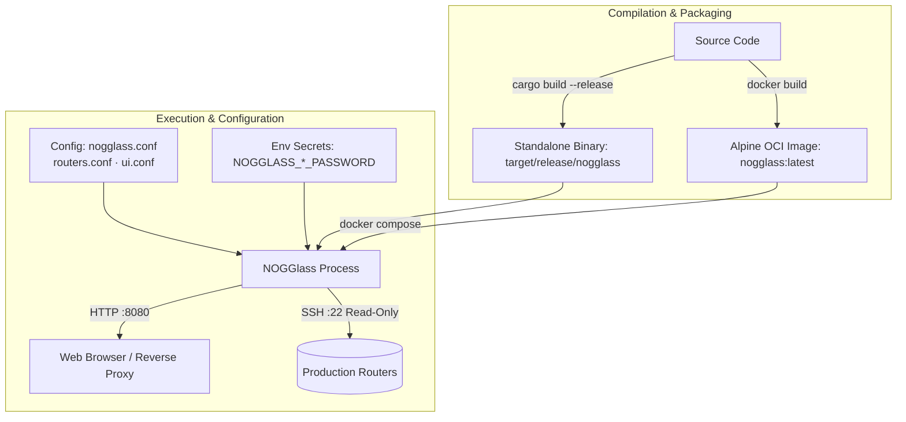

# Installing and Configuring NOGGlass

## TL;DR

NOGGlass can be compiled natively with Cargo (`cargo build --release`), built as a minimal Alpine container via Docker (`docker build -t nogglass .`), or deployed directly using Docker Compose (`docker compose up -d`). Runtime configuration is loaded modularly from `/etc/nogglass/nogglass.conf` alongside companion files `routers.conf` and `ui.conf`, with sensitive credentials passed exclusively through environment variables. For the full production deployment guide, see [`docs/operations/deployment.md`](docs/operations/deployment.md).

## Overview

NOGGlass is a single, self-contained Rust binary with an embedded web UI, SSE streaming, and vendor drivers for production network diagnostic queries. It requires no runtime interpreters, Node.js daemons, or separate frontend servers.



---

## 1. Prerequisites and System Requirements

### Hardware Requirements
- **Architecture**: `x86_64` (AMD64) or `aarch64` (ARM64).
- **RAM**: 512 MB minimum (production idle RSS is under 35 MB).
- **Disk**: ~100 MB free disk space for the binary and configuration.

### Software Requirements
- **For Container Deployment**:
  - Docker Engine 20.10+ / Podman 4.0+.
  - Docker Compose v2+.
- **For Native Host Compilation**:
  - Rust toolchain 1.85+ (or MSRV defined in `rust-toolchain.toml`, currently Rust 1.90).
  - OpenSSL development headers and `pkg-config`:
    - Debian/Ubuntu: `sudo apt-get install -y build-essential pkg-config libssl-dev`
    - RHEL/Rocky/Alma: `sudo dnf install -y gcc pkgconfig openssl-devel`
    - Alpine Linux: `apk add --no-cache musl-dev pkgconfig openssl-dev`

---

## 2. Installation and Build Options

### Option A: Pre-compiled Static Binary (Fastest for Bare-Metal / Systemd)

Download the official statically linked `x86_64-unknown-linux-musl` release archive directly from GitHub Releases. It has zero external shared library dependencies (no glibc required) and runs directly on any 64-bit Linux distribution (Debian, Ubuntu, RHEL, Rocky, Alma, Alpine, Slackware):

```bash
# 1. Download the release archive and checksum (replace with desired version)
VERSION="1.0.0"
curl -fsSLO "https://github.com/andrediashexa/looking-glass/releases/download/v${VERSION}/nogglass-v${VERSION}-linux-amd64.tar.gz"
curl -fsSLO "https://github.com/andrediashexa/looking-glass/releases/download/v${VERSION}/nogglass-v${VERSION}-linux-amd64.tar.gz.sha256"

# 2. Verify integrity
sha256sum -c "nogglass-v${VERSION}-linux-amd64.tar.gz.sha256"

# 3. Extract distribution package
tar -xzf "nogglass-v${VERSION}-linux-amd64.tar.gz"
cd "nogglass-v${VERSION}-linux-amd64"

# 4. Install the binary to system path
sudo install -m 755 nogglass /usr/local/bin/nogglass
```

### Option B: Native Compilation via Cargo (from Source)

Clone the repository and build the workspace with release optimizations:

```bash
git clone https://github.com/andrediashexa/looking-glass.git
cd looking-glass

# Run tests to verify parser and driver integrity
cargo test --workspace

# Compile optimized release binary
cargo build --release --workspace
```

The resulting binary will be located at:
```bash
./target/release/nogglass
```

### Option C: Container Image Build (Multi-stage Alpine)

The repository provides a multi-stage `Dockerfile` based on `rust:1.90-alpine` (with `zig` cross-compilation) and `alpine:3.21` runtime:

```bash
docker build -t nogglass:latest .
```

The final container image is approximately 25–30 MB, runs under non-root user `nogglass` (UID 10001), and has zero compilation toolchains in the runtime layer.

---## 3. Configuration Guide

NOGGlass loads its operational policies, router topology, and visual identity from modular configuration files under `/etc/nogglass/`. The configuration is split into three focused files:
- **`nogglass.conf`**: Daemon limits, RPKI tier fallback, rate limiting, and global view. (Template: [`nogglass.example.conf`](./nogglass.example.conf))
- **`routers.conf`**: Inventory of edge routers, credentials references, and allowed queries. (Template: [`routers.example.conf`](./routers.example.conf))
- **`ui.conf`**: Theme (dark/light), custom branding logo, wallpaper, and panel visibility. (Template: [`ui.example.conf`](./ui.example.conf))

NOGGlass automatically discovers companion files `routers.conf` and `ui.conf` residing in the same directory as `nogglass.conf`. Legacy single-file setups (`nogglass.toml`) remain fully supported for backward compatibility.

### 3.1. Filesystem Configuration Layout

NOGGlass can be deployed natively on the host (Systemd) or inside Docker (Container). Choose the setup that matches your deployment:

#### Setup for Native Host Installation (Systemd / Method 1)
When running natively on the host, create a dedicated system user and configure files directly under `/etc/nogglass`:

```bash
# 1. Create the dedicated unprivileged system user
sudo useradd -r -s /bin/false nogglass 2>/dev/null || true

# 2. Create application directories
sudo mkdir -p /etc/nogglass /var/log/nogglass

# 3. Copy modular configuration templates, visual assets, and restrict permissions
sudo cp nogglass.example.conf /etc/nogglass/nogglass.conf
sudo cp routers.example.conf /etc/nogglass/routers.conf
sudo cp ui.example.conf /etc/nogglass/ui.conf
sudo cp crates/nogglass-server/ui/assets/logo_nogglass_dark.png /etc/nogglass/logo_nogglass_dark.png
sudo cp crates/nogglass-server/ui/assets/logo_nogglass_light.png /etc/nogglass/logo_nogglass_light.png
sudo cp crates/nogglass-server/ui/assets/nogglass_dark.png /etc/nogglass/nogglass_dark.png
sudo cp crates/nogglass-server/ui/assets/nogglass_light.png /etc/nogglass/nogglass_light.png
sudo chown -R nogglass:nogglass /etc/nogglass /var/log/nogglass
sudo chmod 750 /etc/nogglass /var/log/nogglass
sudo chmod 640 /etc/nogglass/*.conf /etc/nogglass/*.png
```

#### Setup for Container Installation (Docker / Method 2)
When running via Docker Compose, no system user on the host is needed. Configuration files (`nogglass.conf`, `routers.conf`, `ui.conf`), credentials (`nogglass.env`), and visual assets are stored inside a dedicated Docker named volume (`nogglass-config`), ensuring your settings survive image updates and container rebuilds:

```bash
# 1. Start the container to initialize the named volume
docker compose up -d nogglass

# 2. Copy modular templates, environment file, and visual assets into the volume
docker cp nogglass.example.conf nogglass:/etc/nogglass/nogglass.conf
docker cp routers.example.conf nogglass:/etc/nogglass/routers.conf
docker cp ui.example.conf nogglass:/etc/nogglass/ui.conf
docker cp deploy/systemd/nogglass.env.example nogglass:/etc/nogglass/nogglass.env
docker cp crates/nogglass-server/ui/assets/logo_nogglass_dark.png nogglass:/etc/nogglass/logo_nogglass_dark.png
docker cp crates/nogglass-server/ui/assets/logo_nogglass_light.png nogglass:/etc/nogglass/logo_nogglass_light.png
docker cp crates/nogglass-server/ui/assets/nogglass_dark.png nogglass:/etc/nogglass/nogglass_dark.png
docker cp crates/nogglass-server/ui/assets/nogglass_light.png nogglass:/etc/nogglass/nogglass_light.png

# 3. Restart the container to apply configuration
docker compose restart nogglass
```


### 3.2. Configuration Files Anatomy

#### Primary Daemon Policies (`nogglass.conf`)
```toml
[limits]
timeout_secs = 30
max_output_bytes = 262144
ping_count = 5
max_concurrent_per_router = 2
max_concurrent_total = 16

[rpki]
enable_fallback = false
# validator_url = "http://routinator.internal:8323"
timeout_ms = 3000
cache_ttl_secs = 3600
cache_max_capacity = 50000

[rate_limit]
enabled = true
max_requests = 20
window_secs = 60
burst = 5
require_captcha_within_secs = 60
trusted_proxies = ["127.0.0.1", "::1"]

[global_view]
enabled = false
timeout_ms = 1500
```

#### Router Inventory (`routers.conf`)
```toml
# Example Huawei VRP Router
[[router]]
id = "edge-01"
name = "Edge 01 - Sao Paulo"
vendor = "huawei_vrp"
host = "192.0.2.10"
port = 22 # Optional, defaults to 22
username = "nogglass"
location = "Sao Paulo, BR"
credentials = { password_env = "NOGGLASS_EDGE01_PASSWORD" }
queries = ["ping", "traceroute", "bgp_route", "bgp_summary"]

# Example Juniper JunOS Router using SSH Key
[[router]]
id = "border-02"
name = "Border 02 - Rio de Janeiro"
vendor = "juniper_junos"
host = "192.0.2.11"
username = "nogglass"
location = "Rio de Janeiro, BR"
credentials = { key_file = { path = "/etc/nogglass/keys/border-02.key", passphrase_env = "NOGGLASS_BORDER02_PASSPHRASE" } }

# Mock Router for Demonstration and Testing
[[router]]
id = "demo"
name = "Mock Router (Fixtures)"
vendor = "mock"
host = "127.0.0.1"
location = "Lab Demo"
```

#### User Interface & Appearance (`ui.conf`)
```toml
[ui]
theme = "dark" # or "light"
logo_path = "/etc/nogglass/logo_nogglass_dark.png"
logo_height_px = 76
background_path = "/etc/nogglass/nogglass_dark.png"
background_blur_px = 1
background_opacity_percent = 35
show_best_path = true
show_paths = true
show_raw_output = true
```

### 3.3. Supported Vendor Identifiers

| Vendor Value | Target Operating System / Hardware |
|---|---|
| `huawei_vrp` | Huawei NE40E, NE8000, S-Series switches |
| `juniper_junos` | Juniper MX, PTX, QFX, SRX, vMX |
| `cisco_iosxr` | Cisco IOS-XR (supports JSON extraction) |
| `cisco_iosxe` | Cisco IOS-XE / Classic IOS |
| `mikrotik_routeros` | MikroTik RouterOS v6 and RouterOS v7 |
| `datacom_dmos` | Datacom DM4000 / DM4200 Series |
| `nokia_sros` | Nokia 7750 SR (TiMOS classic and MD-CLI) |
| `bird_routing_daemon` | BIRD 2 Internet Routing Daemon |
| `arista_eos` | Arista EOS 7000 / vEOS Series |
| `frr` | FRRouting (FRR) Routing Daemon |
| `mock` | Synthetic test driver (no SSH connection needed) |

---

## 4. Running NOGGlass

### Method 1: Running as a Systemd Service (Native Binary)

1. Copy the compiled binary:
   ```bash
   sudo cp target/release/nogglass /usr/local/bin/nogglass
   sudo chmod +x /usr/local/bin/nogglass
   ```

2. Create a dedicated system user and configure application files:
   ```bash
   sudo useradd -r -s /bin/false nogglass 2>/dev/null || true
   sudo mkdir -p /etc/nogglass /var/log/nogglass
   sudo cp nogglass.example.conf /etc/nogglass/nogglass.conf
   sudo cp routers.example.conf /etc/nogglass/routers.conf
   sudo cp ui.example.conf /etc/nogglass/ui.conf
   sudo cp crates/nogglass-server/ui/assets/logo_nogglass_dark.png /etc/nogglass/logo_nogglass_dark.png
   sudo cp crates/nogglass-server/ui/assets/logo_nogglass_light.png /etc/nogglass/logo_nogglass_light.png
   sudo cp crates/nogglass-server/ui/assets/nogglass_dark.png /etc/nogglass/nogglass_dark.png
   sudo cp crates/nogglass-server/ui/assets/nogglass_light.png /etc/nogglass/nogglass_light.png
   sudo chown -R nogglass:nogglass /etc/nogglass /var/log/nogglass
   sudo chmod 750 /etc/nogglass /var/log/nogglass
   sudo chmod 640 /etc/nogglass/*.conf /etc/nogglass/*.png
   ```

3. Create the environment file `/etc/nogglass/nogglass.env` (permissions `0600`):
   ```bash
   sudo bash -c 'cat <<EOF > /etc/nogglass/nogglass.env
   NOGGLASS_CONFIG=/etc/nogglass/nogglass.conf
   # Use 0.0.0.0:8080 for public access or 127.0.0.1:8080 when behind a local reverse proxy
   NOGGLASS_HTTP_ADDR=0.0.0.0:8080
   NOGGLASS_EDGE01_PASSWORD="REPLACE_WITH_ROUTER_PASSWORD"
   NOGGLASS_BORDER02_PASSPHRASE=""
   EOF'
   sudo chmod 600 /etc/nogglass/nogglass.env
   sudo chown nogglass:nogglass /etc/nogglass/nogglass.env
   ```

4. Create the systemd service unit `/etc/systemd/system/nogglass.service`:
   ```ini
   [Unit]
   Description=NOGGlass Multi-Vendor Looking Glass
   After=network.target

   [Service]
   Type=simple
   User=nogglass
   Group=nogglass
   EnvironmentFile=/etc/nogglass/nogglass.env
   ExecStart=/usr/local/bin/nogglass
   Restart=always
   RestartSec=5
   LimitNOFILE=65535

   # Hardening
   ProtectSystem=strict
   ProtectHome=true
   NoNewPrivileges=true
   PrivateTmp=true
   ReadOnlyPaths=/usr/local/bin/nogglass

   [Install]
   WantedBy=multi-user.target
   ```

5. Enable and start:
   ```bash
   sudo systemctl daemon-reload
   sudo systemctl enable --now nogglass
   sudo systemctl status nogglass
   ```

### Method 2: Running with Docker Compose

Running with Docker Compose stores all configuration, credentials, and visual assets inside a Docker named volume (`nogglass-config`), mounted at `/etc/nogglass` in the container. No system user creation on the host and no root `/etc` filesystem modifications are needed.

1. Prepare your local environment file (`nogglass.env`):
   ```bash
   # Copy the example environment template and restrict permissions
   cp deploy/systemd/nogglass.env.example nogglass.env
   chmod 600 nogglass.env

   # Edit nogglass.env to define your router passwords and settings.
   # Note: Inside the container, keep NOGGLASS_HTTP_ADDR=0.0.0.0:8080 so it
   # accepts traffic from the Docker bridge. Loopback isolation is handled
   # on the host via ports: ["127.0.0.1:8080:8080"] in docker-compose.yml.
   ```

2. Prepare your `docker-compose.yml`:
   ```yaml
   services:
     nogglass:
       image: nogglass:latest
       container_name: nogglass
       restart: unless-stopped
       env_file:
         - nogglass.env
       volumes:
         - nogglass-config:/etc/nogglass
       ports:
         - "127.0.0.1:8080:8080" # Binds to localhost on the host for reverse proxy security

   volumes:
     nogglass-config:
       name: nogglass-config
   ```

3. Bootstrap configuration and visual assets directly into the Docker volume:
   ```bash
   # 1. Bring up the container (initializes the named volume)
   docker compose up -d nogglass

   # 2. Populate the named volume (/etc/nogglass) inside the container
   docker cp nogglass.example.conf nogglass:/etc/nogglass/nogglass.conf
   docker cp routers.example.conf nogglass:/etc/nogglass/routers.conf
   docker cp ui.example.conf nogglass:/etc/nogglass/ui.conf
   docker cp nogglass.env nogglass:/etc/nogglass/nogglass.env
   docker cp crates/nogglass-server/ui/assets/logo_nogglass_dark.png nogglass:/etc/nogglass/logo_nogglass_dark.png
   docker cp crates/nogglass-server/ui/assets/logo_nogglass_light.png nogglass:/etc/nogglass/logo_nogglass_light.png
   docker cp crates/nogglass-server/ui/assets/nogglass_dark.png nogglass:/etc/nogglass/nogglass_dark.png
   docker cp crates/nogglass-server/ui/assets/nogglass_light.png nogglass:/etc/nogglass/nogglass_light.png

   # 3. Recreate the container to reload configuration and credentials
   docker compose up -d --force-recreate nogglass
   docker compose logs -f nogglass
   ```

   > [!TIP]
   > Because `/etc/nogglass` is a Docker named volume, you can edit `nogglass.conf`, `routers.conf`, `ui.conf`, or `nogglass.env` locally and push updates with `docker cp`, or edit them directly on the Linux host filesystem at `/var/lib/docker/volumes/nogglass-config/_data/`.


---

## 5. Reverse Proxy and TLS Configuration

NOGGlass listens on plain HTTP (`:8080`) by design. For production environments exposed to the public Internet, place Nginx, Caddy, or Traefik in front to terminate TLS.

### Nginx Configuration Snippet

```nginx
server {
    listen 80;
    listen [::]:80;
    server_name lg.example.net;
    return 301 https://$host$request_uri;
}

server {
    listen 443 ssl http2;
    listen [::]:443 ssl http2;
    server_name lg.example.net;

    ssl_certificate /etc/letsencrypt/live/lg.example.net/fullchain.pem;
    ssl_certificate_key /etc/letsencrypt/live/lg.example.net/privkey.pem;

    location / {
        proxy_pass http://127.0.0.1:8080;
        proxy_http_version 1.1;
        proxy_set_header Host $host;
        proxy_set_header X-Real-IP $remote_addr;
        proxy_set_header X-Forwarded-For $proxy_add_x_forwarded_for;
        proxy_set_header X-Forwarded-Proto $scheme;

        # Server-Sent Events (SSE) support
        proxy_set_header Connection '';
        proxy_buffering off;
        proxy_cache off;
        chunked_transfer_encoding on;
    }
}
```

---

## 6. Verification and Health Check

Once started, verify that NOGGlass is operational:

```bash
# Check service health endpoint (both /api/health and /healthz are supported)
curl -i http://127.0.0.1:8080/api/health
curl -i http://127.0.0.1:8080/healthz

# Check version metadata
curl -i http://127.0.0.1:8080/api/version

# List configured routers
curl -i http://127.0.0.1:8080/api/routers
```

---

## 7. Upgrading NOGGlass

When updates are released in the upstream repository, follow these steps to pull the latest changes and rebuild the Docker container:

### Upgrading with Docker Compose

1. Pull the latest source code from the repository:
   ```bash
   git pull origin main
   ```

2. Rebuild the container image and recreate the running service with zero manual container cleanup:
   ```bash
   docker compose build --no-cache
   docker compose up -d --force-recreate
   ```

3. Confirm that the service restarted cleanly with the updated version:
   ```bash
   docker compose logs --tail=50 -f nogglass
   curl -s http://127.0.0.1:8080/api/version
   ```

---

## 8. Provisioning Read-Only Router Accounts

Security is a foundational tenet of NOGGlass. By design, NOGGlass requires **only read-only / unprivileged operational permissions**. It executes solely non-intrusive commands (`show`, `ping`, `traceroute`). The management accounts provisioned on routers SHOULD follow the principle of least privilege, restricting access to operational diagnostics and preventing configuration changes.

Below are the recommended provisioning commands for each supported network vendor:

### 8.1. Huawei VRP (NE40E, NE8000, S-Series)

Configure a dedicated local user with privilege level 1 (monitoring/read-only) and SSH service:

```text
system-view
aaa
 local-user nogglass password irreversible-cipher <PASSWORD>
 local-user nogglass service-type ssh
 local-user nogglass privilege level 1
quit
ssh user nogglass authentication-type password
ssh user nogglass service-type stelnet
commit
save
```

### 8.2. Cisco IOS-XE / Classic IOS

Configure an unprivileged user (privilege 1) restricted to execution of basic operational commands:

```text
configure terminal
username nogglass privilege 1 secret <PASSWORD>
line vty 0 4
 transport input ssh
 login local
exit
write memory
```

### 8.3. Cisco IOS-XR

Define a custom task group restricted to read operations on BGP, ping, and traceroute:

```text
configure
group looking-glass-grp
 task read bgp, ping, traceroute
!
username nogglass
 group looking-glass-grp
 secret <PASSWORD>
!
commit
```

### 8.4. Juniper JunOS

Define a login class limited to network inspection permissions:

```text
configure
set system login class LOOKING-GLASS permissions [ view network ]
set system login user nogglass class LOOKING-GLASS authentication plain-text-password
# Enter password when prompted
commit and-quit
```

### 8.5. Arista EOS

Create an execution role permitting only diagnostic commands and terminal pagination control:

```text
configure
role LOOKING-GLASS
  10 permit mode exec command ping.*
  20 permit mode exec command traceroute.*
  30 permit mode exec command show ip bgp.*
  40 permit mode exec command show ipv6 bgp.*
  50 permit mode exec command terminal length.*
exit
username nogglass privilege 1 role LOOKING-GLASS secret <PASSWORD>
write memory
```

### 8.6. FRRouting (FRR / Linux Host)

Create a dedicated system user whose default login shell is `vtysh`, belonging to the `frrvty` group:

```bash
# On the Linux host running FRR:
sudo useradd -m -s /usr/bin/vtysh -G frrvty nogglass
sudo passwd nogglass
```

### 8.7. MikroTik RouterOS (v6 & v7)

Create a restricted user group with only `read` and `test` policies, explicitly disallowing modification, sensitive exports, and management reboot capabilities:

```routeros
/user group add name=looking-glass policy=read,test,!local,!telnet,!ssh,!ftp,!reboot,!write,!policy,!compat,!password,!sniff,!sensitive,!romon
/user add name=nogglass group=looking-glass password="<PASSWORD>"
```

### 8.8. Datacom DmOS

Create a user with the `operator` role (monitoring only):

```text
configure
aaa
  user nogglass
    password plain <PASSWORD>
    role operator
    exit
  exit
exit
write
```

### 8.9. Nokia SR OS (Classic & MD-CLI)

In MD-CLI:
```text
/configure system security user-params local-user user "nogglass" password <PASSWORD>
/configure system security user-params local-user user "nogglass" access console true
/configure system security user-params local-user user "nogglass" console member "read-only"
```

In Classic CLI:
```text
/configure system security user "nogglass" password <PASSWORD>
/configure system security user "nogglass" access console
/configure system security profile "read-only"
```

### 8.10. BIRD 2 (Linux Host)

Create a system user with access to execute the `birdc` client:

```bash
sudo useradd -m -s /bin/bash nogglass
sudo passwd nogglass
# Ensure the user has read/exec access to the birdc socket (typically bird group)
sudo usermod -aG bird nogglass
```

