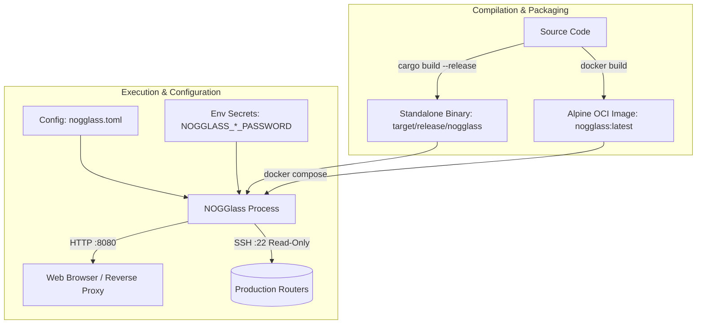

# Installing and Configuring NOGGlass

## TL;DR

NOGGlass can be compiled natively with Cargo (`cargo build --release`), built as a minimal Alpine container via Docker (`docker build -t nogglass .`), or deployed directly using Docker Compose (`docker compose up -d`). Runtime configuration is loaded from a TOML file (`nogglass.toml`) with sensitive credentials passed exclusively through environment variables. For the full production deployment guide, see [`docs/operations/deployment.md`](docs/operations/deployment.md).

## Overview

NOGGlass is a single, self-contained Rust binary with an embedded web UI, SSE streaming, and vendor drivers for production network diagnostic queries. It requires no runtime interpreters, Node.js daemons, or separate frontend servers.



---

## 1. Prerequisites and System Requirements

### Hardware Requirements
- **Architecture**: `x86_64` (AMD64) or `aarch64` (ARM64).
- **RAM**: 512 MB minimum (production idle RSS is under 35 MB).
- **Disk**: ~100 MB free disk space for the binary and configuration.

### Software Requirements
- **For Container Deployment**:
  - Docker Engine 20.10+ / Podman 4.0+.
  - Docker Compose v2+.
- **For Native Host Compilation**:
  - Rust toolchain 1.85+ (or MSRV defined in `rust-toolchain.toml`, currently Rust 1.90).
  - OpenSSL development headers and `pkg-config`:
    - Debian/Ubuntu: `sudo apt-get install -y build-essential pkg-config libssl-dev`
    - RHEL/Rocky/Alma: `sudo dnf install -y gcc pkgconfig openssl-devel`
    - Alpine Linux: `apk add --no-cache musl-dev pkgconfig openssl-dev`

---

## 2. Installation and Build Options

### Option A: Pre-compiled Static Binary (Fastest for Bare-Metal / Systemd)

Download the official statically linked `x86_64-unknown-linux-musl` release archive directly from GitHub Releases. It has zero external shared library dependencies (no glibc required) and runs directly on any 64-bit Linux distribution (Debian, Ubuntu, RHEL, Rocky, Alma, Alpine, Slackware):

```bash
# 1. Download the release archive and checksum (replace with desired version)
VERSION="1.0.0"
curl -fsSLO "https://github.com/andrediashexa/looking-glass/releases/download/v${VERSION}/nogglass-v${VERSION}-linux-amd64.tar.gz"
curl -fsSLO "https://github.com/andrediashexa/looking-glass/releases/download/v${VERSION}/nogglass-v${VERSION}-linux-amd64.tar.gz.sha256"

# 2. Verify integrity
sha256sum -c "nogglass-v${VERSION}-linux-amd64.tar.gz.sha256"

# 3. Extract distribution package
tar -xzf "nogglass-v${VERSION}-linux-amd64.tar.gz"
cd "nogglass-v${VERSION}-linux-amd64"

# 4. Install the binary to system path
sudo install -m 755 nogglass /usr/local/bin/nogglass
```

### Option B: Native Compilation via Cargo (from Source)

Clone the repository and build the workspace with release optimizations:

```bash
git clone https://github.com/andrediashexa/looking-glass.git
cd looking-glass

# Run tests to verify parser and driver integrity
cargo test --workspace

# Compile optimized release binary
cargo build --release --workspace
```

The resulting binary will be located at:
```bash
./target/release/nogglass
```

### Option C: Container Image Build (Multi-stage Alpine)

The repository provides a multi-stage `Dockerfile` based on `rust:1.90-alpine` (with `zig` cross-compilation) and `alpine:3.21` runtime:

```bash
docker build -t nogglass:latest .
```

The final container image is approximately 25–30 MB, runs under non-root user `nogglass` (UID 10001), and has zero compilation toolchains in the runtime layer.

---

## 3. Configuration Guide

NOGGlass loads its topology and operational limits from a TOML configuration file. A template is provided in [`nogglass.example.toml`](./nogglass.example.toml).

### 3.1. Filesystem Configuration Layout

NOGGlass can be deployed natively on the host (Systemd) or inside Docker (Container). Choose the setup that matches your deployment:

#### Setup for Native Host Installation (Systemd / Method 1)
When running natively on the host, create a dedicated system user and configure files directly under `/etc/nogglass`:

```bash
# 1. Create the dedicated unprivileged system user
sudo useradd -r -s /bin/false nogglass 2>/dev/null || true

# 2. Create application directories
sudo mkdir -p /etc/nogglass /var/log/nogglass

# 3. Copy template, existing visual assets, and restrict permissions
sudo cp nogglass.example.toml /etc/nogglass/nogglass.toml
sudo cp crates/nogglass-server/ui/assets/logo_nogglass.png /etc/nogglass/logo_nogglass.png
sudo cp crates/nogglass-server/ui/assets/nogglass.png /etc/nogglass/nogglass.png
sudo chown -R nogglass:nogglass /etc/nogglass /var/log/nogglass
sudo chmod 750 /etc/nogglass /var/log/nogglass
sudo chmod 640 /etc/nogglass/nogglass.toml /etc/nogglass/logo_nogglass.png /etc/nogglass/nogglass.png
```

#### Setup for Container Installation (Docker / Method 2)
When running via Docker Compose, no system user on the host is needed. Configuration and visual assets are stored inside a dedicated Docker named volume (`nogglass-config`), ensuring your settings survive image updates and container rebuilds:

```bash
# 1. Start the container to initialize the named volume
docker compose up -d nogglass

# 2. Copy configuration template and existing visual assets into the volume
docker cp nogglass.example.toml nogglass:/etc/nogglass/nogglass.toml
docker cp crates/nogglass-server/ui/assets/logo_nogglass.png nogglass:/etc/nogglass/logo_nogglass.png
docker cp crates/nogglass-server/ui/assets/nogglass.png nogglass:/etc/nogglass/nogglass.png

# 3. Restart the container to apply configuration
docker compose restart nogglass
```


### 3.2. Configuration File Anatomy (`nogglass.toml`)

```toml
[limits]
timeout_secs = 30
max_output_bytes = 262144
ping_count = 5
max_concurrent_per_router = 2
max_concurrent_total = 16

# Example Huawei VRP Router
[[router]]
id = "edge-01"
name = "Edge 01 - Sao Paulo"
vendor = "huawei_vrp"
host = "192.0.2.10"
username = "nogglass"
location = "Sao Paulo, BR"
credentials = { password_env = "NOGGLASS_EDGE01_PASSWORD" }
queries = ["ping", "traceroute", "bgp_route", "bgp_summary"]

# Example Juniper JunOS Router using SSH Key
[[router]]
id = "border-02"
name = "Border 02 - Rio de Janeiro"
vendor = "juniper_junos"
host = "192.0.2.11"
username = "nogglass"
location = "Rio de Janeiro, BR"
credentials = { key_file = { path = "/etc/nogglass/keys/border-02.key", passphrase_env = "NOGGLASS_BORDER02_PASSPHRASE" } }

# Mock Router for Demonstration and Testing
[[router]]
id = "demo"
name = "Mock Router (Fixtures)"
vendor = "mock"
host = "127.0.0.1"
location = "Lab Demo"

[rpki]
enable_fallback = false
# validator_url = "http://routinator.internal:8323"
timeout_ms = 1000
cache_ttl_secs = 3600
cache_max_capacity = 50000

[ratelimit]
enabled = true
requests_per_minute = 10
burst = 5
trusted_proxies = ["127.0.0.1", "::1"]

[ui]
theme = "dark" # or "light"
logo_path = "/etc/nogglass/logo_nogglass.png"
logo_height_px = 76
background_path = "/etc/nogglass/nogglass.png"
background_blur_px = 1
background_opacity_percent = 35
```

### 3.3. Supported Vendor Identifiers

| Vendor Value | Target Operating System / Hardware |
|---|---|
| `huawei_vrp` | Huawei NE40E, NE8000, S-Series switches |
| `juniper_junos` | Juniper MX, PTX, QFX, SRX, vMX |
| `cisco_iosxr` | Cisco IOS-XR (supports JSON extraction) |
| `cisco_iosxe` | Cisco IOS-XE / Classic IOS |
| `mikrotik_routeros` | MikroTik RouterOS v6 and RouterOS v7 |
| `datacom_dmos` | Datacom DM4000 / DM4200 Series |
| `nokia_sros` | Nokia 7750 SR (TiMOS classic and MD-CLI) |
| `bird_routing_daemon` | BIRD 2 Internet Routing Daemon |
| `mock` | Synthetic test driver (no SSH connection needed) |

---

## 4. Running NOGGlass

### Method 1: Running as a Systemd Service (Native Binary)

1. Copy the compiled binary:
   ```bash
   sudo cp target/release/nogglass /usr/local/bin/nogglass
   sudo chmod +x /usr/local/bin/nogglass
   ```

2. Create a dedicated system user and configure application files:
   ```bash
   sudo useradd -r -s /bin/false nogglass 2>/dev/null || true
   sudo mkdir -p /etc/nogglass /var/log/nogglass
   sudo cp nogglass.example.toml /etc/nogglass/nogglass.toml
   sudo cp crates/nogglass-server/ui/assets/logo_nogglass.png /etc/nogglass/logo_nogglass.png
   sudo cp crates/nogglass-server/ui/assets/nogglass.png /etc/nogglass/nogglass.png
   sudo chown -R nogglass:nogglass /etc/nogglass /var/log/nogglass
   sudo chmod 750 /etc/nogglass /var/log/nogglass
   sudo chmod 640 /etc/nogglass/nogglass.toml /etc/nogglass/logo_nogglass.png /etc/nogglass/nogglass.png
   ```

3. Create the environment file `/etc/nogglass/nogglass.env` (permissions `0600`):
   ```bash
   sudo bash -c 'cat <<EOF > /etc/nogglass/nogglass.env
   NOGGLASS_CONFIG=/etc/nogglass/nogglass.toml
   NOGGLASS_HTTP_ADDR=0.0.0.0:8080
   NOGGLASS_EDGE01_PASSWORD="REPLACE_WITH_ROUTER_PASSWORD"
   NOGGLASS_BORDER02_PASSPHRASE=""
   EOF'
   sudo chmod 600 /etc/nogglass/nogglass.env
   sudo chown nogglass:nogglass /etc/nogglass/nogglass.env
   ```

4. Create the systemd service unit `/etc/systemd/system/nogglass.service`:
   ```ini
   [Unit]
   Description=NOGGlass Multi-Vendor Looking Glass
   After=network.target

   [Service]
   Type=simple
   User=nogglass
   Group=nogglass
   EnvironmentFile=/etc/nogglass/nogglass.env
   ExecStart=/usr/local/bin/nogglass
   Restart=always
   RestartSec=5
   LimitNOFILE=65535

   # Hardening
   ProtectSystem=strict
   ProtectHome=true
   NoNewPrivileges=true
   PrivateTmp=true
   ReadOnlyPaths=/usr/local/bin/nogglass

   [Install]
   WantedBy=multi-user.target
   ```

5. Enable and start:
   ```bash
   sudo systemctl daemon-reload
   sudo systemctl enable --now nogglass
   sudo systemctl status nogglass
   ```

### Method 2: Running with Docker Compose

Running with Docker Compose stores your configuration in a Docker named volume (`nogglass-config`). No system user creation on the host is needed.

1. Prepare your `docker-compose.yml`:
   ```yaml
   services:
     nogglass:
       image: nogglass:latest
       container_name: nogglass
       restart: unless-stopped
       environment:
         - NOGGLASS_CONFIG=/etc/nogglass/nogglass.toml
         - NOGGLASS_HTTP_ADDR=0.0.0.0:8080
         - NOGGLASS_EDGE01_PASSWORD=your_router_password_here
       volumes:
         - nogglass-config:/etc/nogglass
       ports:
         - "8080:8080"

   volumes:
     nogglass-config:
       name: nogglass-config
   ```

2. Bootstrap configuration and visual assets into the Docker volume:
   ```bash
   # Bring up the container (initializes the volume)
   docker compose up -d nogglass

   # Copy configuration template and existing visual assets into the volume
   docker cp nogglass.example.toml nogglass:/etc/nogglass/nogglass.toml
   docker cp crates/nogglass-server/ui/assets/logo_nogglass.png nogglass:/etc/nogglass/logo_nogglass.png
   docker cp crates/nogglass-server/ui/assets/nogglass.png nogglass:/etc/nogglass/nogglass.png

   # Restart to load the new configuration
   docker compose restart nogglass
   docker compose logs -f nogglass
   ```

   > [!TIP]
   > On Linux hosts, configuration management tools (Ansible/Puppet) can also write directly to the volume path on the host at `/var/lib/docker/volumes/nogglass-config/_data/nogglass.toml`.


---

## 5. Reverse Proxy and TLS Configuration

NOGGlass listens on plain HTTP (`:8080`) by design. For production environments exposed to the public Internet, place Nginx, Caddy, or Traefik in front to terminate TLS.

### Nginx Configuration Snippet

```nginx
server {
    listen 80;
    listen [::]:80;
    server_name lg.example.net;
    return 301 https://$host$request_uri;
}

server {
    listen 443 ssl http2;
    listen [::]:443 ssl http2;
    server_name lg.example.net;

    ssl_certificate /etc/letsencrypt/live/lg.example.net/fullchain.pem;
    ssl_certificate_key /etc/letsencrypt/live/lg.example.net/privkey.pem;

    location / {
        proxy_pass http://127.0.0.1:8080;
        proxy_http_version 1.1;
        proxy_set_header Host $host;
        proxy_set_header X-Real-IP $remote_addr;
        proxy_set_header X-Forwarded-For $proxy_add_x_forwarded_for;
        proxy_set_header X-Forwarded-Proto $scheme;

        # Server-Sent Events (SSE) support
        proxy_set_header Connection '';
        proxy_buffering off;
        proxy_cache off;
        chunked_transfer_encoding on;
    }
}
```

---

## 6. Verification and Health Check

Once started, verify that NOGGlass is operational:

```bash
# Check service health endpoint
curl -i http://127.0.0.1:8080/healthz

# Check version metadata
curl -i http://127.0.0.1:8080/api/version

# List configured routers
curl -i http://127.0.0.1:8080/api/routers
```

---

## 7. Upgrading NOGGlass

When updates are released in the upstream repository, follow these steps to pull the latest changes and rebuild the Docker container:

### Upgrading with Docker Compose

1. Pull the latest source code from the repository:
   ```bash
   git pull origin main
   ```

2. Rebuild the container image and recreate the running service with zero manual container cleanup:
   ```bash
   docker compose build --no-cache
   docker compose up -d --force-recreate
   ```

3. Confirm that the service restarted cleanly with the updated version:
   ```bash
   docker compose logs --tail=50 -f nogglass
   curl -s http://127.0.0.1:8080/api/version
   ```

