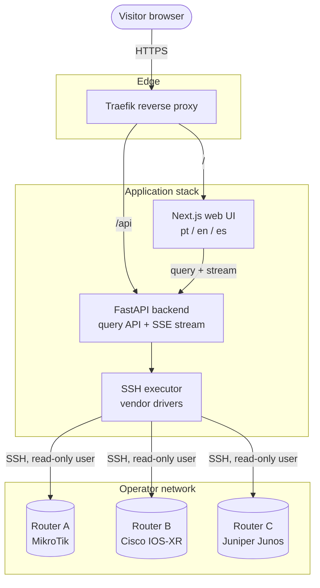

# Looking Glass

A multi-vendor, self-hosted Looking Glass for ISPs and network operators.

## TL;DR

Looking Glass lets your visitors run read-only diagnostics (`ping`, `traceroute`,
BGP and routing lookups) against your production routers from a web page, in
Portuguese, English or Spanish. You describe your routers in a configuration
file, the backend opens a read-only SSH session per query, and the result is
streamed back to the browser. It is free software (Apache-2.0) and ships as a
Docker Compose stack: `docker compose up -d` and you have a Looking Glass.

> **Status: pre-alpha.** Nothing is usable yet. The repository currently holds
> the project rules, the documentation standard and the architecture decisions.
> Follow the milestones for progress.

## Why another Looking Glass

Most existing tools assume a single vendor, expose a shell-ish command box to
the Internet, or have been unmaintained for years. This project targets the
network mix that regional ISPs actually run — MikroTik, Huawei, Datacom, Cisco,
Juniper, Nokia, Arista, FRR/BIRD — and treats the public endpoint as what it is:
untrusted input that ends up near a production router.

## Design principles

1. **The router is sacred.** The backend NEVER builds a command from raw user
   input. Every query is a typed request mapped to a vendor-specific template
   with validated arguments.
2. **Read-only by contract.** Documented least-privilege router users per
   vendor; the executor refuses anything outside the command catalogue.
3. **Public means hostile.** Rate limiting, per-router concurrency caps,
   command timeouts and optional CAPTCHA are part of the core, not add-ons.
4. **Self-hosting must be boring.** One Compose file, one `.env`, published
   container images, no build step required on the operator's server.
5. **Every behaviour is configurable, with a safe default.** Anything that
   reaches the outside world starts disabled.

## Architecture

## Documentation

All documentation lives in [`docs/`](docs/) and is written in English following
the [documentation standard](docs/process/documentation-standard.md).

| Document | Purpose |
|---|---|
| [Architecture overview](docs/architecture/overview.md) | How the pieces fit together |
| [Versioning and releases](docs/process/versioning-and-releases.md) | How a merge becomes a release |
| [Documentation standard](docs/process/documentation-standard.md) | Rules every document MUST follow |
| [Architecture decisions](docs/adr/) | Why the stack looks like this |
| [Contributing](CONTRIBUTING.md) | Issue, branch, commit and review rules |
| [Security policy](SECURITY.md) | How to report a vulnerability |

## License

[Apache License 2.0](LICENSE).
