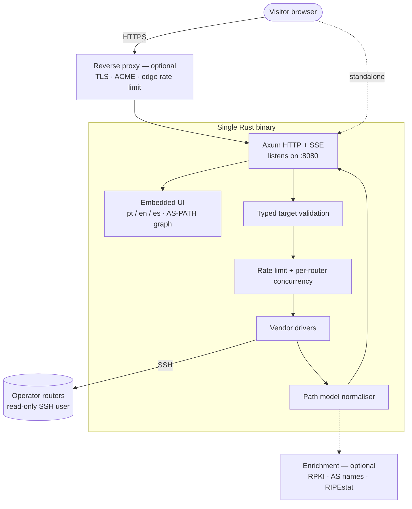
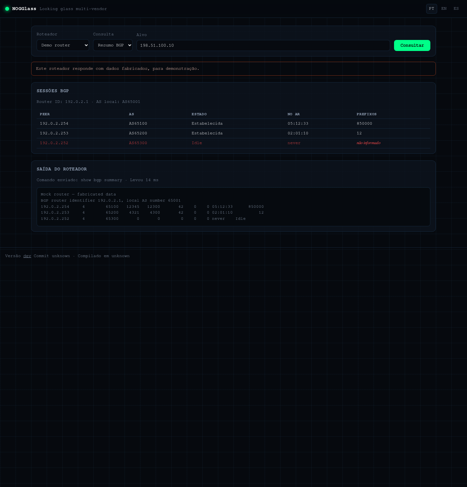
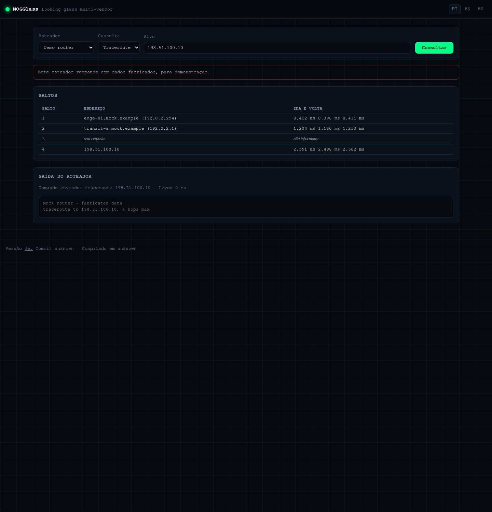

# NOGGlass

A multi-vendor, self-hosted looking glass for ISPs and network operators.

> The repository is named `looking-glass`; the product is **NOGGlass**
> ([ADR-0013](docs/adr/0013-product-name-and-branding.md)).

## TL;DR

NOGGlass lets your visitors run read-only diagnostics — `ping`, `traceroute`,
BGP and routing lookups — against your production routers from a web page, in
Portuguese, English or Spanish. BGP answers are not dumped as CLI text: they are
parsed into a normalised path model and drawn as an AS-PATH topology graph with
RPKI state, route attributes and decoded communities. It is free software
(Apache-2.0) and ships as a single Rust binary, or as one container.

> **Status: beta.** Every vendor in the catalogue answers every query with a
> parsed result — no raw-text fallbacks left. What has **not** happened: no
> query has ever run against real hardware. Every parser was written from
> documented output and proven against fixtures, so the first thing to do with
> a real router is compare what NOGGlass shows with what the CLI says, and open
> an issue with the raw output when they differ.


## Why another looking glass

Most existing tools assume a single vendor, expose a shell-ish command box to
the Internet, or have been unmaintained for years — and all of them answer with
raw CLI text that an operator has to read line by line. NOGGlass targets the
network mix that regional ISPs actually run — MikroTik, Huawei, Datacom, Cisco,
Juniper, Nokia, Arista, FRR/BIRD — treats the public endpoint as what it is,
untrusted input landing next to a production router, and turns the answer into
something a NOC can read at a glance.

## Design principles

1. **The router is sacred.** A command is never built from raw user input. Every
   query is a typed request mapped to a vendor command with validated arguments.
2. **Read-only by contract.** Least-privilege router users, documented per
   vendor; anything outside the command catalogue is refused.
3. **Never invent data.** A field the router did not report is reported as
   unknown. A diagnostic tool that guesses is worse than one that is missing.
4. **Public means hostile.** Rate limiting, per-router concurrency caps, command
   timeouts and optional CAPTCHA are core, not add-ons.
5. **Self-hosting must be boring.** One binary or one container, one
   configuration file, published images, no build step on the operator's server.
6. **Safe defaults.** Anything that reaches the outside world starts disabled.

## Architecture



## What it does

| | |
|---|---|
| **Queries** | `ping`, `traceroute`, BGP route lookup, BGP session summary — all parsed, none returned as raw text |
| **Vendors** | Huawei VRP, Cisco IOS-XE and IOS-XR, Juniper Junos, Nokia SR OS, MikroTik RouterOS, Datacom DmOS, BIRD, plus a mock router with fabricated data |
| **BGP results** | AS-PATH graph, route table with attributes, decoded communities, and the router output always kept |
| **RPKI** | The router's own state first; an operator's validator or RIPEstat fills the gaps, with the source shown |
| **Global view** | What the Internet announces beside what the router answered, so a leak, a hijack or an announcement that never propagated is visible |
| **Protection** | Per-visitor rate limiting counted per /64 on IPv6, per-router concurrency caps, command timeouts, output caps |
| **Languages** | Portuguese, English and Spanish, by URL prefix |
| **Deployment** | One binary, or one container for amd64 and arm64 |

## Stack

| Layer | Choice | Decision |
|---|---|---|
| Language | Rust | [ADR-0005](docs/adr/0005-backend-implementation-language.md) |
| Server and interface | Axum, with the UI embedded in the binary | [ADR-0007](docs/adr/0007-unified-rust-architecture-and-drivers.md) |
| Languages | pt-BR, en, es by URL prefix | [ADR-0004](docs/adr/0004-web-interface-internationalisation.md) |
| Router access | Direct SSH, read-only user, per-vendor drivers | [ADR-0007](docs/adr/0007-unified-rust-architecture-and-drivers.md) |
| BGP results | Normalised path model, never raw text only | [ADR-0006](docs/adr/0006-structured-bgp-model-and-data-sources.md) |
| Deployment | Binary on a high port; reverse proxy optional | [ADR-0012](docs/adr/0012-standalone-binary-exposure-and-packaging.md) |
| Releases | Conventional Commits, SemVer, every merge tagged; patch releases are pre-releases | [ADR-0003](docs/adr/0003-conventional-commits-and-automated-releases.md), [ADR-0014](docs/adr/0014-release-every-change-with-patch-prereleases.md) |

## Documentation

All documentation lives in [`docs/`](docs/), in English, following the
[documentation standard](docs/process/documentation-standard.md). It is also a
container: `ghcr.io/andrediashexa/nogglass-docs` serves the whole set as a
searchable site on port 8081, offline, beside the looking glass itself — see
[running the documentation site](docs/operations/documentation-site.md).

```bash
docker run -d -p 8081:8081 ghcr.io/andrediashexa/nogglass-docs:latest
```

| Document | Purpose |
|---|---|
| [Deployment](docs/operations/deployment.md) | Installing, configuring and upgrading an instance |
| [Architecture overview](docs/architecture/overview.md) | Components, request flow and trust boundaries |
| [Architecture decisions](docs/adr/) | Why the project looks like this |
| [Versioning and releases](docs/process/versioning-and-releases.md) | How a merge becomes a release |
| [Using NOGGlass](docs/wiki/) | Reading an answer, and running an instance |
| [Running the documentation site](docs/operations/documentation-site.md) | Serving these documents in a container |
| [Contributing](CONTRIBUTING.md) | Issue, branch, commit and review rules |
| [Security policy](SECURITY.md) | How to report a vulnerability |

## Quick start

```bash
curl -O https://raw.githubusercontent.com/andrediashexa/looking-glass/main/docker-compose.yml
curl -O https://raw.githubusercontent.com/andrediashexa/looking-glass/main/nogglass.example.toml
docker compose up -d
```

Then open `http://localhost:8080/`. Out of the box it serves a **mock router**
with fabricated data, so you can see what it does before pointing it at
anything real. When you are ready, replace that entry in `nogglass.toml` with
your own routers — [read-only router users](docs/operations/router-users.md) has
the account recipe per vendor, and the
[deployment guide](docs/operations/deployment.md) covers exposure, TLS and
upgrades.

### A result is a link

The query lives in the URL, so an answer can be pasted into a ticket:

```
https://lg.example.net/en/?router=edge-01&type=bgp_route&target=198.51.100.0/24
```

## What it looks like

| | |
|---|---|
|  | **RPKI invalid.** A possible hijack, in red, with the origin AS that claimed the prefix. |
|  | **Sessions.** The one that is down is the reason someone opened the page. |
|  | **Traceroute.** A hop that did not answer keeps its number and says so. |

More in [`docs/design/screens/`](docs/design/screens/), with the
[interface brief](docs/design/interface-brief.md) that explains every state.

## License

[Apache License 2.0](LICENSE).
