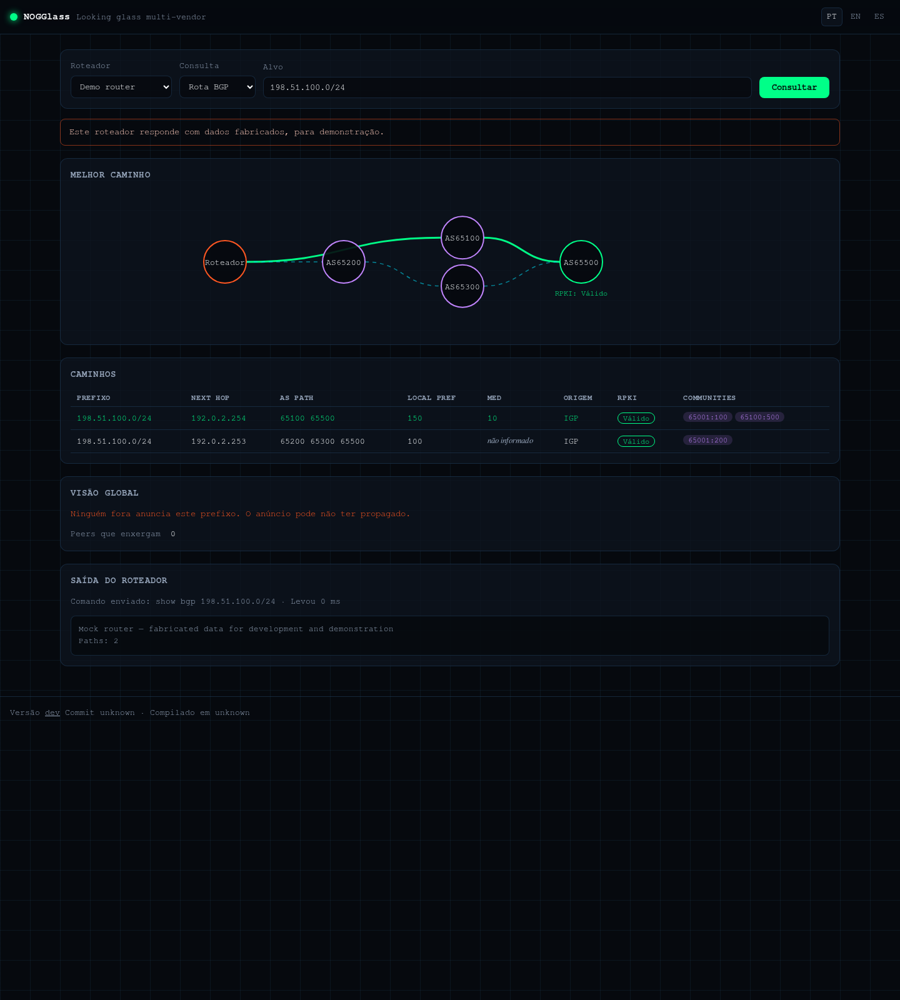
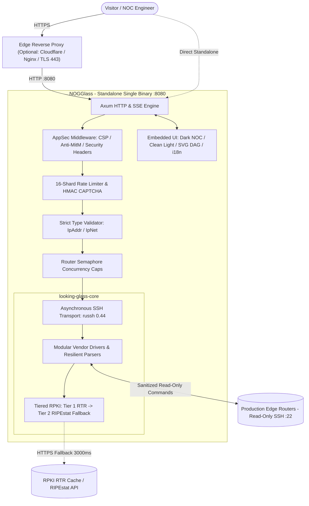

# NOGGlass

A multi-vendor, production-hardened, self-hosted Looking Glass for Autonomous Systems (ASNs), Internet Service Providers (ISPs), and network operators.

> The repository is named `looking-glass`; the official software product is **NOGGlass** ([ADR-0013](docs/adr/0013-product-name-and-branding.md)).

---

## TL;DR

NOGGlass allows visitors and NOC engineers to run read-only network diagnostics — `ping`, `traceroute`, BGP route lookup, and BGP session summary — against edge routers from an embedded web interface in Portuguese, English, or Spanish. BGP output is not dumped as plain text: it is parsed into a strongly typed data model, rendered as an interactive SVG topological AS-PATH graph using Bellman-Ford DAG ranking, enriched with Tiered RPKI validation, and paired with syntax highlighting for active FIB routes. It is free software licensed under the **GNU General Public License v3 (GPLv3)** and ships as a single, self-contained Rust binary or minimal Alpine Linux container.



---

## Why NOGGlass?

Most existing Looking Glass implementations either target a single vendor, rely on unmaintained scripts (PHP/Python/Perl), expose insecure shell command boxes to the Internet, or dump hundreds of lines of raw CLI text that an engineer must parse manually.

NOGGlass was built for the diverse routing mix that regional carriers and ISPs run in production: **Huawei VRP, Juniper JunOS, Cisco IOS-XR/XE, MikroTik RouterOS (v6 & v7), Datacom DmOS, Nokia SR OS, and BIRD 2**. It treats public input as untrusted, protects the router control plane by design, and turns routing data into actionable visual insights for the NOC.

---

## Key Features (v1.0.0)

- **The Router is Sacred:** Complete immunity to command injection. Diagnostic targets and counts are strictly deserialized into Rust types (`std::net::IpAddr`, `ipnet::IpNet`, validated enums) and mapped to read-only command templates.
- **Topological AS-PATH Graph (Bellman-Ford DAG):** Renders route propagation from the local router node. Direct peers (e.g. transit providers and IX peers) are locked in parallel on Column 1, eliminating false cascade representations.
- **Operational Route Highlighting:** Dynamic CLI analyzer (`highlightBgpRaw`) detects winning routes in tabular outputs (`*>`, `DAv`, `[*BGP]`) and detailed blocks (Huawei VRP/Cisco), highlighting the active FIB path in emerald green with a `[★ ROTA ATIVA]` badge.
- **Tiered RPKI Engine:** Tier 1 prioritizes router-native validation states from RTR sessions (Huawei, JunOS, Cisco). Tier 2 provides an asynchronous fallback to RIPEstat/Routinator with an in-memory LRU cache and a 3000ms timeout. Transient lookup timeouts are excluded from caching to prevent cache poisoning.
- **Zero-Jitter Defense & Security Headers:** Sharded 16-partition rate limiter eliminates mutex contention. Stateless HMAC-SHA256 CAPTCHAs prevent replay attacks. Native HTTP security headers (CSP, X-Frame-Options, nosniff, Referrer-Policy) are injected on all routes.
- **Pinned SSH Host Keys (Anti-MitM):** Support for `host_key` in `nogglass.toml` (`HostKeyPolicy::Pinned`) prevents Man-in-the-Middle attacks on management networks.
- **Visual Customization & White-Labeling (`[ui]`):** Configure branding with custom logos (`logo_path`, `logo_height_px`), background wallpapers (`background_path`, `background_blur_px`, `background_opacity_percent`), and themes (`theme = "dark"` or `"light"`).
- **Edge Cache Invalidation (Cloudflare / CDNs):** Injects strict `Cache-Control: no-cache, no-store, must-revalidate, max-age=0` headers on visual assets and dynamic endpoints, ensuring immediate updates upon redeployment.
- **Self-Contained Single Binary:** Axum web engine, HTML5 templates, responsive Vanilla CSS (with Dark NOC and Clean Light Mode design tokens), ES6+ JavaScript, and i18n catalogues (`pt-BR`, `en`, `es`) compile into an autonomous executable using less than 35 MB of RAM.

---

## Architecture



---

## Supported Vendors and Drivers

| Vendor Identifier | Target Hardware / Operating System | Capabilities |
|---|---|---|
| `huawei_vrp` | Huawei NE40E, NE8000, S-Series | Tabular BGP, asdot ASN decoding, detail RPKI extraction, multi-line status tolerance |
| `juniper_junos` | Juniper MX, PTX, QFX, SRX, vMX | Structured native JSON parsing (`| display json`), native RTR RPKI |
| `cisco_iosxr` | Cisco IOS-XR | Native JSON extraction pipeline, structured path attributes |
| `cisco_iosxe` | Cisco IOS-XE / Classic IOS | Tabular output parsing, BGP communities, metric extraction |
| `mikrotik_routeros`| MikroTik RouterOS v6 and v7 | Key-value property parsing, BGP session monitoring |
| `datacom_dmos` | Datacom DM4000 and DM4200 series | Tabular CLI extraction, next-hop resolution |
| `nokia_sros` | Nokia 7750 SR (TiMOS classic & MD-CLI)| Tabular parsing, multi-hop traceroute decoding |
| `bird_routing_daemon`| BIRD 2 Internet Routing Daemon | CLI command parsing, table summaries |
| `arista_eos` | Arista EOS 7000 / vEOS Series | Detail and tabular BGP parsing, Unix ping statistics, BGP summary |
| `frr` | FRRouting (FRR) Routing Daemon | Cisco-compatible BGP detail/table parsing, vtysh integration |
| `mock` | Synthetic Lab Driver | Deterministic fixtures for CI, testing, and public demonstrations |

---

## Quick Start

### 1. Docker Compose (Recommended)

```bash
# Download production compose file and example configuration
curl -O https://raw.githubusercontent.com/andrediashexa/looking-glass/main/docker-compose.yml
curl -O https://raw.githubusercontent.com/andrediashexa/looking-glass/main/nogglass.example.toml

# Start the service (initializes default configuration and mock router)
docker compose up -d
```

Open `http://localhost:8080/` in your browser. Out of the box, NOGGlass boots with a pre-configured **Mock Router** serving realistic routing fixtures.

### 2. Upgrading to Production Configuration

Edit `nogglass.toml` to configure your production edge routers and credentials:

```toml
[limits]
timeout_secs = 30
ping_count = 5
max_concurrent_per_router = 2

[[router]]
id = "edge-01"
name = "Edge 01 - Core Transit"
vendor = "huawei_vrp"
host = "192.0.2.10"
username = "nogglass"
credentials = { password_env = "NOGGLASS_EDGE01_PASSWORD" }
queries = ["ping", "traceroute", "bgp_route", "bgp_summary"]

[ui]
theme = "dark"
logo_height_px = 76
```

Restart the container to apply changes:
```bash
docker compose restart nogglass
```

For bare-metal and Systemd deployments, refer to [`INSTALL.md`](INSTALL.md) and [`docs/operations/deployment.md`](docs/operations/deployment.md).

---

## Project Documentation & Governance

Comprehensive project documentation is maintained in English under [`docs/`](docs/):

| Document | Purpose |
|---|---|
| [`STACK.md`](STACK.md) | In-depth technical description of the Rust, Axum, SSH, and UI stack |
| [`INSTALL.md`](INSTALL.md) | Bare-metal, Systemd, and Docker installation instructions |
| [`AUTHOR.md`](AUTHOR.md) | Co-authors, maintainers, and official contact information |
| [`DEVELOPMENT_PHILOSOPHY.md`](DEVELOPMENT_PHILOSOPHY.md) | Engineering principles, AI-assisted development transparency, and accountability |
| [`CODE_OF_CONDUCT.md`](CODE_OF_CONDUCT.md) | Community collaboration standards and professional conduct |
| [`CONTRIBUTING.md`](CONTRIBUTING.md) | Issue workflow, branch naming, Conventional Commits, and pull request policies |
| [`SECURITY.md`](SECURITY.md) | Vulnerability disclosure channels, responsible disclosure window, and testing boundaries |
| [`docs/adr/`](docs/adr/) | Architectural Decision Records (ADR-0001 through ADR-0015) |
| [`docs/operations/deployment.md`](docs/operations/deployment.md) | Advanced production deployment guide, Systemd hardening, and TLS termination |

---

## Authors and Maintainers

NOGGlass is designed and maintained by:

- **Marcelo Gondim da Cunha** ([@gondimcodes](https://github.com/gondimcodes)) — Systems & Network Architect, Core Developer ([gondim@ispfocus.net.br](mailto:gondim@ispfocus.net.br))
- **André Dias** ([@andrediashexa](https://github.com/andrediashexa)) — Software Engineer, Core Developer ([andreluizroddias@gmail.com](mailto:andreluizroddias@gmail.com))

---

## License

This software is released under the **[GNU General Public License v3.0 (GPL-3.0)](LICENSE)**.
