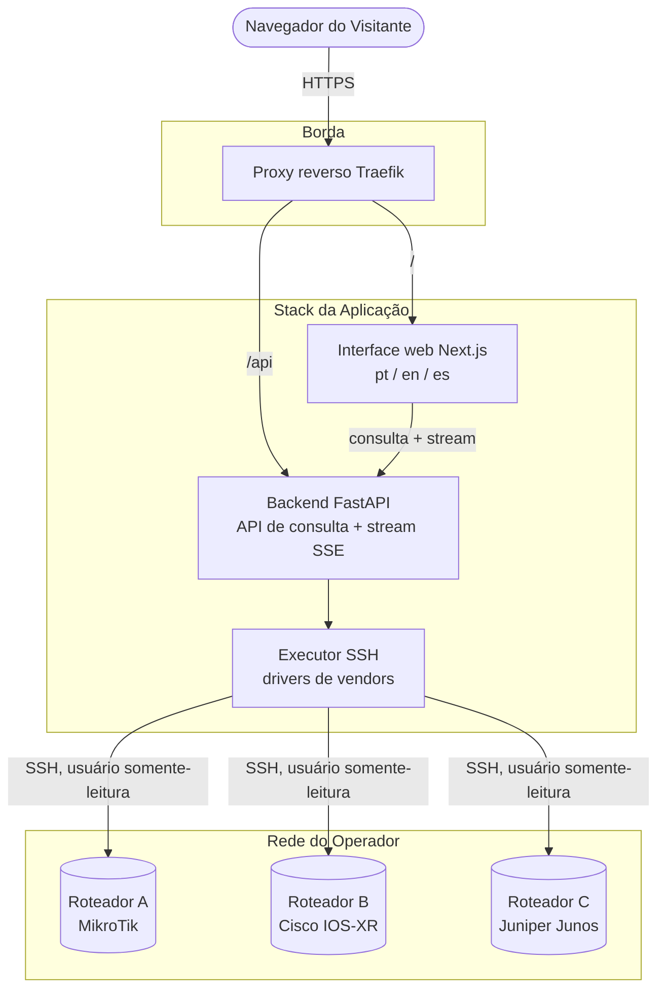

<!-- lint: allow-non-english -->
# Looking Glass

Um Looking Glass multi-vendor auto-hospedável (self-hosted) para Provedores de Internet (ISPs) e operadores de rede.

## TL;DR

O Looking Glass permite que os visitantes executem diagnósticos somente-leitura (`ping`, `traceroute`,
consultas de rotas e BGP) em seus roteadores de produção diretamente de uma página web, em
português, inglês ou espanhol. Você descreve seus roteadores em um arquivo de configuração,
o backend abre uma sessão SSH somente-leitura por consulta e o resultado é transmitido via stream
ao navegador. É software livre (Apache-2.0) e fornecido como uma stack Docker Compose: execute
`docker compose up -d` e seu Looking Glass estará no ar.

> **Status: pré-alfa.** Nada está pronto para uso em produção ainda. O repositório contém
> atualmente as regras do projeto, o padrão de documentação e as decisões arquiteturais.
> Acompanhe os milestones para conferir o progresso.

## Por que outro Looking Glass?

A maioria das ferramentas existentes assume um único vendor, expõe caixas de comando livres estilo shell
para a Internet, ou está abandonada há anos. Este projeto foca no mix de rede que os provedores regionais
realmente operam — MikroTik, Huawei, Datacom, Cisco, Juniper, Nokia, Arista, FRR/BIRD — e trata o endpoint
público pelo que ele de fato é: uma entrada não confiável voltada para as proximidades de um roteador de produção.

## Princípios de Design

1. **O roteador é sagrado.** O backend NUNCA constrói comandos concatenando entrada bruta do usuário.
   Cada consulta é uma requisição tipada mapeada para um template específico por vendor com argumentos estritamente validados.
2. **Somente-leitura por contrato.** Usuários de menor privilégio documentados por vendor; o executor
   recusa sumariamente qualquer instrução fora do catálogo de comandos permitidos.
3. **Público significa hostil.** Rate limiting, limites de concorrência por roteador, timeouts de execução
   e CAPTCHA opcional fazem parte do núcleo da aplicação, não são recursos secundários.
4. **Auto-hospedagem sem fricção (boring).** Um único arquivo Compose, um `.env`, imagens de contêiner publicadas,
   sem necessidade de etapas de build no servidor do operador.
5. **Cada comportamento é configurável, com padrão seguro.** Qualquer funcionalidade com exposição para o mundo
   externo inicia desabilitada por padrão.

## Arquitetura

## Documentação

Toda a documentação reside em [`docs/`](docs/) e é escrita primariamente em inglês seguindo o
[padrão de documentação](docs/process/documentation-standard.md).

| Documento | Objetivo |
|---|---|
| [Visão geral da arquitetura](docs/architecture/overview.md) | Como os componentes se conectam |
| [Versionamento e lançamentos](docs/process/versioning-and-releases.md) | Como merges se tornam releases oficiais |
| [Padrão de documentação](docs/process/documentation-standard.md) | Regras obrigatórias que todo documento DEVE seguir |
| [Decisões arquiteturais](docs/adr/) | Por que a stack técnica foi desenhada dessa forma |
| [Guia de contribuição](CONTRIBUTING.md) | Regras para issues, branches, commits e revisões de código |
| [Política de segurança](SECURITY.md) | Como reportar vulnerabilidades de forma responsável |

## Licença

[Apache License 2.0](LICENSE).
