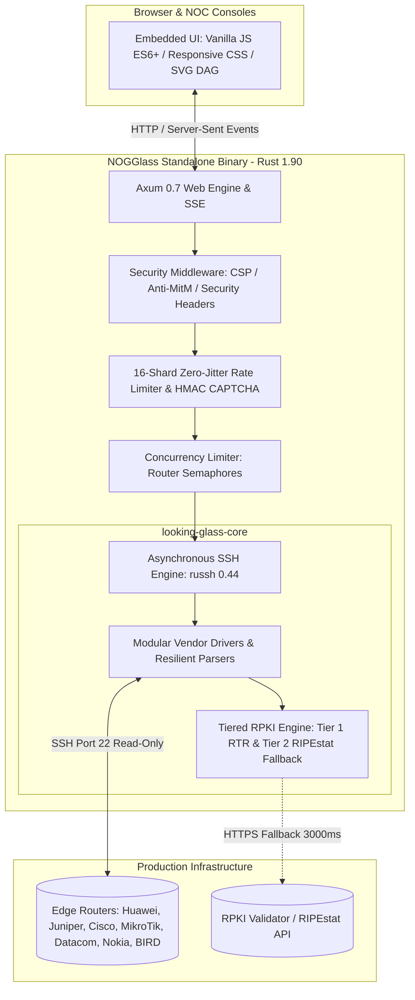

# Technology Stack

## TL;DR

NOGGlass is a single, self-contained binary written in Rust 1.90. It leverages Axum 0.7 and Tokio for asynchronous HTTP/SSE, `russh` for direct non-blocking SSH router transport, `ring` for constant-time cryptographic HMAC verification, and embedded Vanilla JS/CSS with an in-house topological DAG engine for SVG AS-Path graph rendering. The runtime footprint is under 35 MB of RAM and packages into a minimal Alpine Linux OCI container.

---

## Architecture Overview

---

## 1. Programming Language & Core Runtime

- **Language:** **Rust 1.90.0** (Edition 2021, MSRV 1.80).
- **Asynchronous Runtime:** **Tokio 1.x** (`rt-multi-thread`, `sync`, `time`, `macros`, `net`, `io-util`, `signal`).
- **Memory Safety & Footprint:** Zero garbage collection pauses, deterministic memory deallocation, and an idle production memory footprint below 35 MB of RSS.
- **Type Safety & Injection Immunity:** Strong typing with `std::net::IpAddr`, `ipnet::IpNet`, and validated command arguments, guaranteeing compile-time immunity against command injection.

---

## 2. Web Framework & Asynchronous Streaming

- **HTTP Engine:** **Axum 0.7** built on top of `hyper` and `tower`.
- **Event Streaming:** Native **Server-Sent Events (SSE)** via `axum::response::sse::Event`, streaming command execution and diagnostic output line-by-line in real time.
- **Payload Handling & Deserialization:** **Serde 1.0** and **serde_json** for strict JSON parsing and schema validation.
- **Routing & Endpoints:** RESTful health endpoints (`/healthz`), telemetry (`/api/version`), router discovery (`/api/routers`), command catalogues (`/api/catalogue/:vendor`), and query execution (`POST /api/query/stream`).

---

## 3. SSH Transport & Network Communication

- **SSH Client:** **`russh` 0.44** (pure Rust SSH 2.0 client implementation integrated with Tokio).
- **Legacy Equipment Compatibility:** Explicitly compiled with the `"rsa"` feature, ensuring seamless key exchange with Huawei NE40E/NE8000 and legacy enterprise routers requiring `ssh-rsa`.
- **Anti-MitM Host Key Pinning:** Support for pinned host keys (`host_key` in `nogglass.toml`) using `HostKeyPolicy::Pinned`, preventing Man-in-the-Middle attacks on management networks.
- **Connection Lifecycle Management:** Per-vendor terminal pagination disabling (`screen-length 0 temporary`, `terminal length 0`), strict command timeouts (default 30s), and buffer exhaustion limits.

---

## 4. Cryptography & Application Security (AppSec)

- **Cryptographic Primitives:** **`ring` 0.17** providing FIPS-grade cryptographic operations.
- **Stateless CAPTCHA Engine:** HMAC-SHA256 verification using native constant-time `ring::hmac::verify`, accompanied by cryptographically secure random salts (16 hex chars via `rand::rngs::OsRng`) and an in-memory anti-replay cache (`used_captchas`).
- **HTTP Security Headers:** Defense-in-depth middleware enforcing strict `Content-Security-Policy`, `X-Frame-Options: DENY`, `X-Content-Type-Options: nosniff`, and `Referrer-Policy: strict-origin-when-cross-origin`.
- **Zero-Jitter Rate Limiting:** 16-shard hash-partitioned client storage (`[Mutex<HashMap<ClientKey, Bucket>>; 16]`) with lockless `try_lock()` background eviction, eliminating thread contention spikes.

---

## 5. BGP Analysis & Tiered RPKI Engine

- **Structured BGP Modeling:** Normalization of heterogeneous CLI output into strongly typed `BgpPath` records (Best Path, Next-Hop, AS-Path sequence, Local Preference, MED, Weight, Origin, and BGP Communities).
- **Tier 1 Native RPKI:** Real-time extraction of RPKI validation states directly from the router control plane (RTR sessions on Huawei VRP, JunOS, Cisco).
- **Tier 2 Fallback Validation:** Asynchronous fallback against RIPEstat or local validators (Routinator) with a 3000ms timeout and in-memory LRU cache (`cache_ttl_secs = 3600`).
- **Cache Poisoning Shield:** Transient lookup failures, timeouts, and network errors (`NotChecked`) are strictly excluded from long-term caching.

---

## 6. Vendor Drivers & Parsers

NOGGlass features a modular driver architecture through the `VendorDriver` trait:
- **Huawei VRP:** Tabular parsing, multi-line status legend tolerance, asdot 32-bit ASN decoding, CLI truncation cleanup, and native detail block RPKI extraction.
- **Juniper JunOS:** Structured native JSON deserialization (`show route ... | display json`).
- **Cisco Systems:** IOS-XR (with JSON pipeline) and IOS-XE classic tabular parser.
- **MikroTik RouterOS:** Key-value property parsing across RouterOS v6 and v7.
- **Datacom DmOS:** DM4000 and DM4200 series tabular extraction.
- **Nokia SR OS:** TiMOS classic CLI and MD-CLI parsers.
- **BIRD 2:** Internet Routing Daemon CLI parser.
- **Mock Driver:** Synthetic in-memory test driver for automated CI and demonstrations.

---

## 7. Frontend, UI Design & Visualization

- **Distribution Model:** Single binary with all frontend templates and static assets compiled directly into binary read-only sections via `include_str!` and `include_bytes!`.
- **Vanilla Modern JavaScript:** Lightweight ES6+ without heavy frameworks (React, Vue, Angular) or external runtime dependencies.
- **Theme System & Design Tokens:** Pure Vanilla CSS supporting dark Cyberpunk NOC Mode and daylight Clean Light Mode via CSS custom properties and `data-theme`.
- **Topological AS-Path DAG Engine:** In-house Bellman-Ford longest-path DAG relaxation rendering SVG graphs from the local router node, guaranteeing direct peers align in parallel on Column 1 and paths flow left-to-right without visual overlap.
- **Operational Route Highlighting:** Dynamic parser (`highlightBgpRaw`) that colorizes active FIB routes in emerald green (`var(--accent-best)`) and adds `[★ ROTA ATIVA]` badges in raw CLI output.

---

## 8. Packaging, Containerization & CI/CD

- **Containerization:** Multi-stage `Dockerfile` based on `rust:1.90-alpine` with Zig cross-compiler toolchain, yielding a minimal runtime container on **Alpine Linux 3.21** (~25–30 MB).
- **System Integration:** Systemd hardened service configuration with unprivileged execution (`ProtectSystem=strict`, `ProtectHome=true`, `NoNewPrivileges=true`).
- **Documentation Engine:** **MkDocs Material** containerized via `Dockerfile.docs`.
- **Release Automation:** Automated changelog generation and SemVer management powered by **Google Release-Please**.
- **Quality Gates:** Comprehensive test suite (`cargo test --workspace`) and automated documentation linters enforcing RFC standards and Mermaid diagrams (`scripts/check-docs.sh`).
