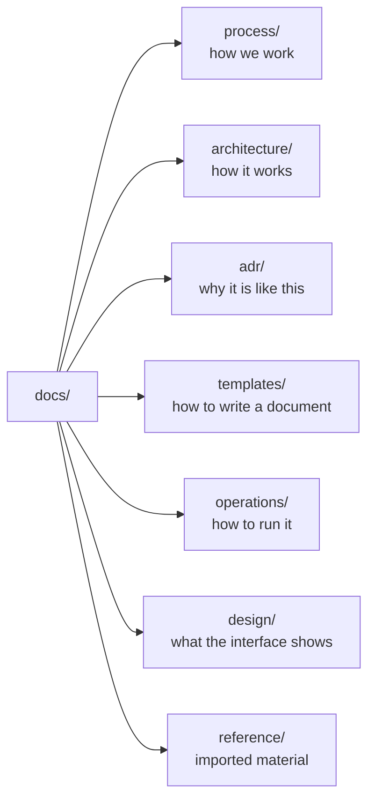

# Documentation index

## TL;DR

Everything the project decided, and why, lives here. Documents are written in
English and follow the [documentation standard](process/documentation-standard.md).
Start with the architecture overview, then read the ADRs for the reasoning.

## 5W2H

| Question | Answer |
|---|---|
| **What** | The index of the Looking Glass documentation set. |
| **Why** | So a new contributor finds the right document without reading the whole tree. |
| **Who** | Maintainers, contributors and operators self-hosting the project. |
| **Where** | `docs/` in this repository; rendered on GitHub. |
| **When** | Updated in the same pull request that adds or removes a document. |
| **How** | One directory per purpose, listed in the tables below. |
| **How much** | No cost; documentation is plain Markdown in the repository. |

## Structure

## Process

| Document | Purpose |
|---|---|
| [Documentation standard](process/documentation-standard.md) | Rules every document MUST follow |
| [Versioning and releases](process/versioning-and-releases.md) | How a merge becomes a tagged release |

## Architecture

| Document | Purpose |
|---|---|
| [Overview](architecture/overview.md) | Components, request flow and trust boundaries |

## Operations

| Document | Purpose |
|---|---|
| [Deployment](operations/deployment.md) | Installing, configuring, exposing and upgrading an instance |
| [Read-only router users](operations/router-users.md) | The account NOGGlass authenticates with, per vendor |

## Design

| Document | Purpose |
|---|---|
| [Interface brief](design/interface-brief.md) | What the product does, every screen, every state, and the rules a design cannot break |
| [Captured payloads](design/payloads/) | Real API responses, one per state, to design and check against |

## Decisions

Architecture Decision Records live in [`adr/`](adr/). Each ADR states the
context, the decision and the consequences, and is immutable once accepted: a
change of mind becomes a new ADR that supersedes the old one.

## Templates

Copy [`templates/document-template.md`](templates/document-template.md) when
starting a new document. It already contains every section the linter requires.
