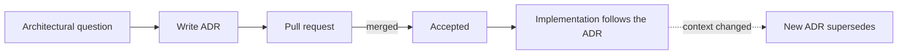

# ADR-0001 — Record architecture decisions

- **Status:** Accepted
- **Date:** 2026-09-17
- **Deciders:** André Dias, Marcelo Gondim

## TL;DR

Architectural decisions MUST be recorded as numbered ADRs in `docs/adr/`. Two
maintainers working asynchronously cannot rely on memory or chat history to know
why something was built a certain way.

## 5W2H

| Question | Answer |
|---|---|
| **What** | Adopting Architecture Decision Records for this project. |
| **Why** | To stop re-deciding settled questions and to let new contributors understand the reasoning. |
| **Who** | Both maintainers; any contributor MAY propose one. |
| **Where** | `docs/adr/`, indexed in `docs/adr/README.md`. |
| **When** | From the first commit onwards. |
| **How** | One Markdown file per decision, immutable after merge. |
| **How much** | Minutes per decision; no tooling cost. |

## Context

The project is built by two maintainers in different time zones of availability,
with an AI assistant writing part of the code. Decisions made in chat are lost.
A self-hosted product also needs its constraints explained to the operators who
deploy it.

## Decision

The project SHALL keep ADRs under `docs/adr/`, numbered sequentially, with the
sections Status, Context, Decision and Consequences plus the standard TL;DR and
5W2H. An ADR MUST be merged before or with the pull request that implements it.
Accepted ADRs MUST NOT be edited except to change Status to `Superseded by
ADR-XXXX`.

## Consequences

- Every significant decision costs an extra document, which slows the first day
  and saves the third month.
- The decision log doubles as onboarding material and as operator documentation.
- Superseded ADRs stay in the tree, so history shows what was tried.
