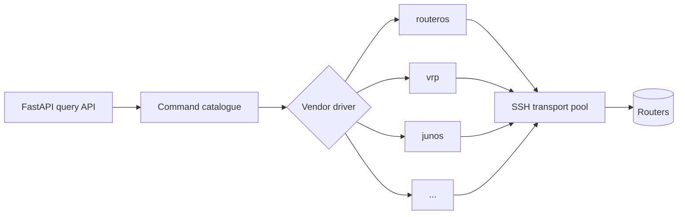

# ADR-0002 — FastAPI backend with direct SSH to routers

- **Status:** Superseded by [ADR-0007](0007-unified-rust-architecture-and-drivers.md)
- **Date:** 2026-09-17
- **Deciders:** André Dias, Marcelo Gondim

## TL;DR

> **Superseded.** The language decision went to Rust (ADR-0005) and the
> architecture to a single binary with an embedded interface (ADR-0007). The
> deferral of RPKI, of the topology graph and of native vendor APIs was already
> reversed by ADR-0006. What survives from this document, and is carried by
> ADR-0007: direct SSH to routers with a read-only user, a per-vendor driver
> abstraction, and an interface that never talks to a router.

The backend is Python 3.12 with FastAPI, and it reaches routers by opening an
SSH session directly from the container, using a read-only user. No per-POP
agents and no BGP daemon in the first releases. The frontend is Next.js and
talks only to the backend API.

## 5W2H

| Question | Answer |
|---|---|
| **What** | The runtime stack and the router access method. |
| **Why** | The mature multi-vendor libraries are Python, and direct SSH is the only method every target vendor supports today. |
| **Who** | Both maintainers; affects every contributor. |
| **Where** | `backend/` (FastAPI), `frontend/` (Next.js). |
| **When** | Decided before the first line of product code. |
| **How** | `scrapli`/`netmiko` drivers behind a vendor abstraction, SSE streaming to the browser. |
| **How much** | One SSH session per query; target of 50 concurrent queries on 2 vCPU. |

## Context

The supported vendors are MikroTik RouterOS, Huawei VRP, Datacom DmOS, Cisco
IOS-XR/IOS-XE/NX-OS, Juniper Junos, Nokia SR OS, Arista EOS and Linux stacks
(FRR, BIRD). Three access methods were considered: direct SSH, per-POP agents,
and native APIs such as NETCONF, RESTCONF or gNMI.

Native APIs give structured output but coverage is uneven and the effort per
vendor is high. Per-POP agents solve segmented networks but ask the operator to
deploy and maintain extra software, which contradicts the goal of a boring
installation. SSH with a read-only user is available on every target vendor and
is what network engineers already grant.

Language choice follows the ecosystem: `scrapli`, `netmiko`, `napalm`, `ttp` and
`textfsm` are Python, and a Node backend would need a Python sidecar anyway.

## Decision

1. The backend SHALL be Python 3.12 with FastAPI, serving a typed query API and
   streaming output over Server-Sent Events.
2. Router access SHALL be a direct SSH session opened by the backend, with a
   read-only user provided by the operator.
3. A vendor driver SHALL declare the command template per query type and the
   post-processing of its output. Adding a vendor MUST NOT change the API layer.
4. The frontend SHALL be Next.js with TypeScript and MUST NOT talk to routers.
5. Per-POP agents, native APIs and a BGP daemon as a lookup source remain
   possible later and MUST each get their own ADR.

## Consequences

- The server hosting the Looking Glass MUST have IP reachability and SSH access
  to every configured router, which is a real constraint in segmented networks.
- Output arrives as text, so parsing into tables is per-vendor work and will lag
  behind raw output support.
- SSH session setup costs hundreds of milliseconds; a connection pool and
  per-router concurrency caps are REQUIRED to keep routers safe.
- Python and Node both exist in the stack, so CI runs two toolchains.
