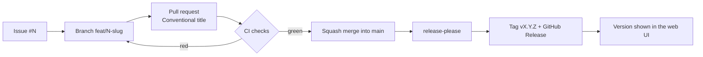

# ADR-0003 — Conventional Commits and automated releases

- **Status:** Accepted; the release scope is superseded by [ADR-0014](0014-release-every-change-with-patch-prereleases.md)
- **Date:** 2026-09-17
- **Deciders:** André Dias, Marcelo Gondim

## TL;DR

> **Partly superseded.** ADR-0014 changed what gets released: every merge is now
> tagged and released, documentation included, and patch releases are published
> as pre-releases. Everything else below still holds.

Pull request titles follow Conventional Commits, merges are squash-only, and
`release-please` turns them into version bumps, a changelog, a tag and a GitHub
Release without human editing. Work starts from an issue and happens on a branch
named after that issue.

## 5W2H

| Question | Answer |
|---|---|
| **What** | The rules that connect an issue to a released version. |
| **Why** | Operators need reliable version numbers and changelogs; maintainers need to not write them by hand. |
| **Who** | Enforced by CI on every contributor. |
| **Where** | `.github/workflows/`, `CONTRIBUTING.md`, branch protection on `main`. |
| **When** | Active from the first pull request. |
| **How** | Conventional Commits, squash merge, `release-please`, SemVer. |
| **How much** | Free on GitHub Actions; a few seconds of CI per pull request. |

## Context

The alternatives were manual version bumping through a script, as done in an
earlier project by the same maintainers, and date-based versioning. Manual
bumping produces merge conflicts and forgotten bumps. CalVer does not tell a
self-hosting operator whether an upgrade breaks their configuration.

Squash merging is what makes automation reliable: one commit per pull request in
`main`, so the pull request title is the unit the tooling reads.

## Decision

1. Every feature or fix SHALL start as a GitHub issue.
2. Work SHALL happen on a branch named `<type>/<issue-number>-<slug>`, one
   branch per issue. Working directly on `main` is impossible by protection.
3. Pull request titles MUST follow Conventional Commits, and bodies MUST close
   their issue.
4. Merges into `main` MUST be squash merges.
5. `release-please` SHALL own `version.txt`, `CHANGELOG.md`, tags and releases.
6. The running version MUST be visible in the web footer, on an About page and
   at `GET /api/version`.

## Consequences

- A badly titled pull request fails CI, which is annoying exactly once per
  contributor.
- Commit history in `main` is one line per feature, readable as a changelog.
- Releases are frequent and small, which is the point: an operator can always
  pin an exact version.
- Emergency fixes still go through a pull request; there is no bypass, and the
  maintainers accepted that cost.
