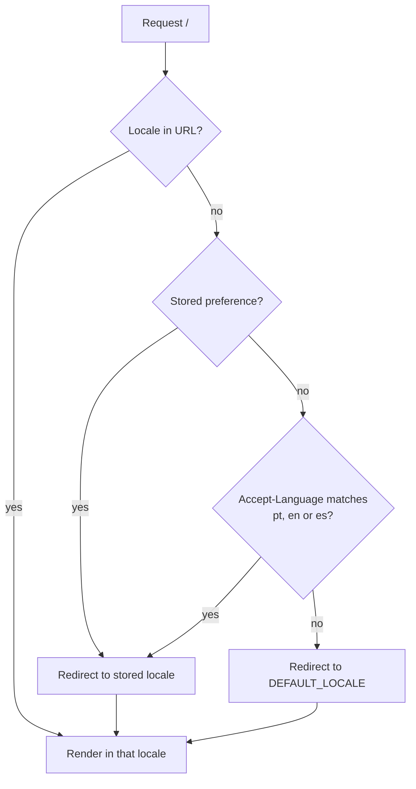

# ADR-0004 — Web interface internationalisation by URL prefix

- **Status:** Superseded in delivery by [ADR-0007](0007-unified-rust-architecture-and-drivers.md); the locale rules below remain in force
- **Date:** 2026-09-17
- **Deciders:** André Dias, Marcelo Gondim

## TL;DR

> **Delivery superseded.** The interface is no longer a Next.js container: it is
> embedded in the Rust binary (ADR-0007, section 4). Everything this document
> says about locales — the three languages, the URL prefix, the fallback chain,
> the parity check and what MUST NOT be translated — still applies, and is
> restated in ADR-0007.

The web interface ships in Portuguese, English and Spanish, selected by a URL
prefix (`/pt`, `/en`, `/es`). The first visit is redirected using
`Accept-Language`, the operator sets the fallback language, and a CI check fails
when a translation key exists in one language but not the others. Router output
is never translated.

## 5W2H

| Question | Answer |
|---|---|
| **What** | How the interface serves three languages. |
| **Why** | The target audience is Latin American and international ISPs; a shareable link MUST keep its language. |
| **Who** | Frontend contributors and translators. |
| **Where** | `frontend/messages/{pt-BR,en,es}.json`, routing under `/[locale]`. |
| **When** | Required for the `0.1.0` interface. |
| **How** | Next.js App Router with locale segment; keys validated by `scripts/check-i18n.sh`. |
| **How much** | Three files to keep in sync; the parity check makes drift visible immediately. |

## Context

A cookie-based selector keeps URLs clean but makes links unshareable and
invisible to search engines. Separate deployments per language would multiply
operations. Prefix routing is the common approach and costs one path segment.

## Decision

1. Supported locales SHALL be `pt-BR`, `en` and `es`, served under `/pt`, `/en`
   and `/es`.
2. A request without a locale prefix SHALL be redirected using `Accept-Language`,
   falling back to the operator's `DEFAULT_LOCALE`, itself defaulting to `en`.
3. The chosen locale SHOULD be remembered for later visits, and the selector
   MUST always allow an explicit override.
4. User-facing strings MUST live in translation files. Hard-coded strings MUST
   NOT be merged.
5. Router output, router names, POP names and technical identifiers MUST NOT be
   translated.
6. CI MUST fail when the key sets of the three files differ.
7. English is the source language; a missing translation falls back to English
   rather than showing a raw key.

## Consequences

- Every user-facing pull request touches three JSON files, and CI will say so.
- Portuguese and Spanish translations of technical networking terms need review
  by a network engineer, not a literal translation.
- Documentation stays English-only; translating `docs/` is explicitly out of
  scope, with translated copies allowed as `*.pt-BR.md` if someone wants them.
