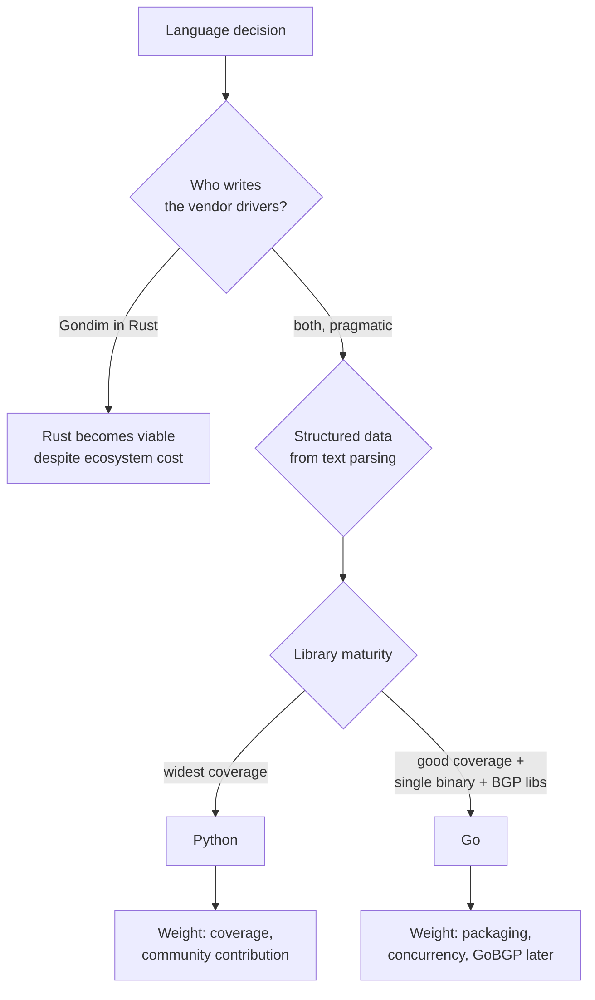

# ADR-0005 — Backend implementation language

- **Status:** Proposed
- **Date:** 2026-09-17
- **Deciders:** André Dias, Marcelo Gondim

## TL;DR

Three candidates: Go with `scrapligo`, Python with `scrapli`/`netmiko`, and Rust
as in the existing NOGGlass prototype. The work that dominates this project is
turning multi-vendor BGP output into a structured path model, so the decision
SHOULD be driven by the maturity of the device-interaction ecosystem and by who
maintains the drivers. Go is the RECOMMENDED option; Python is the safe one;
Rust costs every parser from scratch. This ADR stays `Proposed` until both
maintainers agree, and a follow-up pull request flips it to `Accepted`.

## 5W2H

| Question | Answer |
|---|---|
| **What** | The language and library stack of the backend that talks to routers. |
| **Why** | A Rust prototype exists and ADR-0002 committed to Python; the conflict MUST be resolved before product code is written. |
| **Who** | Both maintainers decide; every future contributor lives with it. |
| **Where** | `backend/` in this repository. The frontend stays Next.js, per ADR-0004. |
| **When** | Before the first driver is merged for the `0.1.0` milestone. |
| **How** | Weighted criteria plus the same Huawei VRP lookup implemented three times, below. |
| **How much** | Roughly one week of rework if the decision is reversed after the first three drivers exist. |

## Context

### What the product actually needs

The differentiating feature is not "run a command on a router". It is
**normalised, structured BGP data**: every path for a prefix, with next hop,
AS path, communities, local preference, MED, origin and best-path flag, plus
RPKI state — consistent across vendors, so a topology graph can be drawn from
it.

That means the dominant cost is per-vendor data extraction:

- **Structured output available:** Juniper Junos (`| display json`), Arista EOS
  (eAPI), Cisco NX-OS (`| json`), Cisco IOS-XR (recent releases), FRR
  (`vtysh -c "... json"`).
- **Text parsing REQUIRED:** Huawei VRP, Datacom DmOS, MikroTik RouterOS
  (its REST API does not expose BGP tables usefully), BIRD, older Cisco IOS-XE.

The first vendor for `0.1.0` is Huawei VRP, which sits in the harder group by
design: if the architecture survives text parsing, JSON vendors are easy.

### Ecosystem per candidate

| Capability | Go | Python | Rust |
|---|---|---|---|
| Multi-vendor CLI driver | `scrapligo`, with YAML platform definitions embedded, including `huawei_vrp` and `mikrotik_routeros` | `scrapli`, `scrapli_community`, `netmiko`, `napalm` — the widest coverage that exists | none; `russh`/`ssh2` give a raw session only |
| CLI output parsing | `gotextfsm`, already a `scrapligo` dependency, runs `ntc-templates` | `textfsm`, `ttp`, `ntc-templates` | hand-written parsers or `nom` |
| NETCONF / gNMI | `scrapligo` NETCONF, `gnmic` | `ncclient`, `scrapli_netconf` | immature |
| BGP daemon as a library | `gobgp`, `bio-rd` | none usable | immature |
| Datacom DmOS | custom driver REQUIRED | custom driver REQUIRED | custom driver REQUIRED |
| Packaging | single static binary, `scratch` image around 15 MB | interpreter plus dependencies, image around 150 MB | single static binary |
| Many concurrent SSH sessions | goroutines, native | `asyncio`, workable but the GIL constrains parsing | native, fearless concurrency |
| Outside contribution from the ISP community | medium | highest — the audience already writes Python and shell | low |

The `scrapli` family is converging on a shared core (`libscrapli`), with the Go
flavour as `scrapligo` and the Python flavour as `scrapli2`. Choosing Go or
Python therefore does not bet on a dead-end library.

### What the NOGGlass prototype contributes

The prototype, written in Rust for one of the maintainers, is adopted as
**product design and data model** regardless of the language decision:

- AS-PATH topology graph as the primary result view, with the best path drawn
  solid and alternatives dashed.
- RPKI validation state shown next to the origin AS.
- Panels for session telemetry, the detailed route table and decoded BGP
  communities.
- A mock driver, so the interface can be demonstrated and tested without a
  router. This project SHALL keep a mock driver for CI and for the public demo.
- Typed parsing and strict prefix validation as the defence against command
  injection, which matches the rule already stated in `CLAUDE.md`.
- Documentation addresses drawn only from RFC 5737 and RFC 6996 ranges. This
  repository SHALL follow the same rule.

What does not carry over automatically is the delivery model: the prototype
embeds its HTML in the binary, while ADR-0004 keeps a separate Next.js frontend
for the three languages. That decision stands.

## Decision criteria



| Criterion | Weight | Go | Python | Rust |
|---|---|---|---|---|
| Vendor library maturity | high | good | best | none |
| Text parsing tooling | high | good | best | none |
| Effort for Huawei VRP, the first vendor | high | template | template | from scratch |
| Operator packaging | medium | best | acceptable | best |
| Concurrency under public load | medium | best | acceptable | best |
| Outside contribution | medium | medium | best | low |
| Future BGP collector | low | best | poor | poor |
| Maintainer familiarity | high | to be filled by the maintainers | to be filled | to be filled |

## The same driver, three times

Each snippet performs the `0.1.0` core operation: ask a Huawei VRP router for
the BGP paths of one prefix and return a typed result. Error handling is
abbreviated; everything else is representative.

### Go, with scrapligo

```go
// vrp.go — Huawei VRP driver.
func (d *VRPDriver) BGPRoute(ctx context.Context, prefix netip.Prefix) ([]BGPPath, error) {
    p, err := platform.NewPlatform("huawei_vrp", d.host,
        options.WithAuthUsername(d.user),
        options.WithAuthPassword(d.pass),
        options.WithTransportType("system"),
    )
    if err != nil {
        return nil, err
    }
    conn, err := p.GetNetworkDriver()
    if err != nil {
        return nil, err
    }
    if err := conn.Open(); err != nil {
        return nil, err
    }
    defer conn.Close()

    // The prefix is a netip.Prefix, so nothing user-typed reaches the CLI.
    cmd := fmt.Sprintf("display bgp routing-table %s %d", prefix.Addr(), prefix.Bits())
    resp, err := conn.SendCommand(cmd)
    if err != nil {
        return nil, err
    }
    records, err := resp.TextFsmParse(vrpBGPRouteTemplate) // ntc-templates
    if err != nil {
        return nil, err
    }
    return toBGPPaths(records), nil
}
```

### Python, with scrapli

```python
# vrp.py — Huawei VRP driver.
async def bgp_route(self, prefix: IPv4Network | IPv6Network) -> list[BGPPath]:
    async with AsyncScrapli(
        host=self.host,
        auth_username=self.user,
        auth_password=self.password,
        platform="huawei_vrp",          # scrapli_community definition
        transport="asyncssh",
    ) as conn:
        # prefix is an ipaddress object: no user string reaches the CLI.
        response = await conn.send_command(
            f"display bgp routing-table {prefix.network_address} {prefix.prefixlen}"
        )
        records = response.textfsm_parse_output()   # ntc-templates
    return [BGPPath.model_validate(r) for r in records]
```

### Rust, as in the prototype

```rust
// vrp.rs — Huawei VRP driver. No vendor abstraction exists, so the
// session handling and the parser are both ours to write and to maintain.
impl RouterDriver for VrpDriver {
    async fn bgp_route(&self, prefix: IpNet) -> Result<Vec<BgpPath>, DriverError> {
        let mut session = ssh::connect(&self.host, &self.user, &self.secret).await?;
        // VRP pages output by default and there is no library default for it.
        session.exec("screen-length 0 temporary").await?;
        let raw = session
            .exec(&format!("display bgp routing-table {} {}", prefix.addr(), prefix.prefix_len()))
            .await?;
        session.close().await?;
        // Hand-written parser: VRP prints a fixed-width table whose columns
        // shift between releases, which is precisely what TextFSM templates
        // in the other two ecosystems already solve for us.
        parse_vrp_bgp_table(&raw)
    }
}
```

The Rust snippet is not longer by accident. `ssh::connect`, paging control,
prompt detection, and `parse_vrp_bgp_table` are all code this project would own
for every vendor, where Go and Python inherit them from a maintained library.

## Decision

**Pending.** The options are:

1. **Go with `scrapligo`** — RECOMMENDED. Single binary, native concurrency,
   embedded YAML platform definitions for the priority vendors, `ntc-templates`
   through `gotextfsm`, and `gobgp` available if a collector is added later.
2. **Python with FastAPI** — keeps ADR-0002 unchanged. Widest vendor coverage
   and the easiest path for outside contributors from the ISP community.
3. **Rust** — reuses the prototype and the experience already paid for, at the
   cost of writing every transport and parser in the project.

The maintainers SHALL fill in the familiarity row of the criteria table and
record the choice by flipping this ADR to `Accepted` in a follow-up pull
request. Product code MUST NOT be merged before that.

## Consequences

- Whatever is chosen, the frontend stays Next.js (ADR-0004) and the data model
  stays the normalised BGP path model of ADR-0006.
- Choosing Go or Rust means Python tooling does not enter CI, and vice versa.
- Choosing Rust means budgeting explicit time per vendor for transport and
  parser work that the other two get for free.
- Reversing this decision after three drivers exist costs roughly a week.
