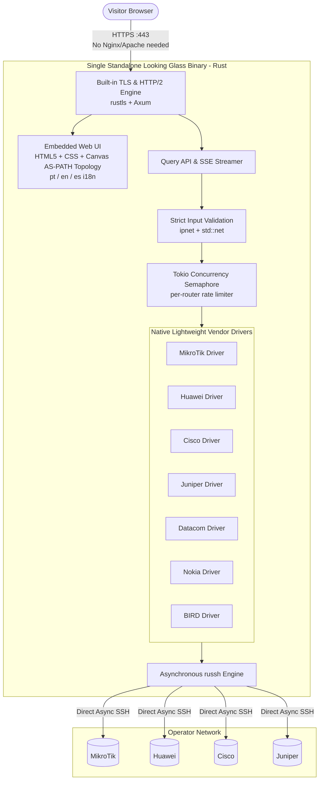

# ADR-0007 — End-to-end Rust architecture with embedded web UI and native vendor drivers

- **Status:** Proposed
- **Date:** 2026-09-17
- **Deciders:** André Dias, Marcelo Gondim

## TL;DR

Proposes an all-in-one, end-to-end Rust architecture that implements both the backend API
and the frontend UI in Rust, eliminating external web servers (Nginx, Apache, Traefik),
Node.js, and Python. Router communication replaces Netmiko with native asynchronous SSH (`russh`)
tailored strictly to read-only diagnostics, embedding UI assets directly into a single static
binary with built-in TLS, rate-limiting and under 35 MB of RAM footprint.

The key words "MUST", "MUST NOT", "REQUIRED", "SHALL", "SHALL NOT", "SHOULD", "SHOULD NOT",
"RECOMMENDED", "MAY" and "OPTIONAL" in this document are to be interpreted as described in
[RFC 2119](https://www.rfc-editor.org/rfc/rfc2119).

## 5W2H

| Question | Answer |
|---|---|
| **What** | Complete Rust stack (Axum HTTP/SSE server + embedded web UI + native SSH drivers). |
| **Why** | Eliminate intermediate web servers (Nginx/Apache), remove Node and Python runtimes, and maximize security. |
| **Who** | Maintainers, contributors, and ISP network operators. |
| **Where** | Implemented under `crates/looking-glass-core/` and the main service binary. |
| **When** | Proposed during the pre-alpha architecture decision phase. |
| **How** | Pure Rust using Axum, `rustls` (built-in HTTPS/TLS), embedded UI templates, and `russh` async drivers. |
| **How much** | Single static executable (~15-20 MB), RAM under 35 MB, zero external reverse proxy required. |

## Context

Previous documents considered a dual-runtime or multi-container architecture:
- ADR-0002 adopted Python (FastAPI) and Next.js, relying on Traefik as reverse proxy.
- ADR-0005 debated Python vs Go vs Rust for the backend, while keeping Next.js for frontend delivery.

In real-world ISP operations, managing multiple containers (Node.js for Next.js, Python for FastAPI,
plus Nginx, Apache2 or Traefik for reverse proxy and TLS termination) creates operational friction:
1. **Container & Web Server Sprawl:** Running separate containers for frontend, backend, and reverse proxy
   consumes 500 MB to 1.5 GB of RAM just for orchestration and idle runtimes.
2. **Reverse Proxy Redundancy:** Modern Rust HTTP engines (such as **Axum** on top of **Hyper** and **`rustls`**)
   provide enterprise-grade, memory-safe HTTP/1.1, HTTP/2, and native TLS termination. Requiring Nginx or
   Apache in front of an Axum binary is unnecessary overhead for a dedicated appliance.
3. **The Netmiko Fallacy:** Netmiko's 10-year codebase is massive because it handles stateful write operations
   (`config term`, rollback, syntax checks, confirmation prompts). A Looking Glass executes only
   **read-only commands** (`ping`, `traceroute`, `show route`, `show bgp`). We only need the vendor-specific
   pagination commands and prompt regular expressions.

## Decision

1. **100% Rust Backend & Frontend Delivery:**
   - The entire Looking Glass application SHALL be compiled into a **single static binary** written in Rust.
   - The HTTP and Server-Sent Events (SSE) server SHALL use **Axum** and **Tokio**.
   - The web interface (HTML5, CSS Glassmorphism, Canvas 2D AS-PATH topology, and multilingual i18n)
     SHALL be embedded directly into the binary using compiled templates (e.g., `askama`) or `include_str!`.
   - Node.js, Next.js build steps, and Python runtimes SHALL NOT exist in the final deployment.

2. **No Mandatory External Web Server (No Nginx / Apache Required):**
   - The binary SHALL be capable of serving HTTP/HTTPS directly on ports 80/443 with built-in TLS termination
     using **`rustls`** (or Let's Encrypt / ACME integration).
   - Operators MAY still place an external proxy (Cloudflare, Traefik, HAProxy) in front if their corporate policy
     dictates, but the Looking Glass MUST function standalone with zero external dependencies.

3. **Rebuilding What We Need from Netmiko in Native Rust:**
   - Router SSH communication SHALL use **`russh`** (asynchronous, memory-safe SSH in pure Rust).
   - The vendor-specific intelligence of Netmiko (terminal pagination disabling, prompt regex detection,
     and command formatting) SHALL be ported directly into Rust modules implementing the `VendorDriver` trait.
   - The initial core drivers SHALL include:
     - `mikrotik`: MikroTik RouterOS v6 / v7
     - `huawei`: Huawei VRP (e.g. `screen-length 0 temporary`)
     - `cisco`: Cisco IOS-XR and IOS-XE (`terminal length 0`)
     - `juniper`: Juniper Junos (`set cli screen-length 0`, optional `| display json`)
     - `datacom`: Datacom DmOS (`terminal length 0`)
     - `nokia`: Nokia SR OS (`environment no more`)
     - `bird`: BIRD 2 (via Unix Domain Socket / SSH)

## Consequences

### Positive
- **Truly Boring Infrastructure:** One executable, one config file, zero external runtimes (no Node, no Python, no Nginx, no Apache).
- **Extreme Efficiency:** Total RAM footprint under 35 MB under heavy load. Boots in milliseconds.
- **Enterprise Security:** Memory-safety by design. Immunity to Python dependency supply-chain attacks and zero shell-escape injection vulnerabilities.
- **Direct Streaming:** Real-time Server-Sent Events (SSE) fed directly from router SSH buffers to the visitor browser with sub-millisecond dispatch latency.

### Negative / Trade-offs
- The project maintainers write and maintain the Rust vendor drivers and web templates rather than relying on off-the-shelf Python libraries.
- Adding a new vendor requires implementing the Rust `VendorDriver` trait instead of dropping in an unvetted Python script.
