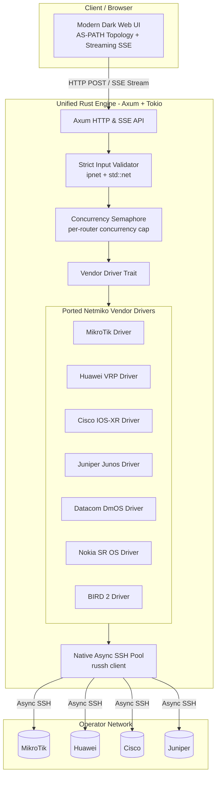

# ADR-0007 — Unified Rust architecture for backend, frontend and lightweight multi-vendor drivers

- **Status:** Proposed
- **Date:** 2026-09-17
- **Deciders:** André Dias, Marcelo Gondim

## TL;DR

Proposes superseding the dual-stack architecture (FastAPI Python backend + Next.js Node frontend)
with a unified, single-binary Rust architecture using Axum and native async SSH (`russh`).
Vendor-specific terminal behavior (pagination disabling, prompt regexes and command templates)
is ported from Netmiko directly into lightweight Rust modules, dropping RAM usage from ~1 GB to
under 35 MB and eliminating runtime dependencies.

The key words "MUST", "MUST NOT", "REQUIRED", "SHALL", "SHALL NOT", "SHOULD", "SHOULD NOT",
"RECOMMENDED", "MAY" and "OPTIONAL" in this document are to be interpreted as described in
[RFC 2119](https://www.rfc-editor.org/rfc/rfc2119).

## 5W2H

| Question | Answer |
|---|---|
| **What** | A unified Rust stack (Axum + native SSH driver + embedded UI) replacing FastAPI and Next.js. |
| **Why** | Eliminate massive memory overhead, remove dual runtime dependencies (Node + Python), and prevent command injection at compile-time. |
| **Who** | Maintainers and contributors. |
| **Where** | `crates/looking-glass-core/` and `src/vendors/`. |
| **When** | Proposed during the pre-alpha architecture validation phase. |
| **How** | Direct async SSH with `russh` and Tokio, porting Netmiko vendor prompt/pagination rules into zero-cost Rust abstractions. |
| **How much** | Footprint reduced from ~1 GB to under 35 MB RAM; single static binary deploy (~15 MB). |

## Context

ADR-0002 accepted Python 3.12 (FastAPI) for the backend based on the ecosystem maturity of Netmiko,
and Next.js for the frontend. However, analyzing the actual requirements of a telecom Looking Glass
reveals that:

1. A Looking Glass performs strictly **read-only diagnostics** (`ping`, `traceroute`, `show route`, `show bgp`).
2. Netmiko's large size stems from transactional configuration management (`config term`, rollback, commit,
   interactive confirmation dialogs) which a Looking Glass MUST NOT execute.
3. The mature vendor intelligence in Netmiko consists primarily of:
   - Terminal pagination disable commands (e.g., `screen-length 0 temporary`, `terminal length 0`).
   - Regular expressions identifying prompt boundaries (`check_prompt`).
   - Command templates mapping query types to vendor syntax.
4. The Python + Node stack requires maintaining two language runtimes, multi-stage Docker builds,
   and incurs high idle/peak memory usage under load.

## Decision

1. The core engine and backend SHALL be implemented in Rust using the **Axum** web framework on top of the **Tokio** async runtime.
2. The router SSH communication SHALL be handled natively using **`russh`** (pure asynchronous Rust SSH), eliminating Python and Paramiko.
3. Vendor-specific terminal mechanics (disable paging, prompt regex, command formats) SHALL be ported from Netmiko into dedicated vendor driver modules under a unified `VendorDriver` trait.
4. The initial core vendor modules SHALL cover:
   - `mikrotik`: MikroTik RouterOS v6 / v7
   - `huawei`: Huawei VRP
   - `cisco`: Cisco IOS-XR / IOS-XE
   - `juniper`: Juniper Junos (with optional native JSON output parsing)
   - `datacom`: Datacom DmOS
   - `nokia`: Nokia SR OS
   - `bird`: Linux BIRD 2 (via Unix Domain Socket / SSH)
5. The web frontend MAY be embedded directly into the Rust binary as static assets or compiled templates, yielding a single zero-dependency container or standalone binary.

## Consequences

### Positive
- **Dramatic Resource Reduction:** The entire stack operates comfortably under 35 MB of RAM on a minimal 1 vCPU / 512 MB VPS.
- **Single Artifact Deploy:** One static binary without Python or Node.js runtime baggage.
- **Safety by Construction:** Type-safe query parameters (`IpNetwork`, `IpAddr`, `AsNumber`) prevent command injection before any SSH session is opened.
- **Ultra-low latency streaming:** Native Tokio async channels feed Server-Sent Events directly as output chunks arrive from routers.

### Negative / Trade-offs
- Adding exotic or rare legacy vendors requires contributing a Rust driver struct rather than importing an existing Netmiko Python class.
- The development team must write and maintain Rust code for the core daemon instead of Python scripts.
