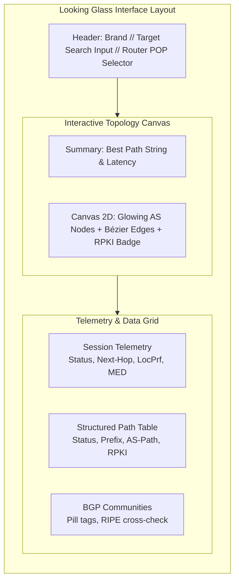

# ADR-0008 — Frontend design system, dark NOC aesthetic and interactive topology graph

- **Status:** Proposed
- **Date:** 2026-09-17
- **Deciders:** André Dias, Marcelo Gondim

## TL;DR

Establishes the visual identity, UI design system and interaction model for the Looking Glass,
adopting a high-contrast dark Network Operations Center (NOC) aesthetic with glassmorphic cards
and neon accents as visualised in `docs/assets/looking_glass_preview.jpg`. BGP queries MUST render
an interactive 2D AS-PATH topology graph with pulsating glow for the best path, alongside
telemetry side panels, live RPKI validation shields, and decoded community pill tags.

The key words "MUST", "MUST NOT", "REQUIRED", "SHALL", "SHALL NOT", "SHOULD", "SHOULD NOT",
"RECOMMENDED", "MAY" and "OPTIONAL" in this document are to be interpreted as described in
[RFC 2119](https://www.rfc-editor.org/rfc/rfc2119).

## 5W2H

| Question | Answer |
|---|---|
| **What** | The official frontend design system, colour palette, component hierarchy and graph visualization spec. |
| **Why** | Looking Glasses traditionally look like plain CLI terminals; network operators need instant visual recognition of routing paths, RPKI health and backup routes. |
| **Who** | Frontend contributors and operators evaluating the product. |
| **Where** | Web interface templates, CSS design tokens, Canvas/SVG topology renderers. |
| **When** | Baseline for all frontend implementations starting with the `0.1.0` milestone. |
| **How** | Dark theme, CSS glassmorphism, HTML5 Canvas/SVG vector graphs with Bézier curves, and neon glowing halos. |
| **How much** | Zero runtime cost; lightweight CSS tokens and client-side hardware-accelerated canvas. |

## Context

Previous documents defined data models and language choices:
- ADR-0004 established URL-based multilingual routing (`/pt`, `/en`, `/es`).
- ADR-0006 established that structured BGP data with a topology graph is the primary product differentiator.
- ADR-0007 proposed embedding this interface into the Rust engine without external web servers.

However, neither document specified the **visual identity and design tokens**. Without a documented standard,
interfaces easily devolve into generic tables or raw terminal dumps. The project committed to the visual
reference established in `docs/assets/looking_glass_preview.jpg`, which reflects a modern cyber-command NOC
aesthetic tailored for ISPs and network engineers.

## Decision

### 1. Visual Theme and Colour Palette (Design Tokens)

The user interface SHALL be dark-first by default. The design system SHALL adhere to the following tokens:

| Token | Hex Value | Semantic Purpose |
|---|---|---|
| `bg-base` | `#06090e` | Deep obsidian background with subtle coordinate grid pattern |
| `bg-card` | `rgba(13, 20, 31, 0.75)` | Translucent glassmorphic panels with `backdrop-filter: blur(16px)` |
| `border-card` | `rgba(30, 58, 86, 0.6)` | Subtle slate-cyan border defining telemetry cards |
| `accent-best` | `#00ff88` | Emerald neon glow for the active BGP Best Path and `RPKI: VALID` badge |
| `accent-backup` | `#00e5ff` | Electric cyan for alternative/backup BGP paths (dashed) |
| `accent-local` | `#ff5722` | Deep amber/orange halo denoting the local querying router / origin edge |
| `accent-transit` | `#c084fc` | Electric violet for Tier-1 and transit carrier ASNs |
| `text-main` | `#f8fafc` | Crisp high-contrast white for operational data |
| `text-muted` | `#94a3b8` | Muted slate for labels, metadata, and timestamps |

### 2. The 2D Interactive Topology Graph

For BGP route queries, the primary visualization MUST be an interactive vector graph:
1. **Nodes (ASNs):**
   - Each unique Autonomous System in the AS-PATH SHALL be rendered as a circular node with a glowing neon halo.
   - The node MUST display the AS Number in monospace (`Fira Code` / `JetBrains Mono`) and the resolved operator name beneath it.
   - The final destination node MUST display the target prefix and the RPKI shield badge (`✔ RPKI VALID` in neon green or `✖ RPKI INVALID` in neon red).
2. **Edges (Paths):**
   - **Best Path:** SHALL be drawn as a solid, prominent line with an animated emerald neon pulse (`#00ff88`).
   - **Alternative / Backup Paths:** SHALL be drawn as semi-transparent dashed lines (`#00e5ff`) with directional arrows.
   - Edges SHOULD use smooth Bézier curves rather than straight intersecting segments to maintain topological readability.

### 3. Layout and Telemetry Panels

The screen layout SHALL organize operational information into three structured zones:
- **Top Bar:** Router selector, search bar accepting IP/Prefix/ASN, and current router location badge.
- **Hero Canvas (Top Half):** The full-width AS-PATH topology graph with real-time path summary header.
- **Operational Grid (Bottom Half):**
  - *Left Panel:* Session telemetry (BGP Status, Uptime, Next Hop, Local Preference, MED, Origin Protocol).
  - *Center Panel:* Detailed tabular view with zebra striping, best-path highlight, and clickable ASN whois links.
  - *Right Panel:* Target metadata, RPKI validation badge, and BGP Communities rendered as clickable pill chips.

### 4. Typography

- **Data & Numbers:** Monospace font (`Fira Code`, `JetBrains Mono`, or system monospace fallback) MUST be used for all IP addresses, ASNs, BGP metrics, and command outputs.
- **Interface & Labels:** Sans-serif font (`Inter` or system sans-serif) MUST be used for titles, navigation, and telemetry labels.

## Consequences

### Positive
- Delivers an industry-leading visual experience that immediately differentiates this Looking Glass from legacy tools.
- Operators instantly diagnose route anomalies, flapping paths, and RPKI invalid states without reading hundred-line CLI dumps.
- Clear design tokens enable consistent implementation whether rendered via server-side templates or client-side Canvas.

### Negative / Trade-offs
- Rendering animated Canvas graphs requires client-side JavaScript execution in the visitor's browser.
- Low-end mobile devices or text-only browsers (e.g. `lynx`) require a tabular fallback view, which the structured table panel satisfies.
