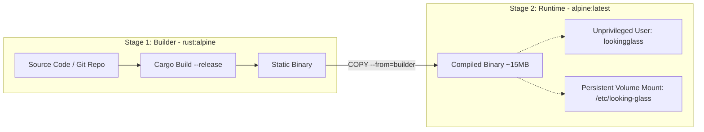

# ADR-0009 — Hardened Alpine container packaging, multi-stage compilation and persistent volume management

- **Status:** Proposed
- **Date:** 2026-09-17
- **Deciders:** André Dias, Marcelo Gondim

## TL;DR

Defines the container packaging strategy using multi-stage builds on hardened Alpine Linux.
The build stage fetches the codebase and compiles a static Rust binary with `musl`,
while the final runtime image is a minimal Alpine container (~15-20 MB) running as an
unprivileged service user. Operational configuration (`routers.yml`, credentials, certificates)
MUST be stored in named persistent Docker volumes accessible on the host under `/var/lib/docker/volumes/`.

The key words "MUST", "MUST NOT", "REQUIRED", "SHALL", "SHALL NOT", "SHOULD", "SHOULD NOT",
"RECOMMENDED", "MAY" and "OPTIONAL" in this document are to be interpreted as described in
[RFC 2119](https://www.rfc-editor.org/rfc/rfc2119).

## 5W2H

| Question | Answer |
|---|---|
| **What** | Container deployment strategy using Alpine Linux, multi-stage build, and named volumes. |
| **Why** | Minimize attack surface, eliminate build tools from runtime, and decouple config from container lifecycle. |
| **Who** | System administrators, DevOps engineers, and ISP operators deploying the Looking Glass. |
| **Where** | `Dockerfile`, `docker-compose.yml`, and host storage under `/var/lib/docker/volumes/`. |
| **When** | Baseline packaging for milestone `0.1.0`. |
| **How** | Multi-stage `cargo build --release` producing a static binary copied to an Alpine runtime image. |
| **How much** | Final image size under 25 MB; runtime RAM consumption under 35 MB; zero build tool baggage. |

## Context

Operational simplicity is a primary design principle ("Self-hosting must be boring").
However, compiling code directly inside a running production container or distributing bloated
runtime images (e.g. Ubuntu or Debian base images with full C compilers and Python environments)
violates security best practices:
1. **Attack Surface:** Production containers containing compilers (`gcc`, `cargo`), package managers,
   and development headers allow attackers who discover an RCE to compile exploitation payloads on-the-fly.
2. **Configuration Loss:** Binding operational configuration (`routers.yml`, TLS keys) directly inside
   the container layer causes data loss on container upgrades or restarts.
3. **Storage & Memory Footprint:** Standard Linux base images consume 150 MB to 600 MB of disk and
   overhead, whereas ISPs frequently deploy Looking Glass instances on low-resource utility VMs.

## Decision

### 1. Multi-Stage Dockerfile Architecture

The project SHALL provide a multi-stage `Dockerfile` separating the compilation environment from
the production execution environment:
- **Stage 1 (Builder):** Uses `rust:alpine` with `musl-dev` to compile the Looking Glass binary
  in `--release` mode. Build dependencies, source trees, and cargo caches exist strictly in this stage.
- **Stage 2 (Runtime):** Uses the latest official **Alpine Linux** base. It copies ONLY the compiled
  static executable from Stage 1. Compilers, source code, and development toolchains MUST NOT exist
  in the final image.



### 2. Execution as an Unprivileged Service User

The container entrypoint MUST NOT run as `root`.
- The `Dockerfile` SHALL create a dedicated system user and group (e.g. `lookingglass`, UID 10001).
- The binary drops privileges upon boot, running strictly under this service user.

### 3. Persistent Configuration via Named Docker Volumes

To ensure configuration persists across upgrades and remains easily administrable by host operators:
- All runtime configurations (`routers.yml`, custom branding, SSH keys, TLS certificates)
  SHALL reside in a dedicated directory inside the container (`/etc/looking-glass/`).
- The `docker-compose.yml` SHALL mount a named volume (e.g. `looking_glass_config`) to this path:
  ```yaml
  services:
    looking-glass:
      build:
        context: .
        dockerfile: Dockerfile
      restart: unless-stopped
      ports:
        - "80:80"
        - "443:443"
      volumes:
        - looking_glass_config:/etc/looking-glass
      environment:
        - LG_CONFIG_DIR=/etc/looking-glass

  volumes:
    looking_glass_config:
      name: looking_glass_config
  ```
- This configuration is physically stored and directly accessible on Linux hosts at:
  `/var/lib/docker/volumes/looking_glass_config/_data/`
  allowing operators to edit `routers.yml` or drop SSH private keys directly from the host filesystem
  without entering the container.

## Consequences

### Positive
- **Extreme Hardening:** Alpine Linux has minimal binaries and zero compilers in the runtime stage,
  drastically mitigating vulnerability scan alerts (CVEs) and container breakout risks.
- **Microscopic Footprint:** The complete image is ~20 MB and uses under 35 MB of RAM in production.
- **Clean Upgrades:** Operators run `docker compose pull && docker compose up -d` without risking
  overwriting their inventory, credentials, or certificates stored in the persistent volume.
- **Host Accessibility:** Host operators can automate router provisioning by pushing `routers.yml`
  directly into `/var/lib/docker/volumes/looking_glass_config/_data/`.

### Negative / Trade-offs
- Building directly from source via `docker compose build` requires several minutes during the initial
  compilation on low-power 1 vCPU hosts. Pre-built images published to GHCR (GitHub Container Registry)
  SHOULD be provided for production deployments as stated in ADR-0003.
- Alpine uses `musl libc` instead of `glibc`. Rust crates with C-bindings must build against `musl`,
  which `russh` and pure-Rust dependencies satisfy natively.
