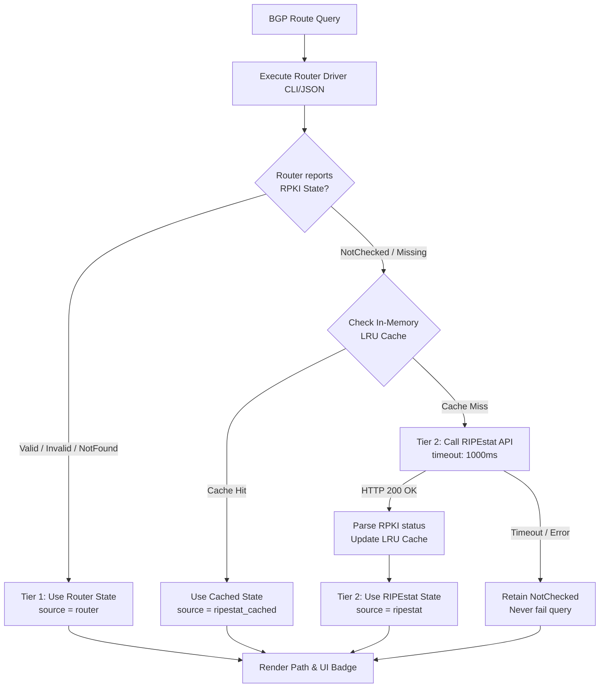

# ADR-0010 — Tiered RPKI validation with router-first state and external RIPEstat fallback

- **Status:** Accepted
- **Date:** 2026-09-17 (accepted 2026-09-20)
- **Deciders:** André Dias, Marcelo Gondim

## TL;DR

Establishes a two-tier (tiered) RPKI validation architecture for BGP routes.
The engine MUST prioritize the router's internal RPKI state (Tier 1) derived from
its control-plane RTR sessions (e.g. JunOS `validation-state`, Huawei VRP, Cisco IOS-XR).
If the queried router does not have RPKI validation active, lacks RTR sessions,
or returns `NotChecked`, the backend engine MUST asynchronously execute a secondary fallback check (Tier 2)
against the public RIPEstat RPKI validation API (or an operator-configured local Routinator instance).
All fallback validations MUST be backed by an in-memory LRU cache with strict HTTP timeouts
to guarantee sub-second response times without blocking or degrading queries.

The key words "MUST", "MUST NOT", "REQUIRED", "SHALL", "SHALL NOT", "SHOULD", "SHOULD NOT",
"RECOMMENDED", "MAY" and "OPTIONAL" in this document are to be interpreted as described in
[RFC 2119](https://www.rfc-editor.org/rfc/rfc2119).

> **Accepted on 2026-09-20.** Naming follows ADR-0013: the configuration file
> is `nogglass.toml` under `/etc/nogglass/`, and any environment variable for
> this feature uses the `NOGGLASS_` prefix. The privacy note in ADR-0006 applies
> to Tier 2: querying an external validator sends the visitor's prefix and
> origin AS to a third party, so the deployment guide MUST state it and the
> operator MUST be able to turn it off.

## 5W2H

| Question | Answer |
|---|---|
| **What** | Two-tier RPKI validation system (router-first, external RIPEstat API fallback). |
| **Why** | Many ISP production routers lack active RPKI RTR sessions, resulting in blind spots; fallback ensures 100% visibility. |
| **Who** | Backend query engine, network operators, and looking glass visitors. |
| **Where** | `crates/looking-glass-core` (enrichment layer) and frontend path badges. |
| **When** | Baseline feature for milestone `0.1.0`. |
| **How** | Evaluate router CLI/JSON state first; if `NotChecked`, query cached RIPEstat API with 1000ms timeout. |
| **How much** | Zero latency penalty on cached hits; maximum 1000ms bounded penalty on cold misses without blocking router output. |

## Context

RPKI Route Origin Authorization (ROA) validation is essential for detecting BGP route leaks
and prefix hijacking across Autonomous Systems. While ADR-0006 establishes that BGP paths
MUST be enriched with RPKI validation states (`valid`, `invalid`, `not_found`, `unknown`),
the operational reality of Internet Service Providers presents significant variance:

1. **Incomplete Router RTR Deployments:** Operators frequently operate heterogeneous fleets where
   Tier-1 border routers (Juniper MX, Huawei NE40E) maintain active RTR sessions with local validators
   (e.g., Routinator), whereas regional POPs, aggregation routers, or older platforms
   (MikroTik RouterOS v6/v7, legacy Cisco) do not run RPKI validation at all.
2. **Missing CLI Exposure:** Certain router operating systems support BGP routing but do not surface
   the cryptographic validation state directly within standard tabular route dumps.
3. **Information Blind Spots:** When a looking glass returns `NotChecked` for a route, end users
   and NOC engineers cannot determine whether the prefix is legitimately protected by a published ROA.

A tiered validation strategy resolves this dichotomy by preserving the router's authentic decision
while offering Internet-wide cryptographic truth when the router cannot provide it.

## Decision

### 1. Two-Tier Validation Hierarchy

The Looking Glass engine SHALL execute RPKI validation according to a strict priority hierarchy:

- **Tier 1 (Router Authoritative):** The driver extracts the RPKI state directly from the router's BGP table
  (e.g., JunOS `validation-state` JSON, Cisco `RPKI state`, Huawei `display bgp routing-table`).
  If the state is conclusive (`Valid`, `Invalid`, or `NotFound`), this value MUST be adopted immediately.
- **Tier 2 (Asynchronous Fallback):** If the router reports `NotChecked`, does not support RPKI output,
  or has no RTR sessions configured, the engine SHALL perform a secondary validation lookup against:
  1. An operator-configured local validator instance (e.g. NLnet Labs Routinator HTTP API), OR
  2. The public RIPEstat RPKI validation API (`https://stat.ripe.net/data/rpki-validation/data.json`).



### 2. Provenance Transparency in the Data Model

To ensure network operators can distinguish between a route validated by their own router's control plane
and a route validated via external fallback, the `BgpPath` model SHALL include provenance metadata:

| Field | Type | Description |
|---|---|---|
| `rpki_status` | `RpkiStatus` | Normalized enum: `Valid`, `Invalid`, `NotFound`, `NotChecked`. |
| `rpki_source` | `RpkiSource` | Enum: `Router`, `RoutinatorLocal`, `RIPEstat`, `None`. |

The frontend UI MUST render visual distinction (such as distinct tooltip indicators or badges)
signaling whether the RPKI state was validated directly by the queried router or resolved via RIPEstat.

### 3. In-Memory LRU Caching and Resilient Timeouts

To prevent latency degradation and third-party rate-limiting:
- The backend MUST utilize an asynchronous in-memory LRU cache (e.g. `moka`) keyed by `(Prefix, OriginASN)`.
- The cache TTL SHALL be configurable with a RECOMMENDED default of 3600 seconds (1 hour).
- Outgoing HTTP requests to the external RPKI provider MUST enforce a hard timeout not exceeding 1000 ms.
- Network errors or timeouts from the fallback service MUST NOT cause the BGP query to fail.
  If the fallback fails, the route SHALL gracefully retain `RpkiStatus::NotChecked`.

### 4. Configuration Schema

The operator configuration file (`/etc/nogglass/nogglass.toml`) SHALL support customization:

```toml
[rpki]
# Master switch for fallback enrichment when router returns NotChecked
enable_fallback = true

# Optional local validator (e.g. Routinator HTTP endpoint)
# If omitted, defaults to RIPEstat public API
# validator_url = "http://routinator.internal.net:8323/api/v1/validity"

# Hard timeout for external HTTP validation in milliseconds
timeout_ms = 3000

# In-memory cache TTL in seconds
cache_ttl_secs = 3600

# Maximum entries in the LRU cache
cache_max_capacity = 50000
```

## Consequences

### Positive
- **Complete Operator Visibility:** Solves the blind-spot problem for ISPs with heterogeneous router fleets,
  providing immediate RPKI badges even on MikroTik or older switches without RTR.
- **Zero Query Block:** The short 1000ms timeout and in-memory caching ensure that external RPKI lookups
  never stall user requests or exhaust server file descriptors.
- **Honest Telemetry:** Distinguishing `Router` vs `RIPEstat` provenance prevents false assumptions about
  an ISP's internal router filtering policies.

### Negative / Trade-offs
- External fallback introduces an outbound HTTP dependency (`reqwest`) in the backend service.
- Querying RIPEstat transmits the target IP prefix and origin ASN over external HTTPS,
  which MUST be clearly documented in privacy guidance as defined in ADR-0006.
