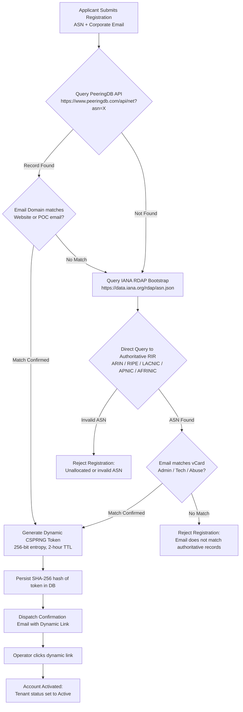
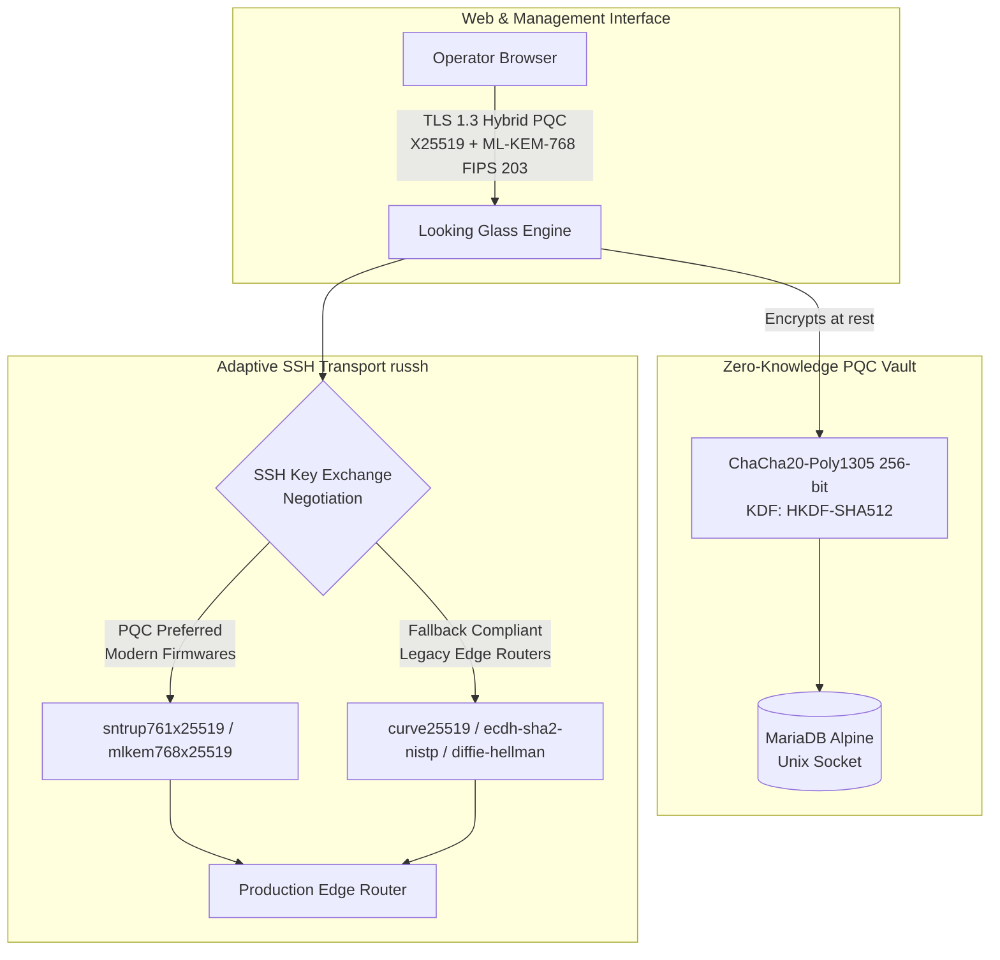
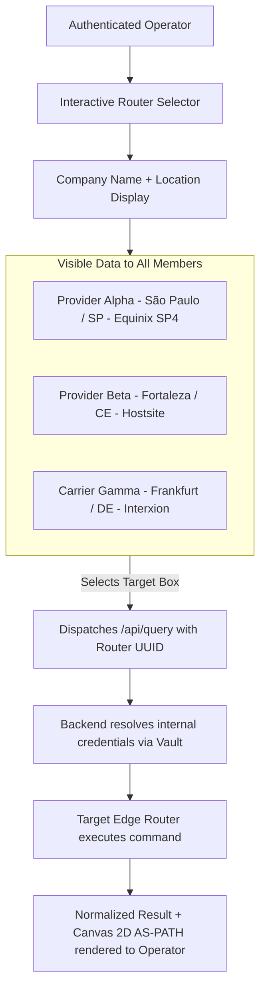

# ADR-0011 — Authenticated collaborative multi-tenant platform with PeeringDB/RDAP verification and encrypted router vault

- **Status:** Proposed — deferred to the `0.3.0` milestone
- **Date:** 2026-09-19
- **Deciders:** André Dias, Marcelo Gondim

## TL;DR

> **Deferred, not rejected.** On 2026-09-20 the maintainers decided that
> `0.1.0` ships a publicly queryable Looking Glass with no account required, as
> stated in the README and ADR-0006. This document describes a different
> product layer — a federated diagnostic network between verified operators —
> and it MUST NOT be implemented before a public Looking Glass works end to
> end. Two consequences need answering before it is accepted: custody of other
> operators' router credentials is a legal and operational liability that does
> not disappear because the blobs are encrypted, and forbidding anonymous
> queries removes the audience a looking glass exists for.

Transforms the Looking Glass from a single-tenant tool into an authenticated, collaborative multi-tenant platform for verified Autonomous System (ASN) operators.
Anonymous public queries are prohibited; all users MUST register and verify administrative authority over their declared ASN via the PeeringDB API or IANA-federated RDAP, followed by dynamic single-use token confirmation by corporate email.
Authenticated operators MAY enroll routers with credentials encrypted at rest using ChaCha20-Poly1305 in an isolated Alpine MariaDB database.
In return, verified operators gain reciprocal access to run operational diagnostics (`ping`, `traceroute`, `bgp_route`, `bgp_summary`) across all participant routers, displayed publicly by company name and location without exposing ASNs or management credentials.

The key words "MUST", "MUST NOT", "REQUIRED", "SHALL", "SHALL NOT", "SHOULD", "SHOULD NOT",
"RECOMMENDED", "MAY" and "OPTIONAL" in this document are to be interpreted as described in
[RFC 2119](https://www.rfc-editor.org/rfc/rfc2119).

## 5W2H

| Question | Answer |
|---|---|
| **What** | Collaborative multi-tenant Looking Glass restricted to authenticated ASN operators with encrypted credential vaulting. |
| **Why** | Prevents Internet-wide command abuse, eliminates configuration exposure, guarantees reciprocal diagnostic visibility, and proves operator legitimacy. |
| **Who** | Autonomous System operators, network engineers, backend authentication engine, and isolated MariaDB container. |
| **Where** | `crates/looking-glass-server`, `crates/looking-glass-auth`, `crates/looking-glass-db`, and `docker-compose.yml`. |
| **When** | Core foundational architecture for release milestone `0.2.0`. |
| **How** | Validate ASN ownership via PeeringDB/RDAP, enforce email challenge-response, encrypt credentials with ChaCha20-Poly1305, and store in MariaDB over Unix socket. |
| **How much** | Zero recurring license costs; minimal storage impact (~50 MB database) and ~5 ms crypto overhead per SSH session establishment. |

## Context

The initial architectural drafts (ADR-0001 through ADR-0007) conceived the Looking Glass as a standalone, single-tenant deployment reading router inventories from static configuration files (`routers.yml`). While effective for private testing, this model presents significant operational limitations in real-world telecommunications:

1. **Vulnerability to External Abuse:** Publicly exposed Looking Glasses without authentication are routinely targeted by automated scrapers, port scanners, and volumetric denial-of-service attempts that exhaust control-plane CPU cycles on edge routers.
2. **Configuration Rigidity:** Managing credentials, connection endpoints, and router inventories in flat files requires redeployment or container restarts whenever edge hardware is added or decommissioned.
3. **Information Asymmetry:** Regional Internet Service Providers (ISPs) often maintain separate looking glasses with disparate interfaces, forcing network engineers to navigate multiple disconnected tools during routing incidents.
4. **Lack of Identity and Attribution:** Without authenticated user sessions, suspicious or unauthorized diagnostic sweeps cannot be audited or attributed to a specific network peer.

To address these challenges, the platform adopts an authenticated, community-driven multi-tenant architecture. Entry is gated by cryptographic and institutional proof of ASN control, fostering a trusted network of operators who share diagnostic vantage points securely.

## Decision

### 1. Mandatory Operator Registration and Gated Access

The Looking Glass SHALL NOT accept anonymous diagnostic queries. Every interaction with router execution endpoints (`/api/query`) MUST require an active, authenticated operator session.

Registration requires:
- **Autonomous System Number (ASN):** The numerical identifier of the applicant's network (e.g. `20111`).
- **Legal and Trade Name:** Retrieved automatically from PeeringDB with optional operator display customization.
- **Operator Name:** Full name of the responsible network engineer.
- **Corporate Email Address:** Matching the registered domain or Point of Contact (POC) for that ASN.
- **Password:** Salted and hashed using Argon2id according to OWASP guidelines.

### 2. Dual-Layer ASN Authority Verification (PeeringDB + IANA RDAP)

Before dispatching an account activation link, the backend MUST verify that the applicant's email address legitimately belongs to the declared ASN:

1. **Tier 1 (PeeringDB Primary):** The engine queries `https://www.peeringdb.com/api/net?asn={ASN}`. If the ASN exists, it extracts `name`, `website`, and official contact domains. If the registrant's email domain corresponds to the official organization domain, authority is provisionally accepted.
2. **Tier 2 (IANA-Federated RDAP Authoritative Fallback):** If PeeringDB data is absent, incomplete, or unconfirmed, the engine consults the local cache of the IANA RDAP bootstrap allocations (RFC 9224). The engine queries the authoritative Regional Internet Registry (RIR) directly (e.g. `rdap.registro.br`, `rdap.arin.net`, `rdap.db.ripe.net`, `rdap.apnic.net`, `rdap.afrinic.net`). The applicant's email domain MUST match an authorized contact entity (`administrative`, `technical`, `noc`, or `abuse`).
3. **Cryptographic Email Activation Challenge:** Upon successful authority validation, the engine generates a 256-bit cryptographically secure pseudorandom token (`rand::rngs::OsRng`). The token's SHA-256 hash is recorded in MariaDB with a strict 2-hour expiration and single-use invalidation. The unhashed token is dispatched via email. The account remains disabled until the dynamic URL is visited.

### 3. Post-Quantum Resistant Vaulting and Adaptive SSH Transport

Router management credentials (passwords, private SSH keys, and internal management IP addresses) MUST NOT be stored in plaintext and MUST resist both classical and post-quantum cryptanalysis (Grover's algorithm).

- **Post-Quantum Resistant At-Rest Vault:** Symmetric authenticated encryption using ChaCha20-Poly1305 (RFC 8439) with a 256-bit key provides 128 bits of effective quantum security against Grover's algorithm, rendering stored credentials immune to future quantum decryption attacks ("Store Now, Decrypt Later"). Key derivation SHALL utilize HKDF-SHA512.
- **Activation Challenge Tokens:** Dynamic email verification tokens SHALL use a 256-bit cryptographically secure pseudorandom number generator (CSPRNG via `rand::rngs::OsRng`), and token hashes stored in MariaDB MUST be computed with SHA3-512 or BLAKE3.
- **Adaptive SSH Transport Negotiation:** Because many operational border routers run legacy operating systems or older microcode that lack Post-Quantum Cryptography implementations, the SSH transport (`russh`) MUST negotiate key exchange adaptively:
  1. **Primary Priority (PQC Hybrid):** Attempt post-quantum hybrid key exchange (`sntrup761x25519-sha512@openssh.com` and `mlkem768x25519-sha512`) when supported by recent router operating systems.
  2. **Backward-Compatible Fallback (RFC Classical):** Gracefully negotiate standard classical algorithms (`curve25519-sha256`, `ecdh-sha2-nistp256`, `diffie-hellman-group14-sha256`) to ensure uncompromised interoperability with legacy Huawei VRP, MikroTik RouterOS v6/v7, Cisco IOS-XE, Datacom, and Nokia hardware.
- **Key Management:** The 256-bit master secret (`LOOKING_GLASS_MASTER_KEY`) MUST be injected exclusively via runtime environment variables and MUST NOT exist in database dumps, configuration files, or version control.
- **Memory Lifetime:** Decrypted credentials SHALL exist only ephemerally in RAM during the lifecycle of the SSH session and MUST be scrubbed from memory immediately upon connection completion.
- **Frontend Masking:** Administrative endpoints listing registered routers SHALL NEVER transmit decrypted passwords or private keys back to the client; fields MUST be masked with redacted placeholders.

### 4. Reciprocal Collaborative Catalog (Company and Location Vantage Points)

Once logged in, operators gain access to a collaborative diagnostic selector:

- **Anonymized Organization Presentation:** The selector displays the organization's business name and physical router location (city, state/province, datacenter). The ASN number is deliberately omitted from the primary selection list to mitigate scraping and targeting.
- **Opaque UUID Addressing:** The frontend references routers solely by immutable UUIDs (e.g. `router_id: "550e8400-e29b-41d4-a716-446655440000"`). Internal management IPs, ports, and usernames are completely concealed from the browser.
- **Inclusive Collaborative Access:** Any operator who successfully completes account registration and email verification for their ASN SHALL have immediate, unrestricted access to execute operational queries (`ping`, `traceroute`, `bgp_route`, `bgp_summary`) against all active community routers. Enrolling edge routers is an OPTIONAL contribution and MUST NOT be a mandatory prerequisite for querying the platform.

### 5. Infrastructure Isolation: Alpine MariaDB via Unix Domain Socket

To prevent credential exfiltration through network vulnerabilities:
- The database runs in a dedicated, minimal `mariadb:lts-alpine` container.
- The MariaDB container MUST NOT expose port 3306 on the host network (`ports:` directive prohibited).
- Communication between the Looking Glass backend and MariaDB SHALL occur through a shared Docker volume containing a Unix domain socket (`/run/mysqld/mysqld.sock`) or an internal Docker bridge network unreachable from external interfaces.

## Consequences

### Positive

- **Elimination of Abuse:** Requiring authenticated sessions for all queries prevents automated scanning and control-plane exhaustion on member routers.
- **High-Fidelity Trust Fabric:** Validation against PeeringDB and IANA RDAP ensures only verified network operators participate in the community.
- **Robust Defense-in-Depth:** Compromise of the MariaDB database reveals only encrypted blobs; credentials cannot be decrypted without the host master key.
- **Collective Intelligence:** Operators gain real-time external vantage points across diverse carriers and regions without negotiating separate peering agreements.

### Negative

- **Onboarding Friction:** Operators must complete email verification and have up-to-date PeeringDB or RDAP records to use the platform.
- **Key Custody Responsibility:** Loss of the `LOOKING_GLASS_MASTER_KEY` permanently renders all vaulted router credentials unrecoverable, requiring re-enrollment.
- **Outbound Email Dependency:** Requires reliable transactional SMTP or API mailer configuration for activation challenges.
