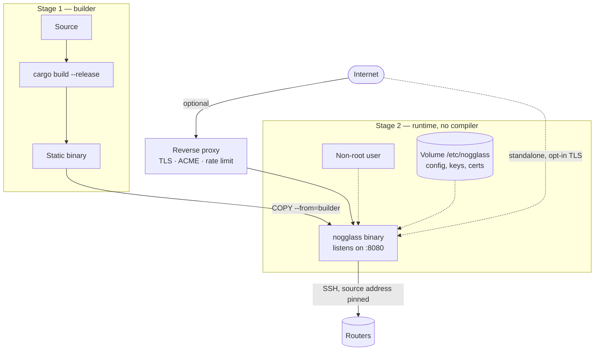

# ADR-0012 — Standalone binary exposure, ports and container packaging

- **Status:** Accepted
- **Date:** 2026-09-20
- **Deciders:** André Dias, Marcelo Gondim

## TL;DR

The binary listens on an unprivileged high port (`8080` by default) as a
non-root user, and works standalone. A reverse proxy — Cloudflare, Traefik,
HAProxy, nginx — is OPTIONAL and RECOMMENDED for public deployments, because
TLS, ACME and edge rate limiting are better handled by software that already
does them. Packaging keeps what ADR-0009 proposed: multi-stage build, Alpine or
`scratch` runtime, non-root user, configuration in a mounted volume. Host
networking becomes an opt-in for operators who need a predictable IPv6 source
address, not the default.

## 5W2H

| Question | Answer |
|---|---|
| **What** | How the process is exposed to the network and how the container is built. |
| **Why** | ADR-0009 required a non-root user and ports 80/443 at the same time, which cannot both hold, and made host networking mandatory for a reason that only applies to IPv6. |
| **Who** | Operators deploying the product; maintainers writing the Dockerfile and the Compose file. |
| **Where** | `Dockerfile`, `docker-compose.yml`, the HTTP listener configuration. |
| **When** | Applies from the first container image published for `0.1.0`. |
| **How** | High port by default, optional proxy, opt-in host networking, documented both ways. |
| **How much** | Image under 25 MB; no privileged capability REQUIRED in the default deployment. |

## Context

ADR-0009 proposed that the binary serve ports 80 and 443 directly with
`network_mode: host`, while also requiring an unprivileged service user. On
Linux, binding a port below 1024 requires root or `CAP_NET_BIND_SERVICE`; the
two requirements contradict each other and the ADR did not say which wins.

The stated reason for host networking is that routers filter management access
by source address, so SSH from the Looking Glass MUST arrive from a predictable
IP. That argument is weaker than it looks for IPv4: Docker already applies
source NAT on bridge networks, so the router sees the host address anyway. It is
real for **IPv6**, where a bridge network hands the container an address from a
different prefix, or NATs it in ways that surprise operators.

TLS is the other half. Terminating TLS inside the binary means owning ACME,
renewal, OCSP stapling, cipher policy and the edge rate limiting that protects
a public endpoint. That is a large surface for a two-person project, and it is
exactly what Cloudflare, Traefik, HAProxy and nginx already do well.

## Decision

### 1. Default listener

1. The binary SHALL listen on `0.0.0.0:8080` and `[::]:8080` by default,
   configurable through `NOGGLASS_HTTP_ADDR`.
2. The process MUST NOT require root. Binding a privileged port is an operator
   choice, made with `CAP_NET_BIND_SERVICE`, a systemd socket or a proxy, and
   MUST be documented rather than assumed.
3. The binary SHALL serve plain HTTP by default and MUST NOT pretend a
   deployment is secure when no TLS terminator is present: startup SHALL log a
   warning when it listens publicly without TLS and without a declared proxy.

### 2. TLS

1. Built-in TLS (`rustls`, with optional ACME) is OPTIONAL and MAY be enabled
   with explicit configuration.
2. A public deployment SHOULD terminate TLS in a proxy. The deployment guide
   MUST document both paths with a working example.
3. When a proxy is declared, the binary SHALL honour `X-Forwarded-For` only
   from configured trusted proxy addresses, and MUST ignore it otherwise. Rate
   limiting keyed on a spoofable header is worse than no rate limiting.

### 3. Networking

1. The default Compose file SHALL use a normal bridge network with IPv6
   enabled, publishing only the HTTP port.
2. `network_mode: host` SHALL be documented as an opt-in for operators who need
   the host's exact IPv6 source address for router ACLs, with its trade-off
   stated: the container loses network isolation and every port it opens is
   exposed on the host.
3. The source address used for outbound SSH SHALL be configurable, so an
   operator can pin it to an address their routers already permit.

### 4. Packaging

1. Multi-stage build: a builder stage compiles with `cargo build --release`; the
   runtime stage copies only the binary.
2. The runtime image SHALL contain no compiler, no package manager and no source.
3. The container SHALL run as a dedicated non-root user.
4. Configuration, TLS material and SSH keys SHALL live under
   `/etc/nogglass/`, mounted from a named volume, so upgrades never overwrite
   operator state.
5. Images SHALL be published to GHCR per ADR-0003, so operators pull rather
   than build.

## Consequences

- The default deployment needs no capability, no root and no host networking,
  which is the safest starting point and the easiest to explain.
- Operators who want a single process on port 443 can still have it, explicitly.
- The project does not own ACME or edge protection in the default path, which
  removes a large maintenance surface.
- ADR-0009 is superseded: its packaging decisions survive, its port and host
  networking mandates do not.
- Trusting `X-Forwarded-For` only from configured proxies is REQUIRED before any
  rate limiting ships, or the rate limiter is trivially bypassed.
