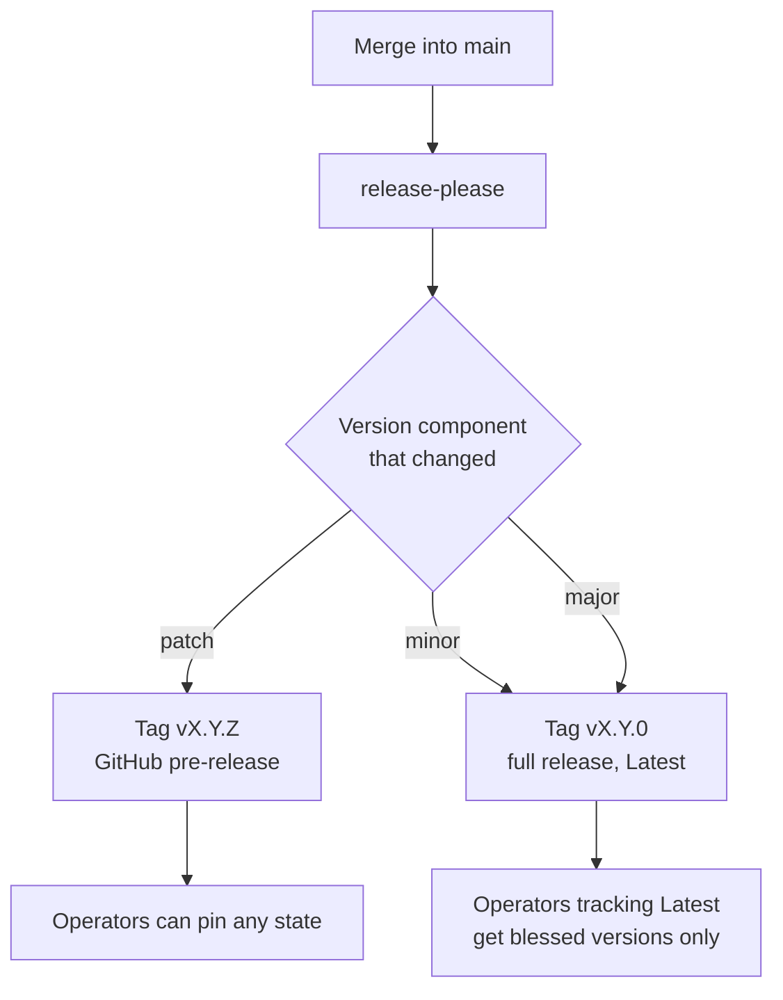

# ADR-0014 — Every change is released; patch releases are pre-releases

- **Status:** Accepted
- **Date:** 2026-09-20
- **Deciders:** André Dias, Marcelo Gondim

## TL;DR

Every merge into `main` produces a tag `vMAJOR.MINOR.PATCH` and a GitHub
release, including documentation and tooling changes. A **patch** release is
published as a **pre-release**; minor and major releases are full releases.
This supersedes the part of [ADR-0003](0003-conventional-commits-and-automated-releases.md)
that said a documentation-only merge produces no release.

## 5W2H

| Question | Answer |
|---|---|
| **What** | The rule that every change is tagged and released, and which releases count as pre-releases. |
| **Why** | Any state of the project MUST be pinnable by tag, and operators MUST be able to tell a continuously shipped fix from a blessed release. |
| **Who** | `release-please` and the release workflow; maintainers only merge the release pull request. |
| **Where** | `.github/workflows/release.yml`, `release-please-config.json`, `docs/process/versioning-and-releases.md`. |
| **When** | From the next release onwards. |
| **How** | Every conventional type produces a changelog entry, so every merge is releasable; the workflow flags patch releases as pre-releases. |
| **How much** | More releases and more tags. Tags are free; the noise is the price of being able to pin anything. |

## Context

ADR-0003 kept releases for changes that alter the product: a documentation or
CI merge produced no artefact. That leaves stretches of `main` that no tag
points at, so "which version has that runbook" has no answer, and a bisect
across a documentation change has no release to anchor on.

At the same time, releasing everything as a full release would flatten the
difference between "we shipped a fix ten minutes ago" and "this is the version
we recommend". The pre-release flag exists exactly for that distinction, and
GitHub already treats pre-releases differently: they do not become "Latest", and
tooling that follows latest releases skips them.

## Decision

1. Tags SHALL be `vMAJOR.MINOR.PATCH`. No component prefix, no suffix.
2. **Every** merge into `main` SHALL produce a tag and a GitHub release, whatever
   the conventional type. `docs`, `chore`, `ci`, `test`, `refactor` and `style`
   changes produce a patch release.
3. A patch release (`Z` greater than zero in `vX.Y.Z`) SHALL be published as a
   **pre-release**.
4. A minor or major release SHALL be a full release, and therefore the version
   GitHub shows as "Latest".
5. `feat` bumps the minor version, `fix` and everything else bump the patch
   version, and a breaking change bumps the minor while below `1.0.0` and the
   major after it — unchanged from ADR-0003.
6. Releases MUST NOT be deleted or re-tagged. A mistake is fixed forward.

## Consequences

- Tag and release counts grow quickly. That is the point: nothing on `main` is
  unreachable by tag.
- Operators who want stability watch full releases; operators who want the
  newest fix take a pre-release knowingly. The distinction is visible in the
  GitHub interface without reading the changelog.
- Container images follow the same rule, so a `X.Y.Z` image exists for every
  state while `latest` tracks full releases only.
- A documentation typo now produces a release. The alternative — stretches of
  history with no tag — costs more when something has to be pinned or bisected.
