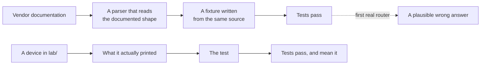

# ADR-0015 — A vendor driver is verified against a real device, or it is not verified

- **Status:** Accepted
- **Date:** 2026-09-21
- **Deciders:** André Dias, Marcelo Gondim

## TL;DR

A driver MUST parse output captured from a device running the vendor's own
software before the project calls that vendor supported. Tests MUST carry that
captured text. The lab topology that produced it MUST be in the repository. A
vendor with no such capture is listed as unverified, in plain words, rather than
quietly presented as working.

## 5W2H

| Question | Answer |
|---|---|
| **What** | The rule that makes a vendor supported: a capture from a real device, in the tests. |
| **Why** | Every driver written from documentation returned plausible wrong answers on first contact with a router, and documentation cannot show what a CLI prints. |
| **Who** | Whoever adds or changes a vendor driver; maintainers enforce it in review. |
| **Where** | `lab/` produces the captures; the tests live beside the parser; `docs/reference/vendor-support.md` publishes the result. |
| **When** | From this ADR onwards, including for the drivers that already exist. |
| **How** | `lab/capture.sh` runs the catalogue's own commands against a node; `cargo run --example parse_capture` shows what the driver made of the answer. |
| **How much** | A vendor image, a few gigabytes of disk and an hour. Against a wrong answer published to strangers, nothing. |

## Context

Every parser in this project was written from documented output and checked
against fixtures written by hand. The week the first real devices were
available, six silent wrong answers appeared in three drivers:

- **MikroTik RouterOS 7.16.2** answered every BGP route query with "no route",
  for prefixes the router held, because RouterOS ends lines with CRLF and the
  entries are split on a blank line. It also reported **0.0 ms** for a hop that
  had timed out, by reading a redraw of the table rather than its final state.
- **BIRD 2.15.1** lost the prefix on every path after the first — BIRD prints it
  once and leaves the column blank — and listed **no sessions at all**, because
  `show protocols all` is not a table and was handed to the table reader.
- **Huawei VRP 8.180** answered route queries in a format the driver did not
  read, reported a session in **Idle as Established**, reported a ping that
  answered every probe as **100% loss**, and dropped 32-bit AS numbers, which
  VRP prints in asdot as `1.0`.

Two more were in the transport, where no parser test could have found them: the
product could not open an SSH session to a Huawei at all, because the client's
default host key preference picks an algorithm whose signature VRP encodes in a
way the decoder rejects; and once that was fixed, the router's **login banner
came back as the answer**, because the executor sent its command first and then
read until a prompt — and a banner ends with one.

The pattern is the same every time: not an error, an answer. And one of them was
**asserted by a test**. A summary row reading `Active` was expected to parse as
`Established`; the test was written from the documented format, passed, and
locked the bug in place.

Documentation lists the fields. It does not say where a CLI wraps a long AS path,
what it prints for a value nobody set, how it marks a route learned from an
aggregate, or what it says before it is ready to be asked anything.

## Decision

1. A vendor driver is **verified** when the tests beside it parse text captured
   from a device running that vendor's software, and that text is in the test
   as the device printed it — line endings included.
2. A change to a driver's parsing SHALL be accompanied by a capture that
   exercises the change, or by an explanation in the pull request of why the
   behaviour cannot be produced in the lab.
3. The lab node that produced a capture SHALL be in `lab/`, so the result can be
   reproduced rather than believed.
4. `docs/reference/vendor-support.md` SHALL say, for every vendor, whether it is
   verified and against which software version. A vendor that has never been run
   against a real device SHALL say so in that table.
5. A fixture MUST NOT be edited to make a test pass. If a device prints
   something unexpected, the parser is what changes.
6. A test MAY assert that a parser refuses. It MUST NOT assert a value the
   device did not print, which is how the `Active`-reads-as-`Established`
   assertion survived.

## Consequences

**A vendor needs an image.** Some are free (BIRD, FRR, SR Linux), some are free
with an account, some need a licence, and some platforms have no public image at
all. That is the cost, and it is why point 4 exists: the honest answer to "does
this work on my Datacom" is currently "nobody knows".

**Adding a vendor is slower.** It now takes an image, a lab node and a capture
rather than an afternoon with a PDF. The drivers this project already had were
written the fast way, and every one of them was wrong.

**Some behaviour cannot be produced in a lab.** A validator for RPKI states, a
router under real load, a table with a million routes. Point 2 allows saying so
in the pull request; it does not allow pretending.

**The captures date.** A driver verified against VRP 8.180 has not been verified
against VRP 8.230. The table names the version so the reader can judge, and a
newer device that parses differently is a bug report with a capture attached.
