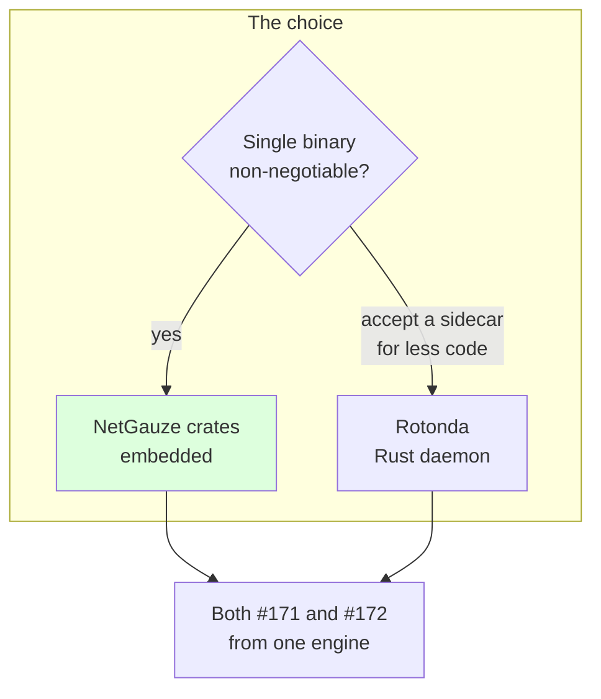
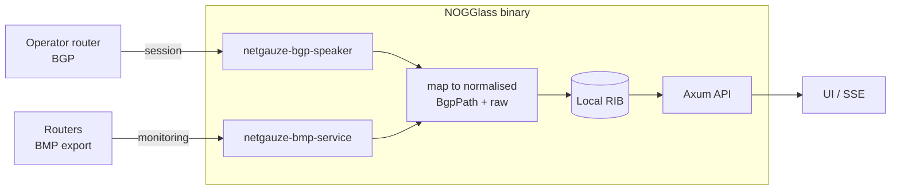

# ADR-0016 — One Rust engine for the BGP session and the BMP station

- **Status:** Proposed
- **Date:** 2026-09-27
- **Deciders:** André Dias, Marcelo Gondim

## TL;DR

NOGGlass is gaining two live routing-data features: peering over BGP with the
operator's own router and holding its routes locally (issue #171), and acting as
a BMP station that receives what the operator's routers monitor (issue #172).
Both need an engine that speaks the protocol and hands NOGGlass **typed** data,
never text to scrape. This ADR proposes **one Rust engine for both**, and names
**NetGauze**, embedded in the binary, as the choice — with **Rotonda** (a Rust
sidecar) as the sanctioned fallback. It is Proposed: it records the
recommendation for the maintainers to accept or reject, and MUST NOT be merged as
Accepted until they decide.

## 5W2H

| Question | Answer |
|---|---|
| **What** | The engine that speaks BGP (session) and BMP (station) for NOGGlass's live routing-data features, chosen once for both. |
| **Why** | The whole cost of this codebase has been scraping vendor CLI text; an engine that returns typed routes removes that class of bug at the source, and one choice for two features avoids two half-integrations. |
| **Who** | The maintainers decide (accept/reject this ADR); the engine then shapes the implementation of #171 and #172. |
| **Where** | A new component in the workspace, behind `NOGGLASS_BGP_ENABLED` / `NOGGLASS_BMP_ENABLED`; the SSH drivers and the normalised model ([ADR-0006](0006-structured-bgp-model-and-data-sources.md)) are unchanged. |
| **When** | Before implementation code for #171 or #172 lands. This ADR blocks both. |
| **How** | Embed NetGauze's BGP and BMP crates and map their typed output into the normalised model; or, as a fallback, run Rotonda as a sidecar and read its JSON API. |
| **How much** | No licence cost (permissive). Engineering: a session/station manager, a mapper into the normalised model, and per-peer RIB bookkeeping — smaller if Rotonda owns the RIB, larger if we embed. |

## Context

Until now NOGGlass reads third-party routers over SSH, on demand, and every
driver is a text parser. Two features change the shape of the product:

- **#171 — BGP session.** The operator configures NOGGlass to peer with their own
  router; NOGGlass receives that router's routes into a **local RIB** and answers
  the looking glass from it. Import-only: NOGGlass **MUST NOT** announce anything.
- **#172 — BMP station.** The operator's routers open BMP sessions *to* NOGGlass
  and stream what their BGP is doing; NOGGlass parses it into the same models.
  Receive-only by the protocol's nature.

The constraints that bound the choice:

- The engine **MUST** hand NOGGlass typed protocol data, not text to parse. This
  is the project's central lesson (see [ADR-0015](0015-vendor-drivers-are-verified-against-real-devices.md));
  re-introducing CLI scraping to gain a feed would be a step backward.
- Output **MUST** map into the normalised path model ([ADR-0006](0006-structured-bgp-model-and-data-sources.md)),
  raw preserved, so a route from BGP, from BMP or from SSH reads the same way.
- Both features **MUST** default disabled and **MUST** fail closed.
- The single-binary deployment ([ADR-0012](0012-standalone-binary-exposure-and-packaging.md))
  is a value to preserve; a sidecar is acceptable only if it buys enough to
  justify a second process.
- The operator's stated preference is a **Rust** engine.

The full option matrix lives in the design documents
([BGP](../design/bgp-session-support.md), [BMP](../design/bmp-support.md)); it is
summarised here because it is the input to this decision.

## Decision

**Proposed:** adopt **one Rust engine for both** #171 and #172, and make it
**NetGauze embedded in the NOGGlass binary** — `netgauze-bgp-speaker` for the
session and `netgauze-bmp-service` / `netgauze-bmp-pkt` for the station, mapped
into the normalised model.

- The engine **MUST** be Rust and **MUST** expose typed protocol structures;
  parsing engine output as text is not acceptable.
- NetGauze is chosen because it keeps the single binary, is typed end to end, and
  one dependency family covers both features (Apache-2.0).
- **Rotonda** (NLnet Labs), run as a Rust sidecar and read over its JSON API, is
  the **sanctioned fallback**: if owning the RIB and session/station glue proves
  too costly for a first cut, the project MAY adopt Rotonda instead without
  reopening this ADR, because it satisfies every constraint except the single
  binary and it, too, serves both features.
- Full router daemons (Holo) and non-Rust engines (GoBGP, BIRD, FRR) are **not**
  chosen: Holo is more than a looking glass needs, and BIRD/FRR reintroduce
  control-plane text parsing.
- Because all candidates are pre-1.0, the implementing pull request **MUST** pin
  an exact version (`Cargo.lock` and an explicit dependency requirement), per the
  pinned-dependencies rule.

## Consequences

- **Easier:** one integration, one mental model, one dependency family for two
  features; typed data end to end, so the "never invent a value a router did not
  report" rule holds by construction rather than by careful parsing.
- **Harder:** embedding means NOGGlass owns the per-peer RIB and the
  session/station lifecycle; a young (pre-1.0) dependency means churn to track
  and a pinned version to bump deliberately.
- **Ruled out:** scraping any engine's CLI; announcing routes; a full routing
  daemon in-tree.
- **Reversible at a known cost:** the fallback to Rotonda is pre-authorised here,
  so discovering mid-implementation that embedding is too much work does not
  require a new decision — only moving the two boxes above into a sidecar and
  reading its JSON.
- **If the maintainers prefer Rotonda from the start,** or reject the Rust-only
  constraint, this ADR is amended before merge or superseded — it is Proposed
  precisely so that conversation happens here.
