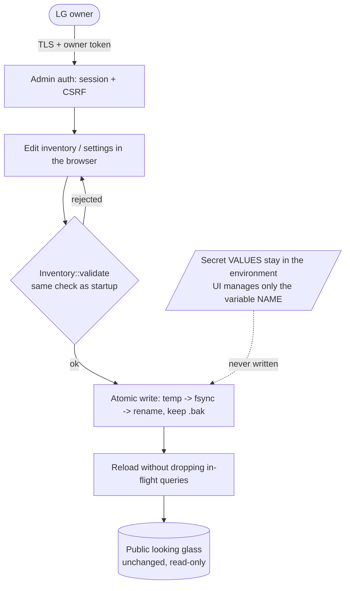

# ADR-0017 — Web admin interface for the Looking Glass owner

- **Status:** Proposed — deferred to post-1.0 ([roadmap](../process/roadmap.md), issue [#204]).

## TL;DR

NOGGlass is configured today by hand-editing `nogglass.toml` / `nogglass.yaml`
on the host and restarting. This ADR proposes a **single-owner web admin
interface** to manage the inventory and settings from a browser, and — because
it turns a read-only service into one that writes state — fixes the shape of
that decision before any code is written. The proposal: **one owner
credential** (a token/password supplied through the environment, behind the
operator's own TLS/proxy), **validate-then-swap** config writes that reuse the
existing `Inventory::validate` and never corrupt a running config, and a hard
rule that **the UI manages the *name* of a secret's environment variable, never
its value** — so ADR-0012's "secrets stay in the environment" invariant and the
"router is sacred" read-only invariant both survive. It is the single-tenant
stepping stone toward the multi-tenant platform in [ADR-0011], not a replacement
for it. The maintainers accept, amend or reject this before implementation.

The key words "MUST", "MUST NOT", "SHOULD", "SHOULD NOT" and "MAY" are used as
in [RFC 2119](https://www.rfc-editor.org/rfc/rfc2119).

## 5W2H

| Question | Answer |
|---|---|
| **What** | A browser interface for the LG **owner** to manage routers, limits, rate limiting, RPKI, global view and UI/branding. |
| **Why** | Hand-editing a file and restarting is error-prone and off-putting; owners expect a console. |
| **Who** | The single operator who owns the deployment. Public visitors are unaffected and never see it. |
| **Where** | A new authenticated surface in `nogglass-server`, writing back the inventory that `looking-glass-core` validates. |
| **When** | Post-1.0. It MUST NOT block the 1.0.0 tag. |
| **How** | Owner auth → edit form → validate with the existing model → atomic write → reload. Secrets stay named, never stored. |
| **How much** | A meaningful build: a new auth surface, config serialization (the model gains `Serialize`), atomic write-back and reload, and a UI. |

## Context

Two invariants define NOGGlass and MUST NOT be weakened by an admin surface:

- **The router is sacred.** No visitor input reaches a router command line; the
  service is read-only toward routers. An admin interface manages
  *configuration*, and MUST NOT introduce any path that issues configuration
  commands to a router.
- **Secrets stay in the environment** ([ADR-0012]/[ADR-0007]). The inventory
  names an environment variable; the value never lands in the file, so the file
  is safe to version-control, paste into an issue, or share. Today the process
  loads the inventory once at startup ([`Inventory::load`]) and refuses to run a
  malformed one.

Adding a browser that writes configuration changes three things at once: the
service starts **accepting authenticated state changes** (it was read-only for
everyone), it must **write the inventory back** (today it only reads it), and it
must **reload** without dropping in-flight queries or corrupting the file. Each
is a decision with security weight, which is why they belong in an ADR rather
than in a pull request's diff.

[ADR-0011] already describes a full authenticated, multi-tenant platform with an
encrypted router vault. That is a larger, later system. This ADR deliberately
scopes a **single-tenant owner console** that a solo operator can run now,
without committing to multi-tenancy; when [ADR-0011] lands it supersedes this.

## Decision

### Scope

The admin interface manages the inventory (`[[router]]` entries, add/edit/remove,
and a connectivity test), the global `[limits]`, `[rate_limit]`, `[rpki]`,
`[global_view]` and `[ui]` sections. It MUST preserve both invariants above. It
is an owner tool: exactly one principal, no per-tenant model (that is
[ADR-0011]).

### Authentication

- Access MUST be gated by an **owner credential provided through the
  environment** (e.g. `NOGGLASS_ADMIN_TOKEN`), consistent with how every other
  secret is provided. No credential is compiled in or stored in the inventory.
- A successful login MUST establish a short-lived, `HttpOnly`, `Secure`,
  `SameSite=Strict` session cookie. State-changing requests MUST carry CSRF
  protection, because the service now mutates state.
- The admin surface MUST be served only over the operator's TLS/reverse proxy in
  production, and SHOULD be bindable to a separate address/port from the public
  looking glass so it can be firewalled independently.
- Admin routes MUST be exempt from the visitor CAPTCHA flow but MUST still be
  rate-limited against credential guessing.

### Configuration write-back

- Edits MUST be validated with the **existing** `Inventory::validate` (the same
  check startup uses) *before* anything is written. An edit that would not boot
  MUST be rejected with the same error the operator would see at startup.
- Writes MUST be **atomic**: serialize to a temporary file, `fsync`, then
  `rename` over the target, so a crash mid-write can never leave a half-written
  or empty inventory. The previous version SHOULD be kept as a `.bak`.
- The model gains `Serialize` (it is `Deserialize` today). The writer SHOULD
  emit the inventory in the file's current format (TOML or YAML, per ADR after
  #202) and MUST round-trip through validation after serializing.
- After a successful swap, the server MUST reload the inventory **without
  dropping in-flight queries**; a signal- or watch-based reload is preferred
  over requiring a manual restart.

### Secret handling — the hard line

- The admin UI manages the **name** of a credential's environment variable
  (`password_env`, `passphrase_env`), never the **value**. It MUST NOT accept,
  display, store or write a password or key material into the inventory or any
  file it controls.
- Provisioning the actual secret (systemd unit, secret store, `.env` at mode
  600) stays an out-of-band operator action. The UI MAY report whether a named
  variable is currently set, so the operator sees a missing secret before a
  visitor does — but it MUST NOT reveal the value.

## Consequences

- **Owners get a console without losing the guarantees.** Configuration becomes
  approachable, while the router stays read-only and secret values never enter a
  file the UI touches.
- **The service is no longer read-only for everyone.** It now has an
  authenticated write surface, which is new attack surface: auth, CSRF, atomic
  writes and reload all have to be right. That cost is exactly why this is an
  ADR and why it is post-1.0.
- **The model has to serialize.** Adding `Serialize` and a format-preserving
  writer is real work and a new place for round-trip bugs; the validate-then-swap
  rule contains the blast radius.
- **It stops short of multi-tenancy on purpose.** A solo operator is served now;
  teams, per-tenant isolation and the encrypted vault remain [ADR-0011], which
  supersedes this ADR when it is built.

[#204]: https://github.com/andrediashexa/NOGGlass/issues/204
[ADR-0007]: 0007-unified-rust-architecture-and-drivers.md
[ADR-0011]: 0011-authenticated-collaborative-multitenant-looking-glass.md
[ADR-0012]: 0012-standalone-binary-exposure-and-packaging.md
[`Inventory::load`]: ../../crates/looking-glass-core/src/inventory.rs
