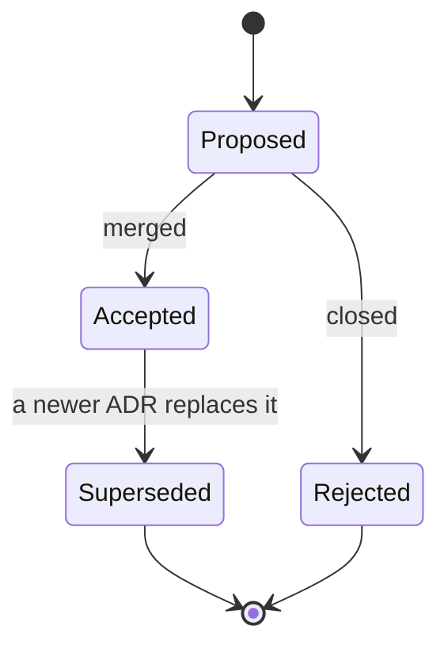

# Architecture Decision Records

## TL;DR

Each ADR records one decision: the context, what was decided, and what it costs.
ADRs are immutable once merged — a change of mind becomes a new ADR that
supersedes the old one. Numbering is sequential, starting at `0001`.

## 5W2H

| Question | Answer |
|---|---|
| **What** | The decision log of the project. |
| **Why** | So a decision is discussed once and its reasoning survives the conversation that produced it. |
| **Who** | Maintainers; contributors MAY propose an ADR in a pull request. |
| **Where** | `docs/adr/NNNN-kebab-case-title.md`. |
| **When** | Written before or together with the implementing pull request. |
| **How** | Copy `docs/templates/document-template.md` and keep Status, Context, Decision, Consequences. |
| **How much** | No cost; typically half an hour of writing. |

## Lifecycle

## Index

| ADR | Title | Status |
|---|---|---|
| [0001](0001-record-architecture-decisions.md) | Record architecture decisions | Accepted |
| [0002](0002-fastapi-backend-and-direct-ssh.md) | FastAPI backend with direct SSH to routers | Superseded by 0007 |
| [0003](0003-conventional-commits-and-automated-releases.md) | Conventional Commits and automated releases | Accepted |
| [0004](0004-web-interface-internationalisation.md) | Web interface internationalisation by URL prefix | Superseded in delivery by 0007; locale rules in force |
| [0005](0005-backend-implementation-language.md) | Backend implementation language — **Rust** | Accepted |
| [0006](0006-structured-bgp-model-and-data-sources.md) | Structured BGP model, data sources and RIPE cross-check | Accepted |
| [0007](0007-unified-rust-architecture-and-drivers.md) | End-to-end Rust architecture with embedded web UI and native vendor drivers | Accepted |
| [0008](0008-frontend-design-system-and-topology-graph.md) | Frontend design system, dark NOC aesthetic and interactive topology graph | Accepted |
| [0009](0009-alpine-container-packaging-and-volumes.md) | Hardened Alpine container packaging, multi-stage compilation and persistent volume management | Superseded by 0012 |
| [0010](0010-tiered-rpki-validation-and-ripestat-fallback.md) | Tiered RPKI validation with router-first state and external RIPEstat fallback | Accepted |
| [0011](0011-authenticated-collaborative-multitenant-looking-glass.md) | Authenticated collaborative multi-tenant platform with PeeringDB/RDAP verification and encrypted router vault | **Proposed** — deferred to 0.3.0 |
| [0012](0012-standalone-binary-exposure-and-packaging.md) | Standalone binary exposure, ports and container packaging | Accepted |
| [0013](0013-product-name-and-branding.md) | Product name: NOGGlass | Accepted |
