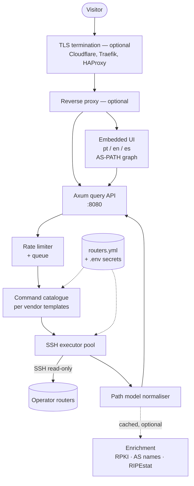
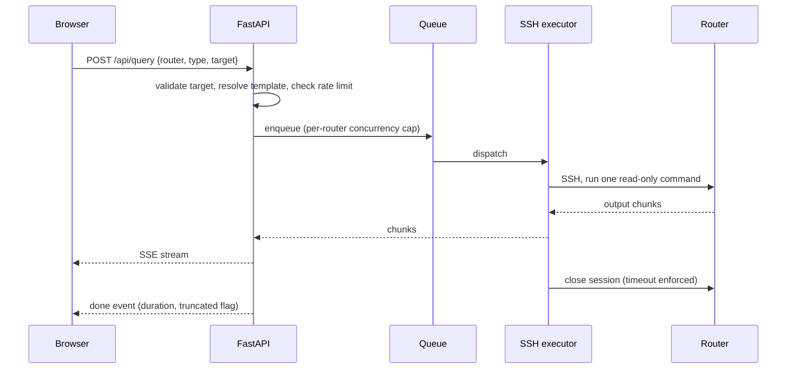

# Architecture overview

## TL;DR

A visitor picks a router and a query type in the embedded web interface. The
binary validates the request against a command catalogue, opens a read-only SSH
session to that router, and returns either streamed text (`ping`, `traceroute`)
or a normalised BGP path model that feeds the AS-PATH topology graph, the route
table and the attribute panels. Routers are described in a configuration file;
credentials come from the environment. NOGGlass is one Rust binary listening on
a high port, with a reverse proxy optional in front (ADR-0005, ADR-0007,
ADR-0012).

## 5W2H

| Question | Answer |
|---|---|
| **What** | The component map, request flow and trust boundaries of the Looking Glass. |
| **Why** | A public web page that reaches production routers needs its boundaries written down before code is written. |
| **Who** | Maintainers and contributors writing backend, frontend or vendor drivers. |
| **Where** | Implemented under `backend/`, `frontend/` and `docker-compose.yml`, once those exist. |
| **When** | Baseline for the `0.1.0` milestone; revised through ADRs. |
| **How** | Typed queries, per-vendor command templates, direct SSH, streamed text and a normalised BGP path model, all inside one binary. |
| **How much** | Target footprint: one process, tens of MB of RAM, on a 1 vCPU VM. |

## Components

Text queries stream straight through; BGP queries pass through the normaliser
described in [ADR-0006](../adr/0006-structured-bgp-model-and-data-sources.md),
which is what makes the topology graph possible.

## Request flow

## Trust boundaries

| Boundary | Rule |
|---|---|
| Internet to the process | Only the HTTP port is published. The process runs as a non-root user on a high port (ADR-0012). |
| Proxy to the process | When a proxy is declared, `X-Forwarded-For` is honoured only from configured trusted addresses, and ignored otherwise. |
| Backend to router | One read-only user per vendor, credentials from the environment, never from the request. |
| Request to command | The visitor chooses a query type from a fixed catalogue. Free-form command input MUST NOT exist. |

## Input handling

Targets are parsed and normalised before use: IPv4 and IPv6 addresses and
prefixes, hostnames, AS numbers. A query whose target does not parse as the type
the catalogue expects MUST be rejected with HTTP 400 before any router is
contacted. Arguments are passed to the template as validated values, never as
raw strings.

Each query carries a timeout, an output size cap and a per-router concurrency
slot. Exceeding any of them MUST terminate the SSH session and return a partial
result flagged as truncated.

## Vendor drivers

A driver declares, for one network operating system, how each supported query
type maps to a command and how its output is post-processed. Adding a vendor
MUST NOT require changes to the API layer.

| Driver | Network OS | Priority |
|---|---|---|
| `vrp` | Huawei VRP | 0.1.0 |
| `mock` | Fixtures on RFC 5737 and RFC 6996 ranges, for CI and the demo | 0.1.0 |
| `routeros` | MikroTik RouterOS | 0.2.0 |
| `dmos` | Datacom DmOS | 0.2.0 |
| `iosxr`, `iosxe`, `nxos` | Cisco | 0.2.0 |
| `junos` | Juniper Junos | 0.2.0 |
| `sros` | Nokia SR OS | 0.3.0 |
| `eos` | Arista EOS | 0.3.0 |
| `frr`, `bird` | Linux routing stacks | 0.3.0 |

## Configuration

| Item | Location | Versioned |
|---|---|---|
| Router inventory, groups, enabled queries | `/etc/nogglass/routers.yml` | Operator's choice; example file in the repository |
| Credentials, tokens, CAPTCHA keys | environment (`NOGGLASS_*`) | Never |
| Branding, default language, limits | environment (`NOGGLASS_*`) | Never |

## Deferred decisions

The following are deliberately out of scope for `0.1.0` and MUST be recorded as
ADRs when they are decided: persistent query history, a BGP daemon of our own as
a route-lookup source, an administrative UI for the inventory, IRR enrichment,
and per-POP agents for segmented networks.

RPKI state, decoded communities, the AS-PATH topology graph and the RIPEstat
cross-check are **no longer deferred**; they are part of `0.1.0` per ADR-0006.
