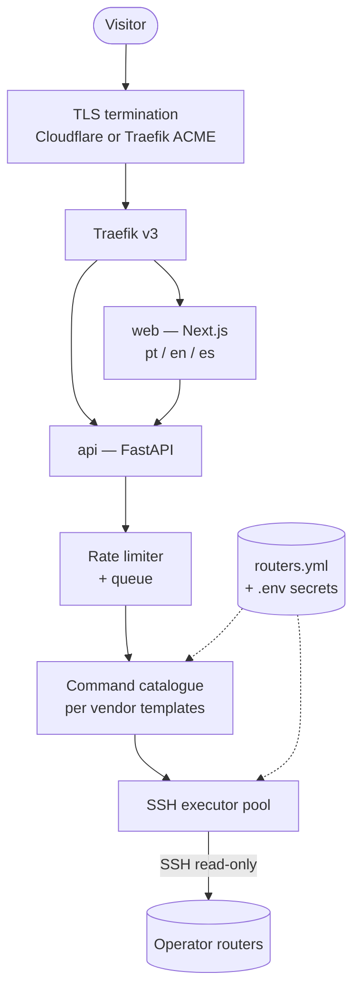
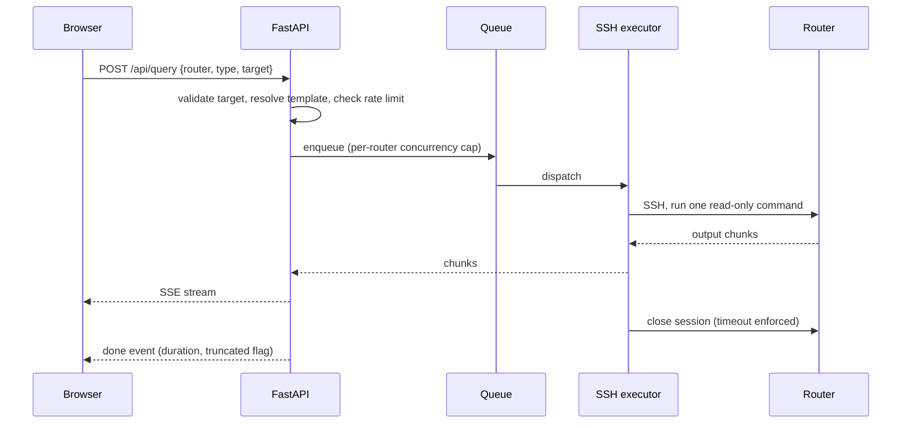

# Architecture overview

## TL;DR

A visitor picks a router and a query type in a Next.js page, the FastAPI backend
validates the request against a command catalogue, opens a read-only SSH session
to that router and streams the output back over Server-Sent Events. Routers are
described in a configuration file; credentials come from the environment. The
only component exposed to the Internet is the Traefik proxy.

## 5W2H

| Question | Answer |
|---|---|
| **What** | The component map, request flow and trust boundaries of the Looking Glass. |
| **Why** | A public web page that reaches production routers needs its boundaries written down before code is written. |
| **Who** | Maintainers and contributors writing backend, frontend or vendor drivers. |
| **Where** | Implemented under `backend/`, `frontend/` and `docker-compose.yml`, once those exist. |
| **When** | Baseline for the `0.1.0` milestone; revised through ADRs. |
| **How** | Typed queries, per-vendor command templates, direct SSH, streamed output. |
| **How much** | Target footprint: under 1 GB RAM for the whole stack on a 2 vCPU VM. |

## Components

## Request flow

## Trust boundaries

| Boundary | Rule |
|---|---|
| Internet to proxy | Only ports 80/443 are published. Everything else is internal to the Compose network. |
| Proxy to backend | The backend MUST NOT be reachable directly from the Internet. |
| Backend to router | One read-only user per vendor, credentials from the environment, never from the request. |
| Request to command | The visitor chooses a query type from a fixed catalogue. Free-form command input MUST NOT exist. |

## Input handling

Targets are parsed and normalised before use: IPv4 and IPv6 addresses and
prefixes, hostnames, AS numbers. A query whose target does not parse as the type
the catalogue expects MUST be rejected with HTTP 400 before any router is
contacted. Arguments are passed to the template as validated values, never as
raw strings.

Each query carries a timeout, an output size cap and a per-router concurrency
slot. Exceeding any of them MUST terminate the SSH session and return a partial
result flagged as truncated.

## Vendor drivers

A driver declares, for one network operating system, how each supported query
type maps to a command and how its output is post-processed. Adding a vendor
MUST NOT require changes to the API layer.

| Driver | Network OS | Priority |
|---|---|---|
| `routeros` | MikroTik RouterOS | 0.1.0 |
| `vrp` | Huawei VRP | 0.1.0 |
| `dmos` | Datacom DmOS | 0.2.0 |
| `iosxr`, `iosxe`, `nxos` | Cisco | 0.2.0 |
| `junos` | Juniper Junos | 0.2.0 |
| `sros` | Nokia SR OS | 0.3.0 |
| `eos` | Arista EOS | 0.3.0 |
| `frr`, `bird` | Linux routing stacks | 0.3.0 |

## Configuration

| Item | Location | Versioned |
|---|---|---|
| Router inventory, groups, enabled queries | `routers.yml` | Operator's choice; example file in the repository |
| Credentials, tokens, CAPTCHA keys | `.env` | Never |
| Branding, default language, limits | `.env` | Never |

## Deferred decisions

The following are deliberately out of scope for `0.1.0` and MUST be recorded as
ADRs when they are decided: persistent query history, a BGP daemon as a
route-lookup source, an administrative UI for the inventory, RPKI and IRR
enrichment, and per-POP agents for segmented networks.
