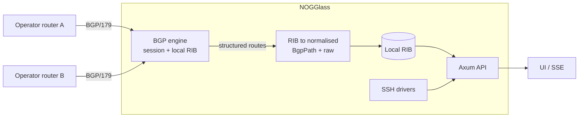
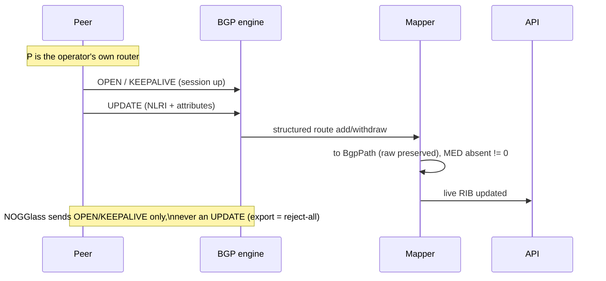

# BGP session support

## TL;DR

Today NOGGlass only reads other people's routers over SSH, on demand. This
document plans a second source of truth: an operator configures NOGGlass to
**peer over BGP with their own router**, NOGGlass receives that router's routes
into a **local RIB**, and the looking glass answers from that live table instead
of a login per question. It stays read-only: it **announces nothing** and only
ever receives. The open decision is **which Rust BGP engine** drives the session,
recorded in an ADR before code lands. Tracked in issue #171.

The key words "MUST", "MUST NOT", "SHOULD", "RECOMMENDED" and "MAY" are to be
interpreted as in [RFC 2119](https://www.rfc-editor.org/rfc/rfc2119).

## 5W2H

| Question | Answer |
|---|---|
| **What** | A BGP speaker inside NOGGlass that peers with the operator's own router(s), receives that router's routes into a local RIB, and serves them through the existing API/UI as the normalised path model ([ADR-0006](../adr/0006-structured-bgp-model-and-data-sources.md)). |
| **Why** | SSH answers one question per login and shows only what a command was typed for. Peering NOGGlass directly with the router gives the looking glass that router's full table, held locally and updated continuously, with no credentials to store and no vendor CLI to scrape. |
| **Who** | Operators who point their own router at NOGGlass; maintainers who pick the engine and own the ADR. Visitors only see faster, fuller answers. |
| **Where** | A new component in the workspace; configuration under `NOGGLASS_*`; a BGP session with the operator's router (TCP/179, inbound or outbound). The SSH drivers do not change. |
| **When** | After the engine decision (ADR-00XX). This document is the plan and the discussion; implementation is a follow-up per the decision. |
| **How** | A BGP engine maintains the session; NOGGlass maps its RIB into `BgpPath`/summary and preserves raw. Export policy is reject-all. |
| **How much** | One long-lived session process/task and its memory (a full IPv4 table is ~1.9M paths — engine choice dominates the footprint); measured `mem_limit` per the Compose rule. Engineering: a session manager, a RIB→model mapper, and the engine integration. |

## Context

NOGGlass is, by design, a read-only looking glass. Becoming a BGP **speaker** is
a new active protocol, so the project's non-negotiable rules are restated here
as requirements:

- NOGGlass **MUST NOT** announce any prefix by default. The export policy
  **MUST** be reject-all; a deployment that wants to originate anything **MUST**
  opt in explicitly. This is the network-facing echo of the lab's "every device
  under test announces nothing" rule — a looking glass is a listener, not a
  transit participant.
- The feature **MUST** default to disabled (`NOGGLASS_BGP_ENABLED=false`).
- It **MUST** fail closed: no session, no configuration, or an engine that is
  down means the query is refused, never answered from stale or guessed data.
  Absent path attributes are `null`; an unreadable feed is an error, never
  `Ok(empty)`.
- Received data **MUST** map into the normalised path model with the raw form
  preserved, so a route learned by BGP and a route scraped by SSH read the same
  way to the UI.
- The session **MUST** be authenticated and hardened: TCP-MD5 or TCP-AO where
  the engine supports it, GTSM (TTL security) **RECOMMENDED**, and the listener
  **MUST** be reachable only from configured peers (ACL / private link).
- The inbound BGP listener is an **exception** to "no published ports except the
  proxy". It **MUST** be opt-in, documented, and firewalled to the peer set.

## Details

Routes flow in; nothing NOGGlass holds is ever advertised out.

### The decision: which engine drives the session

This is the point of the work and **MUST** be settled in an ADR before
implementation. The operator preference is a Rust engine, and the job — peer
with a router, hold its RIB locally, answer from it — is a route-collector, not
a transit router. Two Rust options fit it, and each one also covers BMP (issue
#172), so a single choice **MAY** serve both features. Candidates, Rust first:

| Engine | Shape | For | Against |
|---|---|---|---|
| **Rotonda** (NLnet Labs) | Rust BGP+BMP collector daemon; in-memory RIB; queryable JSON/HTTPS API | Purpose-built to open BGP/BMP sessions and collect peers' routes into a RIB — exactly this feature; typed JSON out, no scraping; same house as Routinator/NSD/Unbound; **also delivers #172** | A separate process (sidecar), so not the single binary; pre-1.0; its Roto filter language to learn |
| **NetGauze** crates (`netgauze-bgp-speaker`, `netgauze-bmp-*`) | Rust libraries compiled into the NOGGlass binary | Keeps the single binary; typed end to end; one dependency family does **both** the BGP session and BMP; Apache-2.0 | We own the RIB and the glue; the speaker crate is young (~27% documented, v0.13, 2026); more engineering |
| **Holo** (NLnet-funded) | Full Rust routing daemon; gRPC/gNMI/YANG northbound | Solid engineering; structured northbound; MIT | It is a *router* meant to install routes — more than a looking glass needs; sidecar |
| GoBGP / BIRD / FRR | Go / C daemons | Mature, huge deployments, proven at scale | Not Rust; BIRD/FRR mean parsing control-plane text again — the pain this project fights; GoBGP is gRPC-clean but a Go sidecar |

**Recommendation (open to discussion).** Given NOGGlass's "one Rust binary"
identity, lead with **NetGauze embedded**: the session FSM and BMP receiver
compile into the binary, everything stays typed, and one dependency family
covers this issue and #172. Fall back to **Rotonda** (a Rust sidecar) if owning
the RIB and glue is too much for a first cut — it is the lowest-risk way to get
the feature running and it, too, delivers both features. All candidates are
pre-1.0, so the ADR **MUST** pin a version; the Rust licences are permissive.

No engine is chosen here. The comparison is the input to the ADR, which the
implementation blocks on. The decision is tracked in issue #171.

## Consequences

- **Easier:** answers that no longer need a login; the full received table, not
  just what a command showed; a path to features that want a live RIB (change
  feeds, history) later.
- **Harder:** NOGGlass now runs a long-lived network session and an inbound
  listener, which is operational surface it did not have — authentication,
  firewalling and memory for a full table all become real concerns.
- **Ruled out for now:** originating or re-advertising anything. The read-only
  posture is preserved by an enforced reject-all export policy; changing that is
  a separate decision, not a config convenience.
- **Independent of BMP** (issue #172): that is an inbound, monitoring-only feed;
  this is an outbound session NOGGlass initiates or accepts as a peer. The two
  share the normalised model but neither blocks the other.
