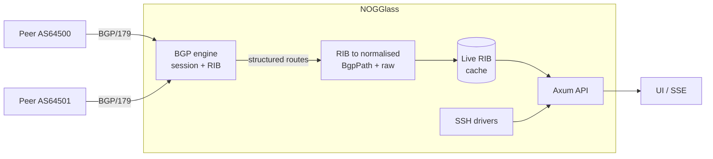
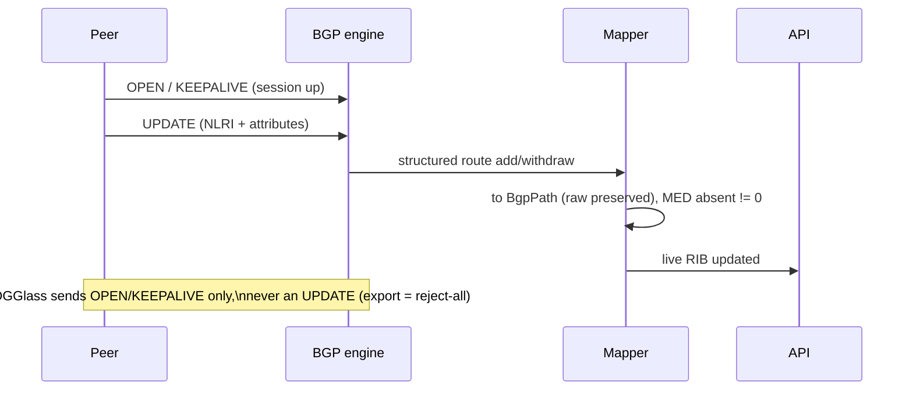

# BGP session support

## TL;DR

Today NOGGlass only reads other people's routers over SSH, on demand. This
document plans a second source of truth: NOGGlass **holds its own BGP session(s)**
to one or more peers and answers from the live feed it receives — an always-on
RIB instead of a login per question. It MUST stay read-only toward the network:
it **announces nothing** by default and only ever listens. The open decision is
**which BGP engine** drives the session — FRR, BIRD, GoBGP or a native Rust
speaker — recorded in an ADR before code lands. Tracked in issue #171.

The key words "MUST", "MUST NOT", "SHOULD", "RECOMMENDED" and "MAY" are to be
interpreted as in [RFC 2119](https://www.rfc-editor.org/rfc/rfc2119).

## 5W2H

| Question | Answer |
|---|---|
| **What** | A BGP speaker inside NOGGlass that establishes and maintains sessions with configured peers, receives their routes, and serves them through the existing API/UI as the normalised path model ([ADR-0006](../adr/0006-structured-bgp-model-and-data-sources.md)). |
| **Why** | SSH answers one question per login and shows only what a command was typed for. A live BGP feed gives the looking glass the full received table, updated continuously, with no router credentials to hold and no vendor CLI to scrape. |
| **Who** | Operators who want a looking glass fed by a real session; maintainers who pick the engine and own the ADR. Visitors only see faster, fuller answers. |
| **Where** | A new component in the workspace; configuration under `NOGGLASS_*`; a new inbound TCP listener (BGP/179). The SSH drivers do not change. |
| **When** | After the engine decision (ADR-00XX). This document is the plan and the discussion; implementation is a follow-up per the decision. |
| **How** | A BGP engine maintains the session; NOGGlass maps its RIB into `BgpPath`/summary and preserves raw. Export policy is reject-all. |
| **How much** | One long-lived session process/task and its memory (a full IPv4 table is ~1.9M paths — engine choice dominates the footprint); measured `mem_limit` per the Compose rule. Engineering: a session manager, a RIB→model mapper, and the engine integration. |

## Context

NOGGlass is, by design, a read-only looking glass. Becoming a BGP **speaker** is
a new active protocol, so the project's non-negotiable rules are restated here
as requirements:

- NOGGlass **MUST NOT** announce any prefix by default. The export policy
  **MUST** be reject-all; a deployment that wants to originate anything **MUST**
  opt in explicitly. This is the network-facing echo of the lab's "every device
  under test announces nothing" rule — a looking glass is a listener, not a
  transit participant.
- The feature **MUST** default to disabled (`NOGGLASS_BGP_ENABLED=false`).
- It **MUST** fail closed: no session, no configuration, or an engine that is
  down means the query is refused, never answered from stale or guessed data.
  Absent path attributes are `null`; an unreadable feed is an error, never
  `Ok(empty)`.
- Received data **MUST** map into the normalised path model with the raw form
  preserved, so a route learned by BGP and a route scraped by SSH read the same
  way to the UI.
- The session **MUST** be authenticated and hardened: TCP-MD5 or TCP-AO where
  the engine supports it, GTSM (TTL security) **RECOMMENDED**, and the listener
  **MUST** be reachable only from configured peers (ACL / private link).
- The inbound BGP listener is an **exception** to "no published ports except the
  proxy". It **MUST** be opt-in, documented, and firewalled to the peer set.

## Details

Routes flow in; nothing NOGGlass holds is ever advertised out.

### The decision: which engine drives the session

This is the point of the work and **MUST** be settled in an ADR before
implementation. Candidates:

| Engine | Integration | For | Against |
|---|---|---|---|
| **GoBGP** | gRPC API (typed messages) or embedded Go lib | Structured routes over gRPC — **no CLI scraping**, the exact pain this project was built around; large tables, add-path, multiprotocol; already speaks BMP as a client | Separate Go runtime → a sidecar, in tension with the single-binary model; needs a Rust gRPC client (tonic) |
| **BIRD 2** | `birdc` control socket | The de-facto looking-glass engine (alice-lg / birdwatcher); tiny footprint; superb RIB and filter language; proven at IXP scale | Control output is semi-structured text — parsing again, though far tamer than vendor CLI |
| **FRR** | vtysh, or northbound gRPC/YANG | Full router; already in the lab as the reference peer | Heaviest; controlling it means parsing vtysh, the very thing the SSH drivers already fight |
| **Native Rust** | in-process (`netgauze` / `zettabgp` / `bgp-rs`) | Single binary preserved; typed end to end; no IPC | A correct BGP FSM, session management and RIB is a lot of code and risk to own |

**Recommendation (open to discussion).** GoBGP as the engine, run as a sidecar,
with a small Rust gRPC client mapping its structured routes into the normalised
model. The whole history of this codebase is the cost of scraping vendor text,
and GoBGP is the one option that hands us **typed** routes and so never tempts us
to invent a value a peer did not send. BIRD is the strong alternative and the
traditional choice; a native-Rust speaker is the long-term "single binary, no
dependencies" endgame and **MAY** supersede the sidecar later.

No engine is chosen here. The comparison is the input to the ADR, which the
implementation blocks on. The decision is tracked in issue #171.

## Consequences

- **Easier:** answers that no longer need a login; the full received table, not
  just what a command showed; a path to features that want a live RIB (change
  feeds, history) later.
- **Harder:** NOGGlass now runs a long-lived network session and an inbound
  listener, which is operational surface it did not have — authentication,
  firewalling and memory for a full table all become real concerns.
- **Ruled out for now:** originating or re-advertising anything. The read-only
  posture is preserved by an enforced reject-all export policy; changing that is
  a separate decision, not a config convenience.
- **Independent of BMP** (issue #172): that is an inbound, monitoring-only feed;
  this is an outbound session NOGGlass initiates or accepts as a peer. The two
  share the normalised model but neither blocks the other.
