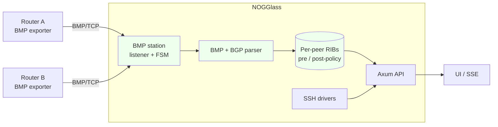

# BMP support

## TL;DR

This document plans NOGGlass acting as a **BMP station** (RFC 7854): the
operator's real routers open a TCP session *to* NOGGlass and stream what their
BGP is doing — per-peer routes (pre/post-policy), session up/down and stats —
and NOGGlass serves that live view through the existing API/UI. BMP is
monitoring-only by definition, so it fits the read-only ethos exactly; but the
feed carries no authentication and NOGGlass MUST treat it as untrusted input and
parse it fail-closed. The open decision is **how the station is built** — native
Rust with a BGP/BMP parsing crate, or an external collector — recorded in an ADR
before code lands. Tracked in issue #172.

The key words "MUST", "MUST NOT", "SHOULD", "RECOMMENDED" and "MAY" are to be
interpreted as in [RFC 2119](https://www.rfc-editor.org/rfc/rfc2119).

## 5W2H

| Question | Answer |
|---|---|
| **What** | A BMP station in NOGGlass that accepts sessions initiated by monitored routers and turns their BMP stream (Initiation, Peer Up/Down, Route Monitoring, Stats, Termination) into the normalised path and summary models ([ADR-0006](../adr/0006-structured-bgp-model-and-data-sources.md)). |
| **Why** | BMP gives the looking glass a continuous, per-peer view of a real router's Adj-RIB-In (and Loc-RIB, RFC 9069) with no login and no CLI to scrape — the always-on complement to on-demand SSH and to a NOGGlass-held BGP session. |
| **Who** | Operators who point their routers' BMP exporters at NOGGlass; maintainers who choose the implementation and own the ADR. |
| **Where** | A new component and an inbound TCP listener (the RFC fixes no port; e.g. 11019). Configuration under `NOGGLASS_*`. The SSH drivers do not change. |
| **When** | After the implementation decision (ADR-00YY). This document is the plan and the discussion. |
| **How** | A BMP listener accepts router-initiated sessions, parses BMP + embedded BGP UPDATEs into `BgpPath`/summary, keeps per-peer RIBs, and serves them. |
| **How much** | One listener plus per-peer RIB state (memory scales with peers × table size); measured `mem_limit`. Engineering: the listener, a BMP+BGP parser, and per-peer RIB bookkeeping. |

## Context

BMP is a receive-and-observe protocol: the station never sends routing state to
a router, so it sits comfortably inside the read-only rule. The requirements
that still bite:

- The feature **MUST** default to disabled (`NOGGLASS_BMP_ENABLED=false`).
- BMP has **no authentication of its own** (RFC 7854 §3.2). NOGGlass **MUST**
  treat every session as untrusted: the listener **MUST** be reachable only from
  configured routers (ACL / private link), and TLS or a network tunnel is
  **RECOMMENDED** where the transport crosses untrusted ground.
- The parser **MUST** be defensive and fail closed: bounded reads, a malformed
  message drops the session rather than corrupting state, and an unparseable
  attribute is reported — never guessed, never `Ok(empty)` for failure. Absent
  attributes are `null`.
- Parsed routes and peer states **MUST** map into the normalised models with the
  raw form preserved, so a BMP-fed route reads like an SSH-scraped one.
- The inbound BMP listener is another **exception** to "no published ports
  except the proxy": opt-in, documented, firewalled to the router set.

## Details



```mermaid
sequenceDiagram
    participant R as Monitored router
    participant S as BMP station
    participant P as Parser
    R->>S: TCP connect (router initiates)
    R->>S: Initiation
    R->>S: Peer Up (per monitored peer)
    R->>S: Route Monitoring (BGP UPDATE, pre/post-policy)
    P->>P: to BgpPath (raw kept); malformed -> drop session
    R->>S: Stats Report
    R->>S: Peer Down / Termination
    Note over S,R: Station only receives.\nIt never sends routing state back.
```

### The decision: how the station is built

To be settled in an ADR before implementation. This is **independent** of the
BGP-session engine choice (issue #171): BMP is receive-only, and the common BGP
speakers are BMP *clients* (the monitored side), not stations — so choosing
GoBGP or BIRD for a session does **not** hand us a BMP collector.

| Approach | For | Against |
|---|---|---|
| **Native Rust station** (`netgauze` / `zettabgp` parse BMP + BGP) | Keeps the single-binary model; typed end to end; no external pipeline; the BMP wire format is small and well-scoped | We own the listener, the per-session FSM and per-peer RIB bookkeeping |
| **OpenBMP / obmp** as a sidecar | Battle-tested at scale | Heavy — a Kafka pipeline and a datastore; breaks single-binary; large operational surface |
| **pmacct `pmbmpd`** as a sidecar | Mature collector, lighter than OpenBMP | Still an external process and its output format to consume; another moving part |

**Recommendation (open to discussion).** A native Rust BMP station built on a
vetted parsing crate (`netgauze` looks the best fit — it parses BMP and the
embedded BGP messages into typed structures). BMP's framing is simple, typed
parsing keeps us honest about "never invent a value," and staying in-process
preserves the single-binary deployment. External collectors remain a **MAY** for
very large fleets that already run one.

No approach is chosen here. The table is the input to the ADR, which the
implementation blocks on. The decision is tracked in issue #172.

## Consequences

- **Easier:** a live, per-peer view of real routers with no credentials and no
  CLI; pre- and post-policy RIBs, which SSH rarely exposes cleanly; a natural
  base for history and change feeds later.
- **Harder:** an inbound listener that parses attacker-reachable input, so the
  parser's defensiveness is a security property, not a nicety; per-peer RIB
  memory grows with the fleet.
- **Ruled out:** any router-facing action. BMP is observe-only and so is this;
  there is no configuration that turns the station into a speaker.
- **Independent of the BGP session** (issue #171): that is an outbound session
  NOGGlass runs as a peer; this is an inbound monitoring feed routers push. They
  share the normalised model, and neither blocks the other.
