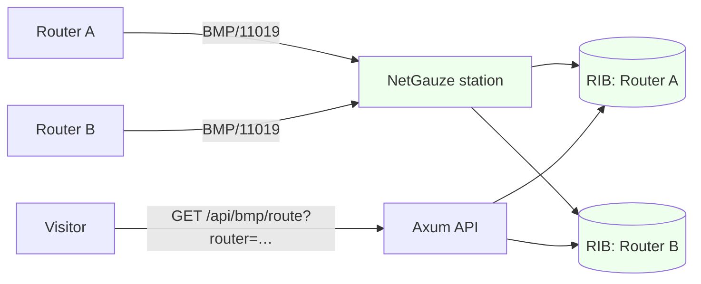

# Running NOGGlass's BMP station

## TL;DR

NOGGlass can run a **BMP station**: your routers open a BMP session to it
(RFC 7854) and stream the routes they see, and NOGGlass answers route queries
from what they reported, with no login and no vendor CLI to scrape (issue #172,
[ADR-0016](../adr/0016-one-rust-engine-for-bgp-session-and-bmp.md)). It is
**off by default** and **observe-only** — BMP carries no routing state back to a
router, and there is no knob that turns the station into a speaker. Its routes
are read back at `GET /api/bmp/route?target=<prefix>`, and it appears in the
source selector as one source. The pipeline works end to end today; per-router
views and BMP v4 are later refinements (see **Status**).

The key words "MUST", "MUST NOT", "SHOULD", "RECOMMENDED" and "MAY" are to be
interpreted as in [RFC 2119](https://www.rfc-editor.org/rfc/rfc2119).

## 5W2H

| Question | Answer |
|---|---|
| **What** | How to configure and query NOGGlass's BMP station. |
| **Why** | A continuous per-peer feed of a router's received routes, always on, with no credentials to store and no CLI to scrape. |
| **Who** | Operators who point their routers' BMP exporters at NOGGlass; it is their call to enable it and firewall it. |
| **Where** | The `[bmp]` section of `nogglass.toml`; the `GET /api/bmp/route` endpoint. |
| **When** | Optional; disabled unless `enabled = true`. |
| **How** | Routers dial NOGGlass, which parses their BMP stream into a local RIB and serves it. See below. |
| **How much** | One listener plus memory for the monitored routes; no licence cost. |

## Context

The station is **observe-only by the protocol**, and three properties are fixed,
not configurable:

- NOGGlass **MUST NOT** send routing state to a router — BMP is a monitoring
  feed in one direction, and there is no speaker mode.
- The feature **MUST** stay off unless `enabled = true`.
- BMP carries no authentication (RFC 7854 §3.2), so its input is **untrusted**:
  the parser **MUST** fail closed (a frame it cannot decode ends that session
  rather than being guessed), and the listener **MUST** be reachable only from
  the configured routers.

Because the station accepts inbound TCP (the RFC fixes no port; 11019 is the
common choice), it is an **exception to the "no published ports but the proxy"
rule**: the operator **MUST** firewall it to the configured routers, and the
`[[bmp.router]]` allow-list is a second line of defence — a connection from an
address not on a non-empty list is refused before a byte is read.

## Configuration

```toml
[bmp]
enabled = true
listen  = ["[::]:11019"]        # where routers dial in

[[bmp.router]]
id          = "edge01"
address     = "192.0.2.2"       # the address the router connects from
description = "Edge router, NYC" # optional, shown in the interface
```

`listen` is required when enabled — a station must listen somewhere. Each
`[[bmp.router]]` needs a distinct `id` and `address`, and **is its own query
source** in the interface, named by its `description` (or its `id`). The `id`
**MUST NOT** collide with a router id or with `bgp.source_id`. An **empty**
router list is allowed but means NOGGlass accepts any source that reaches a
listener, relying on network ACLs alone; each such source then appears keyed by
the address it connects from, and the station logs a warning at startup. Unknown
keys are rejected, so a typo cannot leave the station silently mis-set.

On the router side, export the routes that actually carry data. A common gotcha:
a router that monitors a peer's **pre-policy** Adj-RIB-In may not retain it (FRR,
for one, keeps it only with `soft-reconfiguration inbound`), so the station RIB
stays empty even though the session is up. Prefer **post-policy** monitoring,
which streams the routes as installed after inbound policy. See `lab/localbmp/`
for a worked FRR example.

## Querying the monitored routes

```
GET /api/bmp/route?router=edge01&target=203.0.113.0/24
```

`router` names which monitored router to answer from (its `[[bmp.router]]` id,
or the connecting address when there is no allow-list). It returns the same
shape as a router `bgp_route` answer — every monitored peer's path for the
prefix, in the normalised model
([ADR-0006](../adr/0006-structured-bgp-model-and-data-sources.md)), keyed by the
peer's address, with `raw_output` empty because a BMP-learned route has no router
text. An empty result means "this router reports no such prefix" (including when
it is not currently connected), never a failed lookup. The endpoint answers
`404 bmp_disabled` when `[bmp]` is off. Lookups are rate-limited like every other
query. Matching is longest-prefix, so a host or more-specific query returns the covering route.
An AS-number target answers `bgp_aspath` instead — every route the router
monitors whose AS-path contains that AS (`GET /api/bmp/route?router=edge01&target=AS65001`).

The router also answers `bgp_summary` — its neighbour table, built from the peers
BMP reports (Peer Up/Down) and the RIB:

```
GET /api/bmp/summary?router=edge01
```

It lists each monitored peer with its AS, whether it is up (`Established`) or
down (`Idle`), and how many prefixes it has advertised. A router not currently
connected answers an empty table.



## Status

The station listens, admits routers by the allow-list, and parses their stream
with NetGauze's BMP codec into **that router's** RIB; a Route Monitoring message
installs its peer's routes and a Peer Down forgets them. Each monitored router
has its own RIB, so one router's view is isolated from another's, a reconnecting
router re-synchronises from empty, and a router whose last session closes stops
answering rather than serving a stale table. Proven end to end against a real
FRR 9.1 stream (a captured fixture) and by a loopback test. One refinement is
tracked under #172:

- **BMP v3 only.** v4 messages are parsed but not yet mapped; the station warns
  once per session and changes no routes, rather than dropping v4 routes
  silently.

## Consequences

- **Easier:** an always-on, per-peer view of a router's received table, no
  login, no CLI, and the pre- and post-policy visibility BMP gives.
- **Harder:** the operator opens an inbound port that MUST be firewalled and
  parses attacker-reachable input, so the parser's defensiveness is a security
  property, not a nicety; RIB memory grows with the fleet.
- **Ruled out:** any router-facing action — the observe-only posture is enforced
  by the protocol and the code.
