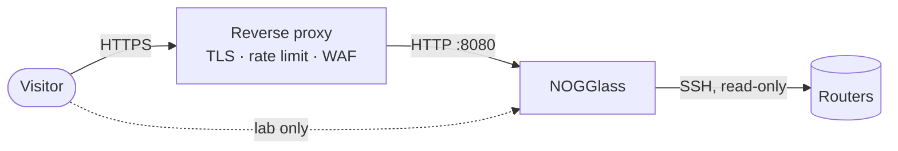

# Deploying NOGGlass

## TL;DR

`docker compose up -d` with a published image, one configuration file in a
named volume, and router passwords in the environment. NOGGlass listens on
`:8080` as an unprivileged user; put a reverse proxy in front for TLS. It
refuses to start with a configuration it does not understand, which is the
behaviour you want from something that reaches production routers.

## 5W2H

| Question | Answer |
|---|---|
| **What** | How an operator installs, configures and upgrades NOGGlass. |
| **Why** | Self-hosting has to be boring, and the failure modes have to be visible before a visitor finds them. |
| **Who** | The network operator running the instance. |
| **Where** | Any Linux host with Docker, or a single binary on a host with none. |
| **When** | From the first release onwards. |
| **How** | Published image, Compose file, `nogglass.toml`, secrets in the environment. |
| **How much** | Measured at 16 MB of RSS serving the mock router, in a debug build; a release build is smaller. |

## What you need first

1. **A read-only user on each router.** NOGGlass never configures anything, so
   the account it uses SHOULD have the smallest read-only role your vendor
   offers. Create one per router, not one shared with humans, so its activity is
   distinguishable in your logs. [Read-only router users](router-users.md) has a
   recipe per vendor.
2. **Reachability.** The host must reach each router over SSH. The source
   address your routers see is the host address; if your management ACLs are
   strict, add it before you start.
3. **A decision about exposure.** A looking glass is a public endpoint in front
   of production routers. Decide now whether it faces the Internet, and put a
   proxy and rate limiting in front if it does.

## Install with Docker

```bash
curl -O https://raw.githubusercontent.com/andrediashexa/looking-glass/main/docker-compose.yml
curl -O https://raw.githubusercontent.com/andrediashexa/looking-glass/main/nogglass.example.toml

docker compose up -d                      # starts and fails loudly if misconfigured
docker cp nogglass.example.toml nogglass:/etc/nogglass/nogglass.toml
docker compose restart
docker compose logs -f nogglass
```

The configuration lives in a named volume, so `docker compose pull && docker
compose up -d` never overwrites it. On a Linux host the file is at
`/var/lib/docker/volumes/nogglass-config/_data/nogglass.toml`, which is where
configuration management should write it.

## Install the binary

```bash
NOGGLASS_CONFIG=/etc/nogglass/nogglass.toml \
NOGGLASS_HTTP_ADDR=0.0.0.0:8080 \
  ./nogglass
```

No runtime, no interpreter, no asset directory: the interface and the command
catalogue are inside the binary.

## Configuration

Copy [`nogglass.example.toml`](https://github.com/andrediashexa/looking-glass/blob/main/nogglass.example.toml). Router passwords are
**named** in that file and **read from the environment**, so the file is safe to
keep in version control:

```toml
[[router]]
id = "edge-01"
vendor = "huawei_vrp"
host = "192.0.2.10"
username = "nogglass"
credentials = { password_env = "NOGGLASS_EDGE01_PASSWORD" }
```

```bash
# In your secret store, your systemd unit, or a .env file with mode 600.
NOGGLASS_EDGE01_PASSWORD=...
```

NOGGlass checks every named variable at startup and names the missing one, so a
forgotten password is found by you and not by a visitor.

## Environment variables

| Variable | Default | What it does |
|---|---|---|
| `NOGGLASS_CONFIG` | `/etc/nogglass/nogglass.toml` | Configuration file |
| `NOGGLASS_HTTP_ADDR` | `0.0.0.0:8080` | Listen address |
| `NOGGLASS_DEFAULT_LOCALE` | `en` | Language for a visitor whose browser asks for none we serve |
| `NOGGLASS_BEHIND_PROXY` | unset | Declares that a proxy terminates TLS; silences the startup warning |
| `NOGGLASS_LOG` | `info` | Log filter |
| `NOGGLASS_<ROUTER>_PASSWORD` | — | Whatever your configuration names |

## Exposure and TLS

NOGGlass serves plain HTTP on an unprivileged port. That is deliberate
([ADR-0012](../adr/0012-standalone-binary-exposure-and-packaging.md)): binding
443 needs a capability, and TLS with certificate renewal is better handled by
software built for it.



Any proxy does: Cloudflare, Traefik, HAProxy, nginx, Caddy. When one is in
front, set `NOGGLASS_BEHIND_PROXY`. NOGGlass warns at startup when it is
listening on a public address with neither TLS nor a declared proxy, because a
looking glass quietly served in the clear is a worse default than a noisy log
line.

## Upgrading

```bash
docker compose pull && docker compose up -d
```

Image tags follow the release rules
([ADR-0014](../adr/0014-release-every-change-with-patch-prereleases.md)):

| Tag | What it tracks |
|---|---|
| `X.Y.Z` | One exact release. Pin this in production. |
| `X.Y` | Latest patch of that minor version |
| `latest` | Latest **full** release; patch releases are pre-releases and do not move it |

Images are published for **linux/amd64** and **linux/arm64**. They are
cross-compiled rather than emulated, so a release takes minutes instead of the
half hour QEMU needed to compile Rust for arm64.

The arm64 image is built but not started in CI, because running it there would
need the emulation the build avoids. If you run NOGGlass on Ampere, Graviton or
a Raspberry Pi, the first `/api/health` after an upgrade is worth a look.

An operator who wants only blessed versions follows `latest`. An operator who
wants the newest fix pins the exact `X.Y.Z` of a pre-release, knowingly.

## Verifying an installation

```bash
curl -s localhost:8080/api/health                  # {"status":"ok"}
curl -s localhost:8080/api/version                 # version, commit, build time
curl -s localhost:8080/api/routers                 # your inventory, without hosts
curl -s localhost:8080/api/catalogue/huawei_vrp    # exactly what would run on a VRP
```

That last one matters before you point NOGGlass at production: it prints the
commands the vendor driver would send, so you can read them first.

## Operating notes

- **Limits are yours to set.** `timeout_secs`, `max_output_bytes`,
  `max_concurrent_per_router` and `max_concurrent_total` decide how much
  control-plane CPU a stranger can spend. The defaults are deliberately
  conservative; raise them knowingly.
- **A busy instance refuses rather than queues**, answering HTTP 429 with
  `Retry-After`. That is intentional: an unbounded queue is a way to keep a
  router busy indefinitely.
- **Rate limiting is on by default**, at 20 queries a minute per visitor with a
  burst of 5. IPv6 is counted per /64, because one visitor holds a whole /64.
  Listing the router inventory, the version and the health check are never
  limited, so a visitor who is being limited can still read the page that tells
  them to wait.
- **Behind a proxy, list it in `trusted_proxies`.** `X-Forwarded-For` is
  believed only from those addresses; from anywhere else it is attacker
  controlled, and a limiter keyed on an unverified header is a limiter with a
  documented bypass. With a proxy in front and no `trusted_proxies`, every
  visitor counts as the proxy and they all share one allowance — NOGGlass warns
  about exactly that at startup.
- **The mock router** (`vendor = "mock"`) answers from fixtures and never opens
  a session. Keep it for a public demo, remove it once real routers are
  configured.
- **RPKI fallback is off by default.** Turning it on without `validator_url`
  sends queried prefixes to RIPEstat; say so in your privacy notice or point it
  at your own validator.
- **The global view is off by default** for the same reason. Enabled, it shows
  what the Internet announces beside what your router answered, so a prefix that
  never propagated, an origin that does not match, or a more specific announced
  inside your space becomes visible in the interface. A failed lookup reads as
  "global view unavailable", never as agreement.
- **Logs** go to stdout. `docker compose logs -f nogglass`, or your journal for
  the plain binary.

## When something is wrong

| Symptom | Where to look |
|---|---|
| Container exits immediately | Startup validates the configuration and prints exactly what it refused |
| "could not reach the router" | Reachability and ACLs from the host; the message stays vague on purpose, the log has the detail |
| A query returns raw text instead of a table | That vendor has no parser for that query yet. The raw output is still the router answer |
| "too many queries are running" | Concurrency caps; raise them or wait |
| "too many queries from your address" | The per-visitor rate limit; `[rate_limit]` in the configuration |
| Everyone shares one allowance | A proxy is in front and `trusted_proxies` is empty |
| The footer shows `dev` | The binary was not built by the release pipeline, so it does not know its version |
