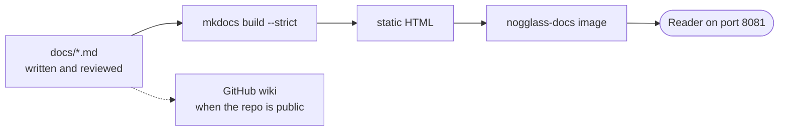

# Running the documentation as a site

## TL;DR

`docs/` is also a container. One image builds every page in this directory into
a searchable site — wiki, operations, design, decisions — and serves it on port
8081. Run it beside NOGGlass and the people using your looking glass have the
manual next to the tool. Nothing in the page is fetched from the Internet, so it
works on a management network with no route out.

```
docker run -d --name nogglass-docs -p 8081:8081 \
  ghcr.io/andrediashexa/nogglass-docs:latest
```

## 5W2H

| Question | Answer |
|---|---|
| **What** | A container serving the whole of `docs/` as a browsable, searchable site. |
| **Why** | GitHub's wiki is unavailable on a private repository without a paid plan, and a manual nobody can reach is not a manual. |
| **Who** | The operator running NOGGlass; readers are whoever can reach the port. |
| **Where** | `Dockerfile.docs` and `mkdocs.yml` in the repository; the image is `ghcr.io/andrediashexa/nogglass-docs`. |
| **When** | Published with every release, tagged with the same version as the server image. |
| **How** | MkDocs Material builds the Markdown; nginx serves the result as a non-root user. |
| **How much** | About 30 MB of image, a few megabytes of memory, and no request ever leaves the container. |

## Why it is a container and not the GitHub wiki

The wiki module needs the repository to be public, or the account to be on a
paid plan. Neither is true today. The pages are written and reviewed as files in
`docs/wiki/` regardless — `scripts/publish-wiki.sh` will mirror them to GitHub
the day the repository is public — so this image is the way to read them
comfortably in the meantime, and stays useful afterwards for anyone who wants
the manual on their own network.



The site is built from the repository at image build time. It therefore cannot
drift from the documents under review: a page that is not committed is not in
the image, and a link to a page that does not exist fails the build.

## Running it

### Beside NOGGlass

NOGGlass listens on 8080 and this listens on 8081, so both run on one host with
no configuration:

```bash
docker run -d --name nogglass-docs --restart unless-stopped \
  -p 8081:8081 ghcr.io/andrediashexa/nogglass-docs:latest
```

Operators MUST pin a version in production — `:0.5` or `:0.5.0` rather than
`:latest` — so that the manual matches the server people are using. The two
images carry the same version number for exactly this reason.

### Building it yourself

```bash
docker build -f Dockerfile.docs -t nogglass-docs:local .
docker run --rm -p 8081:8081 nogglass-docs:local
```

The build takes under a minute and needs no Rust toolchain; it is a separate
image from the server precisely so that a documentation change does not rebuild
the binary.

### Behind a reverse proxy

The site uses relative links throughout except for the diagram library, which is
loaded from `/assets/mermaid.min.js`. It therefore MUST be served from the root
of a host or subdomain — `docs.example.net` — rather than from a subdirectory
such as `example.net/docs/`. A proxy SHOULD pass the request path unchanged:

```nginx
location / {
    proxy_pass http://127.0.0.1:8081;
    proxy_set_header Host $host;
}
```

## What it does not need

The container makes no outbound connection, and neither does the page in the
reader's browser:

| Usually fetched from the Internet | Here |
|---|---|
| Web fonts | System fonts, named explicitly in `docs/assets/site.css` |
| The diagram library | Vendored into the image at build time |
| Search | Built at build time, run in the reader's browser |

One exception SHOULD be known: a browser older than about 2020 with no
`ResizeObserver` tries to fetch a polyfill from a CDN. Every current browser
skips it.

This matters more than it looks. A looking glass is opened when the network is
broken, often from a management network that deliberately has no route to the
Internet. Documentation that renders only when the reader is online is
documentation that disappears when it is needed.

## Exposing it

The site is public information — it is what will be on GitHub when the
repository is public — so it needs no authentication. It has no write path, no
database and no upload: a reader can only fetch files.

Two things are still worth doing if it faces the Internet:

- Serve it over TLS, so a reader is not given a manual an intermediary edited.
- Put it on a different name from the looking glass itself, so that a rate limit
  on queries is not shared with people reading a page.

The container listens as uid 10001 and MUST NOT be run as root; the image is
built to work that way and is not tested any other way.

## Checking it works

```bash
curl -fsS http://127.0.0.1:8081/ >/dev/null && echo "index"
curl -fsS http://127.0.0.1:8081/wiki/ >/dev/null && echo "wiki"
```

The release workflow runs the same two checks against the image it just pushed,
so an image that cannot serve its own wiki never reaches the registry.

## What to read on it

The site groups the whole documentation set:

- **Using NOGGlass** — the ten pages of the manual, which is what most readers
  want. Start at [what a looking glass is](../wiki/1-what-is-a-looking-glass.md).
- **Operations** — [deployment](deployment.md) and
  [read-only router users](router-users.md), which is the pair an operator needs
  before the first router is connected.
- **Design** — the [interface brief](../design/interface-brief.md), screenshots
  and captured payloads.
- **Decisions** — every ADR, which is where "why is it like this" is answered.
