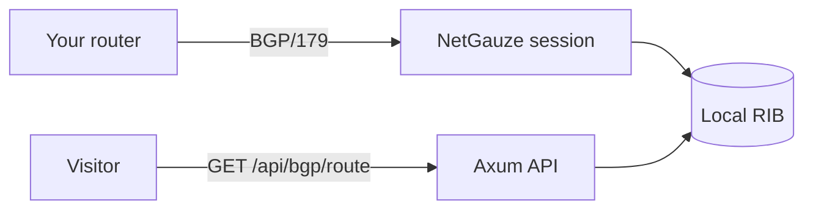

# Running NOGGlass's own BGP session

## TL;DR

NOGGlass can hold its **own** BGP session with a router you operate and answer
route queries from the routes it receives, instead of logging in per query
(issue #171, [ADR-0016](../adr/0016-one-rust-engine-for-bgp-session-and-bmp.md)).
It is **off by default**, **read-only** — it announces nothing and only listens —
and its received routes are read back at `GET /api/bgp/route?target=<prefix>`.
The session runs, but until the known NetGauze parser bug is resolved (see
**Status**) received routes do not yet populate, so treat this as operator setup
that lights up once the engine fix lands.

The key words "MUST", "MUST NOT", "SHOULD", "RECOMMENDED" and "MAY" are to be
interpreted as in [RFC 2119](https://www.rfc-editor.org/rfc/rfc2119).

## 5W2H

| Question | Answer |
|---|---|
| **What** | How to configure and query NOGGlass's own BGP session. |
| **Why** | A live feed answers from the router's full received table with no credentials to store and no vendor CLI to scrape. |
| **Who** | Operators who peer NOGGlass with their own router; it is their call to enable it and firewall it. |
| **Where** | The `[bgp]` section of `nogglass.toml`; the `GET /api/bgp/route` endpoint. |
| **When** | Optional; disabled unless `enabled = true`. |
| **How** | NOGGlass dials the router, receives its routes into a local RIB, and serves them. See below. |
| **How much** | One long-lived session and memory for the received table; no licence cost. |

## Context

The session is **read-only toward the network**, and three properties are fixed,
not configurable:

- NOGGlass **MUST NOT** advertise any prefix — the export policy is reject-all.
- The feature **MUST** stay off unless `enabled = true`.
- A missing `local_as`, `router_id`, or peer when enabled is a **startup error**,
  not a half-configured speaker (fail closed).

Because a BGP session is an inbound/outbound TCP session on port 179, it is an
**exception to the "no published ports but the proxy" rule**: the operator
**MUST** firewall it to the configured router only, and **SHOULD** authenticate
it (TCP-MD5/TCP-AO, GTSM) where the engine supports it.

## Configuration

```toml
[bgp]
enabled   = true
local_as  = 64500
router_id = "192.0.2.1"     # a BGP identifier NOGGlass presents

[[bgp.peer]]
id         = "edge01"
host       = "192.0.2.2"    # the router NOGGlass peers with
remote_as  = 64496
# passive = true            # wait for the router to dial in (needs `listen`)
```

`peer.passive = true` makes NOGGlass wait for the router to connect instead of
dialing it; a passive peer needs a `listen` address (e.g.
`listen = ["[::]:179"]`). Unknown keys are rejected, so a typo cannot leave a
session silently off.

## Querying the received routes

```
GET /api/bgp/route?target=203.0.113.0/24
```

It returns the same shape as a router `bgp_route` answer — every peer's path for
the prefix, in the normalised model ([ADR-0006](../adr/0006-structured-bgp-model-and-data-sources.md)),
with `raw_output` empty because a BGP-learned route has no router text. An empty
result means "no peer advertises this prefix", never a failed lookup. The
endpoint answers `404 bgp_disabled` when `[bgp]` is off. Lookups are rate-limited
like every other query. Matching is longest-prefix, so a host or more-specific query returns the covering route.

The session also answers `bgp_summary`, the neighbour table a vendor router
gives:

```
GET /api/bgp/summary
```

It lists every configured peer with its remote AS, its live session state
(`Idle` … `Established`), the uptime once established, and how many prefixes it
has advertised — built from the configuration, the session state, and the RIB.
Same `404 bgp_disabled` when `[bgp]` is off.

An AS-number target on the route endpoint answers `bgp_aspath` — every route
whose AS-path contains that AS, across both families:

```
GET /api/bgp/route?target=AS65001
```



## Status

The session establishes against real routers, but **received routes do not yet
reach the RIB** because of a bug in the BGP engine (`netgauze-bgp-speaker`
0.13.0): its post-decode check wrongly rejects a valid UPDATE whose NEXT_HOP
follows ORIGIN and AS_PATH — the standard ordering — and resets the session.
The fix is one line upstream; it has been verified locally that with it the
whole pipeline works (routes flow into the RIB), and that the pre-authorised
Rotonda fallback ingests the same routes. The engine resolution is tracked
against issue #171. Configure the session now; it populates once that lands.

## Consequences

- **Easier:** always-on answers from the router's full table, no login, no CLI.
- **Harder:** an operator now runs a long-lived session and opens a port that
  MUST be firewalled and SHOULD be authenticated.
- **Ruled out:** announcing anything — the read-only posture is enforced.
