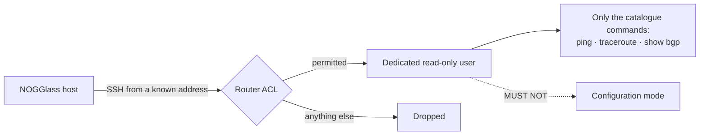

# Read-only router users

## TL;DR

Create a dedicated account per router, with the smallest role that can run the
four commands NOGGlass sends, and nothing else. The per-vendor recipes below are
a starting point, not a policy: check them against your own hardening standard
before pasting. Whatever you configure, verify it from a shell first — if the
account can enter configuration mode, it is too strong.

## 5W2H

| Question | Answer |
|---|---|
| **What** | The router-side account NOGGlass authenticates with, per vendor. |
| **Why** | A public endpoint reaches these routers; the account it uses is the blast radius. |
| **Who** | The network operator, before pointing NOGGlass at anything. |
| **Where** | On each router in the inventory. |
| **When** | Before the first query against a real device. |
| **How** | A dedicated user, a read-only role, and a check that it cannot configure. |
| **How much** | Minutes per router; no licence and no extra hardware. |

## Rules

1. Each router SHOULD have its own account and its own password or key. One
   shared account makes an incident impossible to attribute.
2. The account MUST NOT be able to enter configuration mode, write files, or
   reload. NOGGlass never needs any of those and never asks for them.
3. The account SHOULD be restricted by source address to the NOGGlass host.
4. Where the platform supports it, key authentication SHOULD be preferred over a
   password.
5. The commands NOGGlass will actually send are printed by
   `GET /api/catalogue/{vendor}`. Read them before granting anything.



## Huawei VRP

The reference vendor for `0.1.0`. Level 1 is the visit level: it can run
display and diagnostic commands and cannot configure.

```text
aaa
 local-user nogglass password irreversible-cipher <password>
 local-user nogglass service-type ssh
 local-user nogglass privilege level 1
 local-user nogglass ftp-directory  # not needed; leave unset
quit

ssh user nogglass authentication-type password
ssh user nogglass service-type stelnet
stelnet server enable
```

Restrict where it may come from:

```text
acl number 2000
 rule 5 permit source <nogglass-host> 0
 rule 10 deny
quit
ssh server acl 2000
```

Verify: log in as the account and confirm that `system-view` is refused, and
that `display bgp routing-table 198.51.100.0 255.255.255.0` works.

## Cisco IOS-XE

```text
username nogglass privilege 1 secret <password>
ip ssh version 2

! Privilege 1 already excludes configuration. Allow the diagnostics explicitly
! if your baseline restricts them.
privilege exec level 1 show bgp
privilege exec level 1 ping
privilege exec level 1 traceroute

line vty 0 4
 access-class NOGGLASS in
 transport input ssh
```

## Cisco IOS-XR

```text
username nogglass
 group read-only-tg
 secret <password>
!
```

`read-only-tg` is the built-in read-only task group. Confirm with
`show user tasks` while logged in as the account.

## Juniper Junos

```text
set system login user nogglass class read-only
set system login user nogglass authentication ssh-ed25519 "<public key>"
set system services ssh protocol-version v2
```

The built-in `read-only` class covers `show` commands and `ping` or
`traceroute` from the operational mode, and excludes configuration.

## Nokia SR OS

```text
/configure system security user "nogglass"
    password <password>
    access console
    console member "read-only"
```

## MikroTik RouterOS

RouterOS groups are explicit, so grant the minimum and nothing else:

```text
/user group add name=nogglass policy=ssh,read,test,!write,!policy,!ftp,!reboot,!password,!sniff,!sensitive,!romon
/user add name=nogglass group=nogglass password=<password> address=<nogglass-host>
```

`test` is what `/ping` and `/tool traceroute` need; `!sensitive` keeps stored
secrets out of the account's view.

## Datacom DmOS

```text
configure
 aaa authentication user nogglass password <password> group operator
commit
```

`operator` is the read-only group on DmOS. Verify that `configure` is refused.

## BIRD

BIRD is reached through its control socket or through a shell account. The
account NOGGlass uses SHOULD have read access to the socket and nothing else:

```bash
usermod -aG bird nogglass        # read access to /run/bird/bird.ctl
```

`birdc` is read-only for `show` commands; configuration changes need a separate
privilege, so do not grant `sudo`.

## Arista EOS

```text
username nogglass privilege 1 role network-operator secret <password>
management ssh
   idle-timeout 5
```

## After configuring

From the NOGGlass host, as the account:

```bash
ssh nogglass@192.0.2.10
# Then, on the router, confirm two things:
#   1. the diagnostic commands work
#   2. configuration mode is refused
```

Then let NOGGlass try it:

```bash
curl -s -X POST localhost:8080/api/query \
  -H 'content-type: application/json' \
  -d '{"router":"edge-01","type":"bgp_route","target":"198.51.100.0/24"}'
```

If the answer comes back as raw text instead of a table, the account works and
the parser does not cover that output yet — report it with the raw output
attached, and redact anything you would not publish.
