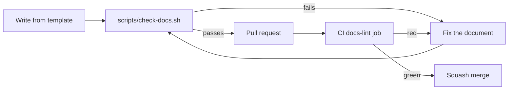

# Documentation standard

## TL;DR

Every document in this repository MUST be written in English, MUST open with a
`## TL;DR`, and — under `docs/` — MUST carry a `## 5W2H` section, MUST use
RFC 2119 keywords in uppercase for requirements, and MUST contain at least one
Mermaid diagram. `scripts/check-docs.sh` enforces this and blocks the pull
request when a rule is broken.

The key words "MUST", "MUST NOT", "REQUIRED", "SHALL", "SHALL NOT", "SHOULD",
"SHOULD NOT", "RECOMMENDED", "MAY" and "OPTIONAL" in the project documentation
are to be interpreted as described in
[RFC 2119](https://www.rfc-editor.org/rfc/rfc2119).

## 5W2H

| Question | Answer |
|---|---|
| **What** | The mandatory shape of every document in this repository. |
| **Why** | Two maintainers and outside contributors need documents that answer the same questions in the same order, so knowledge survives the people who wrote it. |
| **Who** | Everyone who writes Markdown here, including AI assistants. |
| **Where** | Applies to every tracked `*.md` file; the stricter rules apply under `docs/`. |
| **When** | Checked by CI on every pull request that touches Markdown. |
| **How** | Write from `docs/templates/document-template.md` and run `scripts/check-docs.sh`. |
| **How much** | Roughly ten extra minutes per document; the linter is free and runs in seconds. |

## Rules

### R1 — English

Documents MUST be written in English. Translated copies MAY exist with a locale
suffix (`*.pt-BR.md`, `*.es.md`) and are exempt from this rule.

### R2 — TL;DR

Every document MUST start, after the title, with a `## TL;DR` section of at most
six lines that answers the document's question outright. A reader who stops
there MUST still get the conclusion.

### R3 — 5W2H

Every document under `docs/` MUST contain a `## 5W2H` section covering **What**,
**Why**, **Who**, **Where**, **When**, **How** and **How much**. A table is
RECOMMENDED. "How much" means cost, effort or resource impact — write "no cost"
when that is the honest answer, never omit the row.

### R4 — RFC 2119

Requirements MUST be expressed with RFC 2119 keywords in uppercase, and each
document under `docs/` MUST use at least one. Documents that state requirements
SHOULD quote the RFC 2119 boilerplate, as this document does.

### R5 — Diagrams

Every document under `docs/` MUST contain at least one Mermaid diagram.
Diagrams MUST show the real mechanism — components, flow, states or sequence —
not decoration. A document where no diagram adds meaning MAY opt out with the
marker `<!-- lint: no-diagram -->`, which SHOULD be rare.

### R6 — Keep documentation with the change

A pull request that changes behaviour, configuration or architecture MUST update
the affected documents in the same pull request. Documentation debt is treated
as a bug.

### R7 — Decisions become ADRs

An architectural decision MUST be recorded in `docs/adr/` using the ADR
template. ADRs are immutable once merged: superseding one means writing a new
ADR and marking the old one `Superseded by ADR-XXXX`.

## Linter escape hatches

| Marker | Effect |
|---|---|
| `<!-- lint: no-diagram -->` | Skips R5 for that document |
| `<!-- lint: no-tldr -->` | Skips R2, for generated files only |
| `<!-- lint: allow-non-english -->` | Skips R1, for imported or translated material |

Escape hatches MUST carry a one-line comment explaining why they are used.
