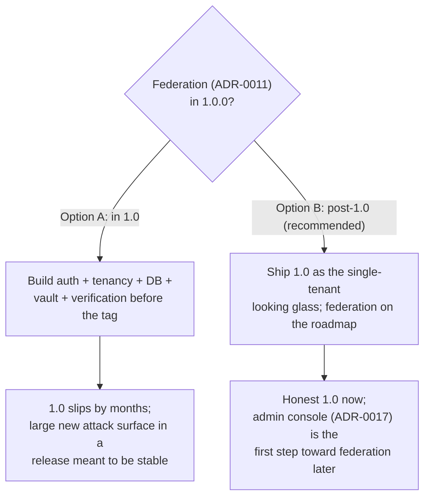

# Federation and 1.0 scope

## TL;DR

This records the answer to [#78]: is the authenticated, multi-tenant **federated
platform** ([ADR-0011]) part of the **1.0.0** release? The recommendation is
**no — federation is post-1.0**. 1.0.0 is the honest, single-tenant, self-hosted
SSH looking glass NOGGlass already is; federation is a large separate system
(accounts, tenancy isolation, a database, PeeringDB/RDAP verification, an
encrypted router vault) that MUST NOT be rushed into a stability release. It
stays on the [roadmap](roadmap.md), with the single-owner web admin interface
([ADR-0017], [#204]) as its natural first step. The maintainers own this call;
merging this document accepts the recommendation and closes [#78].

The key words "MUST", "MUST NOT", "SHOULD" and "MAY" are used as in
[RFC 2119](https://www.rfc-editor.org/rfc/rfc2119).

## 5W2H

| Question | Answer |
|---|---|
| **What** | Whether the ADR-0011 federated multi-tenant platform is in the 1.0.0 release. |
| **Why** | 1.0.0 is a public stability promise; its scope MUST be decided deliberately, and [#78] is the open question. |
| **Who** | The maintainers decide; this document records the recommendation for their sign-off. |
| **Where** | Scope only — no code. Relates to [ADR-0011] (the platform) and [ADR-0017] (the single-tenant admin console). |
| **When** | Before tagging 1.0.0. |
| **How** | Recommend federation is post-1.0; on acceptance, close [#78] and keep it on the roadmap. |
| **How much** | No cost to defer. Including it in 1.0 would be a large, security-sensitive build that dwarfs the rest of the release. |

## Context

A 1.0.0 that operators can depend on MUST claim only what is proven
([ADR-0015]). What is proven today is a single-tenant, read-only, self-hosted
looking glass: SSH engine, typed BGP model, AS-PATH graph, tiered RPKI, global
view, rate limiting and the i18n UI.

[ADR-0011] describes something much larger: authenticated accounts, multi-tenant
isolation, PeeringDB/RDAP identity verification, and an encrypted router vault —
backed by a database and an auth system NOGGlass does not have yet. Its own
status is "Proposed" (its "deferred to 0.3.0" note predates the current
versioning and is stale). The routing engine has already been deferred off the
1.0 gate ([#214]); federation is the remaining open scope question.

## Details

Two options, and the recommendation.

### Option A — federation in 1.0.0

Everything in [ADR-0011] ships before the tag. This MUST NOT be chosen lightly:
it adds an authentication system, tenant isolation, persistent storage and a
secret vault — a large, security-critical surface — to a release whose whole
point is that it is stable and proven. It would delay 1.0 by a wide margin and
put unproven, high-risk code in the release that is supposed to be dependable.

### Option B — federation post-1.0 (recommended)

1.0.0 ships as the single-tenant, self-hosted looking glass. Federation stays on
the [roadmap](roadmap.md) as a deliberate post-1.0 track, sequenced **after** the
single-owner web admin interface ([ADR-0017]), which is its natural first step
(one owner managing config, before many tenants managing many). [ADR-0011]
remains the recorded architecture for that work; nothing is thrown away.

This keeps 1.0 honest and near, and does not gate a stability release on the
largest, least-proven part of the vision. It is the recommendation.

## Consequences

- **1.0 stays honest and close.** The release claims what is proven; the last
  scope question is settled without adding a large surface.
- **Federation is not dropped, only sequenced.** [ADR-0011] stands; the roadmap
  carries it; the admin interface ([ADR-0017]) is the stepping stone.
- **On acceptance**, [#78] is closed and the 1.0.0 gate is reduced to verifying
  the remaining vendor drivers ([ADR-0015]) plus cutting `Release-As: 1.0.0`.

[#78]: https://github.com/andrediashexa/NOGGlass/issues/78
[#204]: https://github.com/andrediashexa/NOGGlass/issues/204
[#214]: https://github.com/andrediashexa/NOGGlass/issues/214
[ADR-0011]: ../adr/0011-authenticated-collaborative-multitenant-looking-glass.md
[ADR-0015]: ../adr/0015-vendor-drivers-are-verified-against-real-devices.md
[ADR-0017]: ../adr/0017-web-admin-interface-for-the-looking-glass-owner.md
