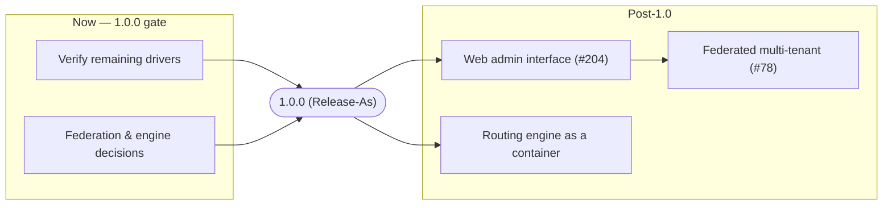

# Roadmap

## TL;DR

This is the direction, not a promise of dates. **1.0.0** is the honest looking
glass NOGGlass already is — SSH engine, typed BGP model, AS-PATH graph, tiered
RPKI, global view, rate limiting and the i18n UI — gated only on verifying the
remaining vendor drivers and two product decisions (see
[1.0.0 readiness](release-1.0-readiness.md)). Everything larger is **post-1.0**:
a **web admin interface** for the LG owner ([#204]), the return of the routing
engine as a separate container, and the federated multi-tenant platform ([#78]).
Post-1.0 items MUST NOT block the 1.0.0 tag, and each significant one MUST get
its own ADR before implementation.

The key words "MUST", "MUST NOT", "SHOULD" and "MAY" are used as in
[RFC 2119](https://www.rfc-editor.org/rfc/rfc2119).

## 5W2H

| Question | Answer |
|---|---|
| **What** | The planned direction of NOGGlass: what 1.0.0 contains and what is deferred to after it. |
| **Why** | Contributors and users need one place to see scope; post-1.0 features need a home so they do not creep into 1.0. |
| **Who** | Maintainers set scope and priority; contributors pick up items through the normal issue → branch → PR flow. |
| **Where** | This document, alongside [`release-1.0-readiness.md`](release-1.0-readiness.md); each item links its tracking issue. |
| **When** | No fixed dates. 1.0.0 when its gate is met; post-1.0 items as capacity and decisions allow. |
| **How** | One issue per item, ADR for anything architectural, verified against real devices where a driver is involved (ADR-0015). |
| **How much** | 1.0.0 is mostly device/licence access, not code. Post-1.0 items are larger builds, each scoped in its own ADR and issue. |

## Now — the road to 1.0.0

1.0.0 is a stability commitment, cut deliberately with `Release-As: 1.0.0`
([ADR-0014]), not an automatic bump. What stands between here and the tag is
tracked in detail in [1.0.0 readiness](release-1.0-readiness.md):

- **Verify the unverified drivers.** A driver counts only once it has run
  against a real device ([ADR-0015]); Juniper Junos, Nokia SR OS, Datacom DmOS
  and MikroTik v6 remain unverified and MUST either be verified or scoped out of
  the production claim.
- **Settle two product decisions**: federation scope ([#78]) and whether the
  routing engine returns before 1.0.

Nothing on this roadmap below the 1.0.0 line may delay that tag.

## Next — post-1.0

These are **explicitly not part of 1.0.0**. Each significant item MUST have an
ADR before implementation begins.

### Web admin interface ([#204])

A web interface for the LG **owner** to manage the whole deployment — routers
(add, edit, remove, test connectivity), global limits, rate limiting, RPKI,
global view, and UI/branding — instead of hand-editing `nogglass.toml`
and restarting. It manages *configuration*; it MUST preserve the
router-is-sacred, read-only invariants, and it MUST NOT write secrets to disk —
passwords stay named in the environment, exactly as the inventory keeps them
today. It needs its own ADR for the authentication model and the configuration
write-back path.

### Routing engine as a separate container

The embedded BGP session and BMP station were removed in [#194]. Bringing them
back is **explicitly deferred to post-1.0** and does not gate the 1.0.0 tag (see
[1.0.0 readiness](release-1.0-readiness.md)). The agreed direction is to return
the routing engine as a **separate container** rather than inside the web
process, so a heavy, long-lived RIB never shares a fate with the request path.
Whether this is our own engine or an existing one (e.g. Rotonda) is still open
and belongs in a fresh ADR.

### Federated, multi-tenant platform ([#78])

The authenticated, collaborative, multi-tenant direction described in
[ADR-0011]. Large in scope; sequenced after the admin interface, since the admin
interface is the natural first step toward multi-tenant management.

## Direction

## Consequences

- **1.0.0 stays honest and small.** The tag claims only what is proven; ambition
  lives here, below the line, and cannot push unverified work into a stability
  release.
- **Post-1.0 work is discoverable.** Every large idea has a home and a tracking
  issue, so contributors can pick it up through the normal flow, and users can
  see where NOGGlass is going without reading the issue tracker end to end.

[#78]: https://github.com/andrediashexa/NOGGlass/issues/78
[#194]: https://github.com/andrediashexa/NOGGlass/issues/194
[#204]: https://github.com/andrediashexa/NOGGlass/issues/204
[ADR-0011]: ../adr/0011-authenticated-collaborative-multitenant-looking-glass.md
[ADR-0014]: ../adr/0014-release-every-change-with-patch-prereleases.md
[ADR-0015]: ../adr/0015-vendor-drivers-are-verified-against-real-devices.md
