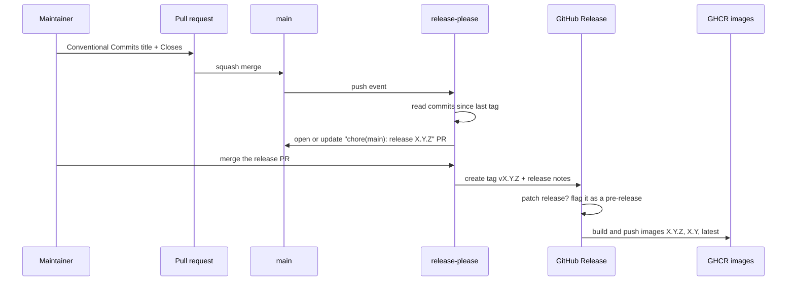

# Versioning and releases

## TL;DR

The project follows Semantic Versioning. Pull request titles follow Conventional
Commits, `release-please` reads them after every squash merge into `main`,
bumps `version.txt`, writes `CHANGELOG.md`, tags `vX.Y.Z` and publishes a GitHub
Release with container images. **Every** merge produces a release, and a patch
release is published as a **pre-release** ([ADR-0014](../adr/0014-release-every-change-with-patch-prereleases.md)).
Nobody edits version numbers by hand, and the running version is always visible
in the web interface footer and at `/api/version`.

## 5W2H

| Question | Answer |
|---|---|
| **What** | The automated path from a merged pull request to a tagged, released, visible version. |
| **Why** | Operators self-host this software and MUST be able to tell which version they run, what changed and whether an upgrade breaks them. |
| **Who** | `release-please` running in GitHub Actions; maintainers only approve its release pull request. |
| **Where** | `.github/workflows/release.yml`, `release-please-config.json`, `version.txt`, `CHANGELOG.md`. |
| **When** | On every push to `main`, which only happens through squash merges. |
| **How** | Conventional Commits determine the bump; see the flow below. |
| **How much** | No cost beyond GitHub Actions minutes, which are free for public repositories. |

## Version scheme

The project uses [Semantic Versioning 2.0.0](https://semver.org/):
`MAJOR.MINOR.PATCH`.

| Pull request title | Bump while `0.x` | Bump after `1.0.0` |
|---|---|---|
| `fix: ...` | patch | patch |
| `feat: ...` | minor | minor |
| `feat!: ...` or `BREAKING CHANGE:` | minor | major |
| `docs:`, `chore:`, `ci:`, `test:`, `refactor:`, `style:` | patch | patch |

While the version is below `1.0.0` the public interfaces MAY change between
minor versions. `1.0.0` SHALL be released when the Looking Glass runs
end-to-end: the supported vendor drivers, the public query flow, the three
languages and the deployment documentation.

Every merge produces a release, including documentation and tooling changes
(ADR-0014). Nothing on `main` is left unreachable by tag, which is what makes
any state of the project pinnable and bisectable.

### Full releases and pre-releases

| Version component that changed | GitHub release | Shown as "Latest" |
|---|---|---|
| Patch (`vX.Y.Z`, `Z` greater than zero) | **pre-release** | no |
| Minor (`vX.Y.0`) | full release | yes |
| Major (`vX.0.0`) | full release | yes |

A patch release ships continuously: a fix, a document, a dependency bump. It is
flagged as a pre-release so operators tracking "Latest" see only versions the
maintainers stand behind, while operators who want the newest fix can take a
pre-release knowingly. The release workflow applies the flag; nobody sets it by
hand.

## Release flow

## Where the version becomes visible

| Surface | Content | Source |
|---|---|---|
| Web footer | `vX.Y.Z`, linking to the GitHub release | build-time environment variable |
| About page | version, short commit SHA, build date, changelog link | `/api/version` |
| `GET /api/version` | JSON with the same fields | `version.txt` and build arguments |
| Container image tags | `X.Y.Z`, `X.Y`, `latest` | release workflow |

The frontend reads the version at build time, so the release workflow MUST pass
it as a build argument. A container that cannot determine its version MUST
display `dev` rather than a wrong number.

## Rules

- Contributors MUST NOT edit `version.txt` or `CHANGELOG.md` manually.
- The release pull request SHOULD be merged as soon as CI is green; letting
  releases pile up defeats the purpose.
- A release MUST NOT be deleted or re-tagged. A mistake is fixed by releasing
  the next patch version.
- Tags MUST be `vX.Y.Z`, matching the GitHub Release name. The first release
  was tagged `looking-glass-v0.1.0` because `release-please` prefixes the
  component name by default; `include-component-in-tag` is now `false`, so
  later tags follow the rule. The published tag is never rewritten.
- A patch release MUST be a pre-release, and a minor or major release MUST NOT
  be one.
