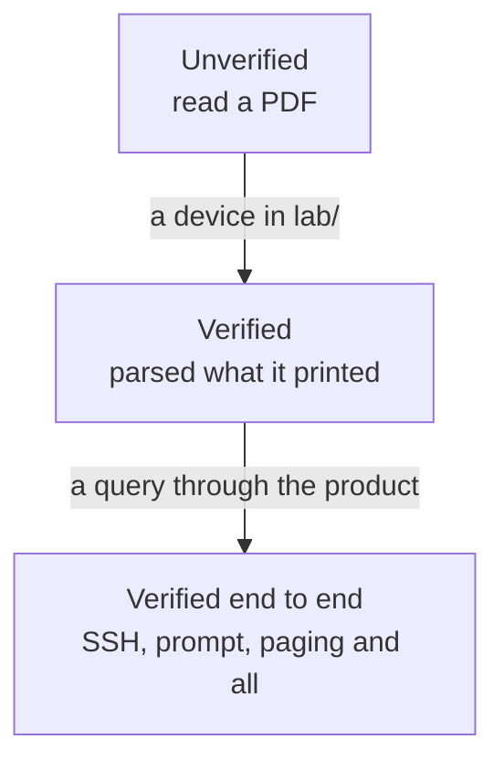

# Vendor support, and what it rests on

## TL;DR

Eight drivers, and they are not equally trustworthy. Five have read output from
a device running the vendor's own software, and **all five** have answered
every query through the whole product, SSH and all. The rest have been written from
documentation and never run against anything, which — on the evidence of the
three — means they are probably wrong in ways nobody has noticed yet
([ADR-0015](../adr/0015-vendor-drivers-are-verified-against-real-devices.md)).

This page says which is which. It is meant to be read before publishing a
looking glass for a network you care about.

## 5W2H

| Question | Answer |
|---|---|
| **What** | The verification status of every vendor driver, with versions. |
| **Why** | An operator MUST be able to tell a driver that has read a real router from one that has read a PDF. |
| **Who** | Maintainers update it when a driver is verified; readers use it to decide what to trust. |
| **Where** | This file; the captures live in the tests, the lab nodes in `lab/`. |
| **When** | Updated in the pull request that verifies a vendor. |
| **How** | A device in `lab/`, `lab/capture.sh`, and the tests beside the parser. |
| **How much** | Free where the image is; a licence where it is not. |

## What the words mean

| Status | Meaning |
|---|---|
| **Verified** | The tests parse text captured from a device running that software. The version is named. |
| **Verified end to end** | The same, and the product itself queried that device over SSH and returned the answer. |
| **Unverified** | Written from documentation. It may work. Nobody has seen it work. |

The distinction is not pedantry. Every driver that has since been run against a
real device was wrong, and none of them failed loudly — they returned a
plausible answer.



## The table

| Vendor | Driver | Status | Verified against | How it was run |
|---|---|---|---|---|
| **Huawei VRP** | `huawei_vrp` | **Verified end to end** | NE40E, VRP 8.180 (V800R011C00SPC607) | `lab/huawei.clab.yml`, vrnetlab |
| **Cisco IOS-XE** | `cisco_iosxe` | **Verified end to end** | CSR1000v, IOS-XE 17.03.08a | `lab/iosxe.clab.yml`, vrnetlab |
| **MikroTik RouterOS 7** | `mikrotik_routeros` | **Verified end to end** | RouterOS 7.16.2 (CHR) | `lab/mikrotik.clab.yml`, vrnetlab |
| **MikroTik RouterOS 6** | `mikrotik_routeros` | Unverified | — | The image will not start under vrnetlab; see below |
| **BIRD** | `bird_routing_daemon` | **Verified end to end** | BIRD 2.15.1 | `lab/bird.clab.yml` |
| **Cisco IOS-XR** | `cisco_iosxr` | **Verified end to end** | XRv9k, IOS-XR 7.9.2 | `lab/iosxr.clab.yml`, vrnetlab |
| **Juniper Junos** | `juniper_junos` | Unverified | — | Two images tried, neither runs BGP; see below |
| **Nokia SR OS** | `nokia_sros` | Unverified | — | The software is available; the licence is not |
| **Datacom DmOS** | `datacom_dmos` | Unverified | — | Cannot be virtualised; needs hardware |

## What each real device changed

Worth reading before assuming an unverified driver is fine.

### Huawei VRP 8.180

- The route query was answered in a **different format** from the one the driver
  read. `display bgp routing-table <network> <mask>` prints blocks; the parser
  expected the columns of the argument-less command. Every route query returned
  "no route".
- A session in **Idle** was reported as **Established**. VRP prints State and
  PrefRcv as two columns, the shared reader took the last field as the state,
  and `0` was read as "a number, therefore established". This affected every
  vendor, and an existing test asserted it.
- A **ping that answered every probe** was reported as 100% loss: the statistics
  are on three lines, the parser expected one, and the loss counter defaulted
  to 100.
- **32-bit AS numbers** arrive in asdot — `1.0` is 65536 — and were dropped,
  turning a ten-hop path into a plausible four-hop one.
- The product **could not open an SSH session at all**: the client's default
  host key order picks `ecdsa-sha2-nistp521`, and VRP's signature for it fails
  to decode.
- Once connected, the **login banner came back as the answer**, because the
  executor sent its command before reading the greeting, and a banner ends with
  a prompt.
- **Every IPv6 route query failed**, because VRP wants the prefix and its length
  as two arguments and the catalogue sent them with a slash. The router answered
  `Wrong parameter found` and the interface showed "no route" for every IPv6
  prefix.
- **Large and multiline BGP communities** in detail blocks caused the query to
  degrade to `Completeness::Partial`: VRP wraps communities across multiple lines,
  prints `Large-Community:` separately, and emits `Ext-Community:`. The parser
  now consumes multiline entries and `Large-Community:` into the path model and
  recognises `Ext-Community:` as known metadata, preventing unreadable line alerts.

### MikroTik RouterOS 7.16.2

- **CRLF** line endings alone emptied every BGP result: entries are split on a
  blank line, and `"\n\n"` does not match `"\r\n\r\n"`.
- The flag legend arrives **glued to the first route**, which was skipped along
  with it.
- Flags are printed **first, with no index**, so no path was ever marked best.
- Attributes are **dotted** sub-properties (`.as-path=`, `.med=`), so none were
  read.
- A hop that **timed out** was reported as 0.0 ms, read from a redraw of the
  table rather than its final state.
- RouterOS prints an AS_SET with **no closing brace** (`64498{64496,64497`).
- **The product could not query it at all.** Given a shell on a terminal,
  RouterOS probes what it has been given — `ESC [ 9999 B`, `ESC Z`,
  `ESC [ 6 n` — and waits for the client to report its cursor position before
  printing anything. Every query came back empty. It answers an exec request
  immediately, which is what the catalogue now asks for.
- The session summary is **not a table** either: one numbered entry per
  session, attributes as dotted sub-properties, and `.as=` belonging to
  whichever of `remote` or `local` was named last — read without tracking
  that, every session reports this router's own AS.

**One thing to know when reading a RouterOS summary:** `/routing/bgp/session`
lists sessions, not configured neighbours, so a neighbour that has **never**
come up does not appear at all. On the lab router that is six rows for seven
configured connections. An absent peer means "never established", which is not
the same as a peer shown as down — and no other vendor here behaves this way.

### Cisco IOS-XR 7.9.2

- **Every peer was reported as `AS0`.** XR prints a speaker instance (`Spk`)
  between the neighbour and its AS, and the shared reader took the first number
  it found. AS 0 is reserved by RFC 7607 and is never a peer's, so a zero there
  is a column that is not the AS.
- Everything else was already right: ping, traceroute with its silent hop, and
  the route detail including the 32-bit ASNs.
- Version **7.7.1 never finished booting** here — its admin VM reported
  `calvados bootup timer expired` until it gave up. 7.9.2 boots in 26 minutes
  on the same machine, which is worth knowing before blaming the host.

### Cisco IOS-XE 17.03.08a

- The route query was answered in the **detail format** and the driver read the
  column one: three paths came back with no prefix, no next hop and an AS path
  of `[0]`.
- The column reader — shared with Datacom — put **the first AS of the path into
  the weight** whenever a row had a blank LocPrf, because it took "the leading
  numbers of what is left" as the three metric columns.
- A continuation line of the status-code legend was read as **a route with no
  prefix**.
- Ping, traceroute and the session summary were already right, including a
  silent hop that keeps its number.
- **The product could not open an SSH session to it at all.** The client offers
  no `ecdh-sha2-nistp*` key exchange by default, and IOS-XE offers those three
  and `diffie-hellman-group14-sha1` and nothing else, so the handshake ended
  with no algorithm in common — twelve milliseconds after being asked, reported
  as "could not reach the router".

### BIRD 2.15.1

- The prefix is printed **once**; every path after the first came back without
  one.
- `show protocols all` is **not a table**, and the table reader found no
  sessions at all on a router with six.
- The prefix count had to come from `Routes:` and not from the **cumulative**
  `Route change stats`, which would only ever grow.
- Its commands run in a **shell**, not inside `birdc`, so the `bird>` prompt the
  catalogue names never appears. Every query waited the full idle timeout and a
  ping — still printing when that landed — arrived without its statistics.
- **Every traceroute across a silent hop was truncated**, on every vendor. The
  reader gave up after five seconds without output, and a probe to a hop that
  does not answer is silent for about that long: the answer came back with no
  hops at all. Found here because busybox waits five seconds per probe, where a
  router's own CLI prints sooner.

## Why the four unverified ones are unverified

Written down because "we did not get to it" and "it cannot be done here" are
different answers, and an operator deciding what to trust needs to know which
one applies.

### Juniper Junos — two images, neither of them routes

**vJunos-switch 24.4R1.9** boots and answers on SSH. Its forwarding plane runs
as a virtual machine inside the virtual machine, and that one never comes up:
`show chassis fpc` reports slot 0 `Present/Absent`, no `ge-` interfaces exist,
and the addresses cannot be assigned. It also warns
`License key missing; requires 'BGP' license`, so even with interfaces it would
not peer.

**vMX 24.4R1.9**, assembled from the VCP and VFP disks that were available,
boots the routing engine and reaches a usable CLI on the console. It has no
`fxp0`, so SSH has no address until one is configured by hand, and
`show bgp summary` answers `the routing subsystem is not running` — the control
plane is up and `rpd` is not. Those disks are packaged for a different
hypervisor layout than the one vrnetlab drives.

What would fix it: Juniper's own `vmx-bundle-*.tgz`, which is what vrnetlab's
vMX build expects and which carries the pieces in the layout it assumes; or
**vJunos-router**, which unlike vJunos-switch is built to route.

### Nokia SR OS — the software is here, the licence is not

The available distribution is a TiMOS `cflash` tree (24.10.R2), not the
`sros-vm.qcow2` vrnetlab builds from, and SR OS requires a licence file to run
as a virtual router at all. No licence came with it.

What would fix it: a `sros-vm-<version>.qcow2` and a licence file.

### MikroTik RouterOS 6 — the same driver, and nobody knows if that is right

RouterOS 6 is not version 7 with a smaller number: it keeps BGP under
`/routing/bgp/peer` where 7 uses `/routing/bgp/connection`, and it may print it
differently. The catalogue has one entry for both and the driver has one code
path, which is honest only so long as nobody assumes otherwise — the driver used
to carry an `is_v7` flag that nothing read, promising a distinction it did not
make. That flag is gone.

A 6.48.6 CHR was built to settle it with a capture and does not come up:
vrnetlab's launcher answers the licence prompt, the router prints its CLI help,
and the bootstrap never finishes. The image is in the list vrnetlab says it
supports, so this is worth another attempt rather than a conclusion.

Until then, a RouterOS 6 router is served by a parser written for 7. If its
output differs, that is a bug report with a capture attached.

### Datacom DmOS — there is nothing to run, and there will not be

DmOS does not run virtualised. This is not an image nobody has found; there is
no image. Verifying this driver needs a router, and the only question is whose.

It is a low bar. `lab/capture.sh` runs from any machine that can reach one:

```bash
./capture.sh --node dmos --host <address> --user <read-only user> \
    --vendor datacom_dmos --via ssh
```

It sends exactly what the product sends, paging command included, and writes
each answer to a file. Those files are what the tests are written from — see
[ADR-0015](../adr/0015-vendor-drivers-are-verified-against-real-devices.md).
Nothing else from this repository is needed, and nothing is sent anywhere.

The account it uses SHOULD be the read-only one described in
[read-only router users](../operations/router-users.md). A capture from a
router in production is fine; every command in the catalogue is read-only, and
the capture is one session of `display`-style commands.

Until someone runs that, this driver has been read by a human and by nothing
else, and the table says so.

## Running a vendor that is not here

`lab/README.md` explains the topology and `lab/capture.sh`. A driver moves from
unverified to verified with an image, a lab node and a capture in the tests —
and, judging by the three above, a handful of fixes along the way.
