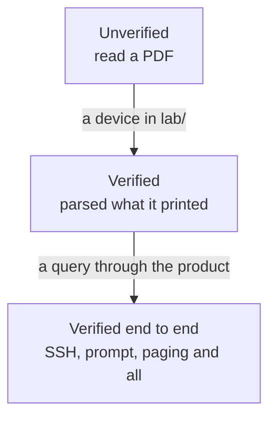

# Vendor support, and what it rests on

## TL;DR

Eight drivers, and they are not equally trustworthy. Four have read output from
a device running the vendor's own software; two of those have answered every
query through the whole product, SSH and all. The rest have been written from
documentation and never run against anything, which — on the evidence of the
three — means they are probably wrong in ways nobody has noticed yet
([ADR-0015](../adr/0015-vendor-drivers-are-verified-against-real-devices.md)).

This page says which is which. It is meant to be read before publishing a
looking glass for a network you care about.

## 5W2H

| Question | Answer |
|---|---|
| **What** | The verification status of every vendor driver, with versions. |
| **Why** | An operator MUST be able to tell a driver that has read a real router from one that has read a PDF. |
| **Who** | Maintainers update it when a driver is verified; readers use it to decide what to trust. |
| **Where** | This file; the captures live in the tests, the lab nodes in `lab/`. |
| **When** | Updated in the pull request that verifies a vendor. |
| **How** | A device in `lab/`, `lab/capture.sh`, and the tests beside the parser. |
| **How much** | Free where the image is; a licence where it is not. |

## What the words mean

| Status | Meaning |
|---|---|
| **Verified** | The tests parse text captured from a device running that software. The version is named. |
| **Verified end to end** | The same, and the product itself queried that device over SSH and returned the answer. |
| **Unverified** | Written from documentation. It may work. Nobody has seen it work. |

The distinction is not pedantry. Every driver that has since been run against a
real device was wrong, and none of them failed loudly — they returned a
plausible answer.



## The table

| Vendor | Driver | Status | Verified against | How it was run |
|---|---|---|---|---|
| **Huawei VRP** | `huawei_vrp` | **Verified end to end** | NE40E, VRP 8.180 (V800R011C00SPC607) | `lab/huawei.clab.yml`, vrnetlab |
| **Cisco IOS-XE** | `cisco_iosxe` | **Verified end to end** | CSR1000v, IOS-XE 17.03.08a | `lab/iosxe.clab.yml`, vrnetlab |
| **MikroTik RouterOS** | `mikrotik_routeros` | **Verified** | RouterOS 7.16.2 (CHR) | `lab/mikrotik.clab.yml`, vrnetlab |
| **BIRD** | `bird_routing_daemon` | **Verified** | BIRD 2.15.1 | `lab/bird.clab.yml` |
| **Cisco IOS-XR** | `cisco_iosxr` | Unverified | — | XRv9k boots and its admin VM times out here; see below |
| **Juniper Junos** | `juniper_junos` | Unverified | — | Two images tried, neither runs BGP; see below |
| **Nokia SR OS** | `nokia_sros` | Unverified | — | The software is available; the licence is not |
| **Datacom DmOS** | `datacom_dmos` | Unverified | — | Cannot be virtualised; needs hardware |

## What each real device changed

Worth reading before assuming an unverified driver is fine.

### Huawei VRP 8.180

- The route query was answered in a **different format** from the one the driver
  read. `display bgp routing-table <network> <mask>` prints blocks; the parser
  expected the columns of the argument-less command. Every route query returned
  "no route".
- A session in **Idle** was reported as **Established**. VRP prints State and
  PrefRcv as two columns, the shared reader took the last field as the state,
  and `0` was read as "a number, therefore established". This affected every
  vendor, and an existing test asserted it.
- A **ping that answered every probe** was reported as 100% loss: the statistics
  are on three lines, the parser expected one, and the loss counter defaulted
  to 100.
- **32-bit AS numbers** arrive in asdot — `1.0` is 65536 — and were dropped,
  turning a ten-hop path into a plausible four-hop one.
- The product **could not open an SSH session at all**: the client's default
  host key order picks `ecdsa-sha2-nistp521`, and VRP's signature for it fails
  to decode.
- Once connected, the **login banner came back as the answer**, because the
  executor sent its command before reading the greeting, and a banner ends with
  a prompt.

### MikroTik RouterOS 7.16.2

- **CRLF** line endings alone emptied every BGP result: entries are split on a
  blank line, and `"\n\n"` does not match `"\r\n\r\n"`.
- The flag legend arrives **glued to the first route**, which was skipped along
  with it.
- Flags are printed **first, with no index**, so no path was ever marked best.
- Attributes are **dotted** sub-properties (`.as-path=`, `.med=`), so none were
  read.
- A hop that **timed out** was reported as 0.0 ms, read from a redraw of the
  table rather than its final state.
- RouterOS prints an AS_SET with **no closing brace** (`64498{64496,64497`).

### Cisco IOS-XE 17.03.08a

- The route query was answered in the **detail format** and the driver read the
  column one: three paths came back with no prefix, no next hop and an AS path
  of `[0]`.
- The column reader — shared with Datacom — put **the first AS of the path into
  the weight** whenever a row had a blank LocPrf, because it took "the leading
  numbers of what is left" as the three metric columns.
- A continuation line of the status-code legend was read as **a route with no
  prefix**.
- Ping, traceroute and the session summary were already right, including a
  silent hop that keeps its number.
- **The product could not open an SSH session to it at all.** The client offers
  no `ecdh-sha2-nistp*` key exchange by default, and IOS-XE offers those three
  and `diffie-hellman-group14-sha1` and nothing else, so the handshake ended
  with no algorithm in common — twelve milliseconds after being asked, reported
  as "could not reach the router".

### BIRD 2.15.1

- The prefix is printed **once**; every path after the first came back without
  one.
- `show protocols all` is **not a table**, and the table reader found no
  sessions at all on a router with six.
- The prefix count had to come from `Routes:` and not from the **cumulative**
  `Route change stats`, which would only ever grow.

## Why the four unverified ones are unverified

Written down because "we did not get to it" and "it cannot be done here" are
different answers, and an operator deciding what to trust needs to know which
one applies.

### Cisco IOS-XR — the lab machine is the limit

The XRv9k image builds and starts. Its admin VM (Calvados) reports
`calvados bootup timer expired` and the router never finishes coming up.
XRv9k asks for four cores and 24 GB, and it runs its own virtual machines
inside the one it is given — on a lab host that is already a virtual machine,
that is a third level of nesting and it is too slow to meet its own timers.

What would fix it: a bare-metal lab host, or Cisco's container-native **XRd**,
which runs IOS-XR as a container and skips the nesting entirely. The driver is
shared with IOS-XE, which **is** verified, so the parsing of the detail format
and the columns has been exercised — but IOS-XR prints neither exactly the same
way, and until one answers, this says unverified.

### Juniper Junos — two images, neither of them routes

**vJunos-switch 24.4R1.9** boots and answers on SSH. Its forwarding plane runs
as a virtual machine inside the virtual machine, and that one never comes up:
`show chassis fpc` reports slot 0 `Present/Absent`, no `ge-` interfaces exist,
and the addresses cannot be assigned. It also warns
`License key missing; requires 'BGP' license`, so even with interfaces it would
not peer.

**vMX 24.4R1.9**, assembled from the VCP and VFP disks that were available,
boots the routing engine and reaches a usable CLI on the console. It has no
`fxp0`, so SSH has no address until one is configured by hand, and
`show bgp summary` answers `the routing subsystem is not running` — the control
plane is up and `rpd` is not. Those disks are packaged for a different
hypervisor layout than the one vrnetlab drives.

What would fix it: Juniper's own `vmx-bundle-*.tgz`, which is what vrnetlab's
vMX build expects and which carries the pieces in the layout it assumes; or
**vJunos-router**, which unlike vJunos-switch is built to route.

### Nokia SR OS — the software is here, the licence is not

The available distribution is a TiMOS `cflash` tree (24.10.R2), not the
`sros-vm.qcow2` vrnetlab builds from, and SR OS requires a licence file to run
as a virtual router at all. No licence came with it.

What would fix it: a `sros-vm-<version>.qcow2` and a licence file.

### Datacom DmOS — there is nothing to run, and there will not be

DmOS does not run virtualised. This is not an image nobody has found; there is
no image. Verifying this driver needs a router, and the only question is whose.

It is a low bar. `lab/capture.sh` runs from any machine that can reach one:

```bash
./capture.sh --node dmos --host <address> --user <read-only user> \
    --vendor datacom_dmos --via ssh
```

It sends exactly what the product sends, paging command included, and writes
each answer to a file. Those files are what the tests are written from — see
[ADR-0015](../adr/0015-vendor-drivers-are-verified-against-real-devices.md).
Nothing else from this repository is needed, and nothing is sent anywhere.

The account it uses SHOULD be the read-only one described in
[read-only router users](../operations/router-users.md). A capture from a
router in production is fine; every command in the catalogue is read-only, and
the capture is one session of `display`-style commands.

Until someone runs that, this driver has been read by a human and by nothing
else, and the table says so.

## Running a vendor that is not here

`lab/README.md` explains the topology and `lab/capture.sh`. A driver moves from
unverified to verified with an image, a lab node and a capture in the tests —
and, judging by the three above, a handful of fixes along the way.
