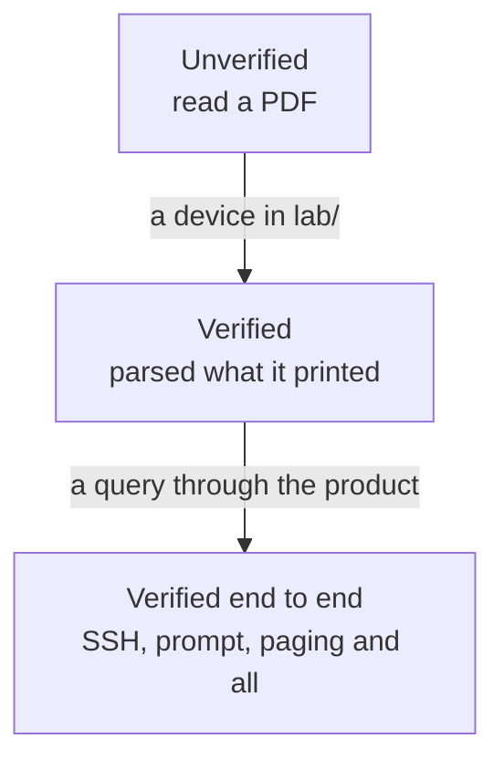

# Vendor support, and what it rests on

## TL;DR

Eight drivers, and they are not equally trustworthy. Three have read output from
a device running the vendor's own software; one of those has answered a query
through the whole product, SSH and all. The rest have been written from
documentation and never run against anything, which — on the evidence of the
three — means they are probably wrong in ways nobody has noticed yet
([ADR-0015](../adr/0015-vendor-drivers-are-verified-against-real-devices.md)).

This page says which is which. It is meant to be read before publishing a
looking glass for a network you care about.

## 5W2H

| Question | Answer |
|---|---|
| **What** | The verification status of every vendor driver, with versions. |
| **Why** | An operator MUST be able to tell a driver that has read a real router from one that has read a PDF. |
| **Who** | Maintainers update it when a driver is verified; readers use it to decide what to trust. |
| **Where** | This file; the captures live in the tests, the lab nodes in `lab/`. |
| **When** | Updated in the pull request that verifies a vendor. |
| **How** | A device in `lab/`, `lab/capture.sh`, and the tests beside the parser. |
| **How much** | Free where the image is; a licence where it is not. |

## What the words mean

| Status | Meaning |
|---|---|
| **Verified** | The tests parse text captured from a device running that software. The version is named. |
| **Verified end to end** | The same, and the product itself queried that device over SSH and returned the answer. |
| **Unverified** | Written from documentation. It may work. Nobody has seen it work. |

The distinction is not pedantry. Every driver that has since been run against a
real device was wrong, and none of them failed loudly — they returned a
plausible answer.

## The table

| Vendor | Driver | Status | Verified against | How it was run |
|---|---|---|---|---|
| **Huawei VRP** | `huawei_vrp` | **Verified end to end** | NE40E, VRP 8.180 (V800R011C00SPC607) | `lab/huawei.clab.yml`, vrnetlab |
| **MikroTik RouterOS** | `mikrotik_routeros` | **Verified** | RouterOS 7.16.2 (CHR) | `lab/mikrotik.clab.yml`, vrnetlab |
| **BIRD** | `bird_routing_daemon` | **Verified** | BIRD 2.15.1 | `lab/bird.clab.yml` |
| **Juniper Junos** | `juniper_junos` | Unverified | — | vMX in progress |
| **Cisco IOS-XE** | `cisco_iosxe` | Unverified | — | CSR1000v in progress |
| **Cisco IOS-XR** | `cisco_iosxr` | Unverified | — | XRv9k available |
| **Nokia SR OS** | `nokia_sros` | Unverified | — | TiMOS needs a licence |
| **Datacom DmOS** | `datacom_dmos` | Unverified | — | No public image |

## What each real device changed

Worth reading before assuming an unverified driver is fine.

### Huawei VRP 8.180

- The route query was answered in a **different format** from the one the driver
  read. `display bgp routing-table <network> <mask>` prints blocks; the parser
  expected the columns of the argument-less command. Every route query returned
  "no route".
- A session in **Idle** was reported as **Established**. VRP prints State and
  PrefRcv as two columns, the shared reader took the last field as the state,
  and `0` was read as "a number, therefore established". This affected every
  vendor, and an existing test asserted it.
- A **ping that answered every probe** was reported as 100% loss: the statistics
  are on three lines, the parser expected one, and the loss counter defaulted
  to 100.
- **32-bit AS numbers** arrive in asdot — `1.0` is 65536 — and were dropped,
  turning a ten-hop path into a plausible four-hop one.
- The product **could not open an SSH session at all**: the client's default
  host key order picks `ecdsa-sha2-nistp521`, and VRP's signature for it fails
  to decode.
- Once connected, the **login banner came back as the answer**, because the
  executor sent its command before reading the greeting, and a banner ends with
  a prompt.

### MikroTik RouterOS 7.16.2

- **CRLF** line endings alone emptied every BGP result: entries are split on a
  blank line, and `"\n\n"` does not match `"\r\n\r\n"`.
- The flag legend arrives **glued to the first route**, which was skipped along
  with it.
- Flags are printed **first, with no index**, so no path was ever marked best.
- Attributes are **dotted** sub-properties (`.as-path=`, `.med=`), so none were
  read.
- A hop that **timed out** was reported as 0.0 ms, read from a redraw of the
  table rather than its final state.
- RouterOS prints an AS_SET with **no closing brace** (`64498{64496,64497`).

### BIRD 2.15.1

- The prefix is printed **once**; every path after the first came back without
  one.
- `show protocols all` is **not a table**, and the table reader found no
  sessions at all on a router with six.
- The prefix count had to come from `Routes:` and not from the **cumulative**
  `Route change stats`, which would only ever grow.

## Running a vendor that is not here

`lab/README.md` explains the topology and `lab/capture.sh`. A driver moves from
unverified to verified with an image, a lab node and a capture in the tests —
and, judging by the three above, a handful of fixes along the way.
