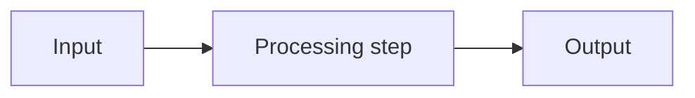

# Document title

<!--
  Copy this file when starting a document under docs/.
  Delete the sections that do not apply, except TL;DR and 5W2H, which are
  mandatory. Run scripts/check-docs.sh before opening the pull request.
-->

## TL;DR

Three to six lines stating the conclusion. A reader who stops here MUST still
know what this document decided or explained.

## 5W2H

| Question | Answer |
|---|---|
| **What** | What this document covers. |
| **Why** | The problem it solves or the reason it exists. |
| **Who** | Who is affected and who is responsible. |
| **Where** | Which files, services or environments it applies to. |
| **When** | When it applies, or the deadline and milestone. |
| **How** | The mechanism, in one or two sentences. |
| **How much** | Cost, effort or resource impact. Write "no cost" if that is true. |

## Context

What a reader MUST know to understand the rest. State constraints explicitly and
use RFC 2119 keywords for requirements.

## Details

The body of the document. At least one Mermaid diagram is REQUIRED: show the
flow, the components, the sequence or the states.

## Consequences

What this makes easier, what it makes harder, and what it rules out.

---

## ADR variant

For a file under `docs/adr/`, replace the body with these sections and keep the
header metadata:

- **Status:** Proposed | Accepted | Rejected | Superseded by ADR-XXXX
- **Date:** YYYY-MM-DD
- **Deciders:** names

`## Context`, `## Decision`, `## Consequences`.
