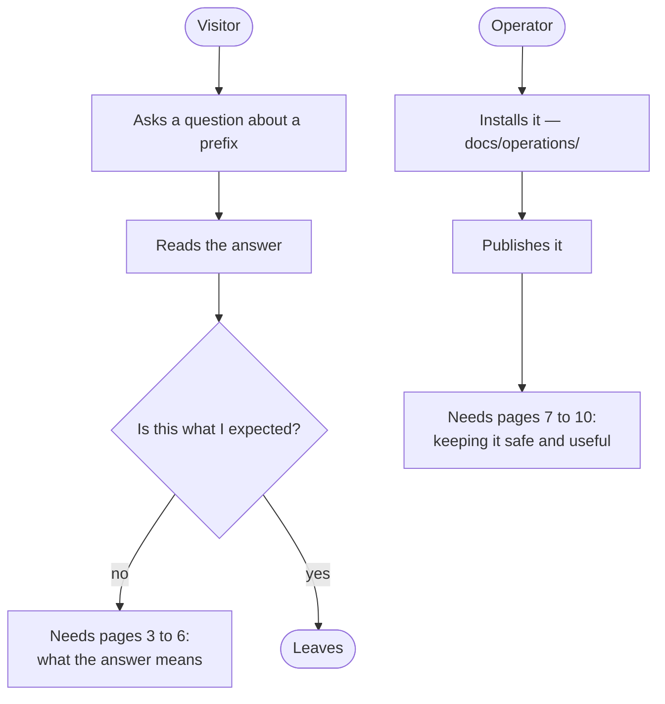

# Using NOGGlass: the wiki outline

## TL;DR

The pages a wiki needs, in the order someone actually needs them, with what
each one answers and how to tell when it is finished. It is organised by the
question the reader arrives with — "why is my prefix not showing up" — rather
than by feature, because nobody opens a looking glass wanting to learn about a
looking glass. The reference material already exists in `docs/`; the wiki is
where the *using* goes.

## 5W2H

| Question | Answer |
|---|---|
| **What** | The structure of the user-facing wiki, page by page. |
| **Why** | The repository documents installation and decisions, and nothing documents use. |
| **Who** | Whoever writes the wiki; maintainers reviewing it. |
| **Where** | The GitHub wiki of this repository, or `docs/wiki/` if the wiki stays disabled. |
| **When** | Written after `0.4.x`, when the product stopped changing shape weekly. |
| **How** | Short pages, one question each, every example runnable against the mock router. |
| **How much** | Roughly one working day for the first five pages, which cover most visits. |

## Two readers, not one

The visitor never reads documentation before using the tool; they read it when
an answer surprises them. Pages 3 to 6 exist for that moment and SHOULD be
reachable from the interface itself.

## The pages

### 1. What a looking glass is

For the customer who was handed a link. What the tool shows, what it cannot do
— it never changes anything — and why the operator published it. Half a page.

**Done when** a reader who has never run a network can say what the answer
means for their own connection.

### 2. Running your first query

The four query types, side by side: what each one asks a router, and when to
reach for it. Screenshots from `docs/design/screens/`. Ends with the fact that
every result is a shareable link.

**Done when** someone can answer "does your network have a route to my prefix"
without asking anyone.

### 3. Reading a BGP result

The page that earns the wiki. The graph, the path table, and what each column
means in operational terms:

- **AS path** — who the traffic goes through, and why longer is not always worse
- **Local preference, MED, weight** — why the best path is not always the
  shortest one, in one paragraph each
- **Communities** — that they encode the operator's policy, and that NOGGlass
  shows them raw because only that operator knows what they mean
- **"not reported"** — that it means the router said nothing, which is different
  from zero. This is the single most misread thing in the interface.

**Done when** a reader can explain why the best path has a longer AS path than
an alternative.

### 4. RPKI: four states, and who said so

`valid`, `invalid`, `no ROA`, `not checked` — what each means for the prefix,
and what to do about it. Then the part no other looking glass shows: the
**source**. "My router validated this" and "a public API says so" are different
facts, and the second says nothing about whether the operator filters on it.

**Done when** a reader understands that `invalid` on a public looking glass does
not mean the operator is dropping the route.

### 5. When the router and the Internet disagree

The global view: the four verdicts, each with the situation behind it.

| Verdict | What is usually happening |
|---|---|
| Agrees | Nothing to see |
| Not announced globally | The announcement did not propagate, or an upstream filtered it |
| Not seen by this router | This router is missing a route the world has |
| Origin mismatch | A hijack, a leak, or a customer announcing what they should not |

**Done when** a reader can tell "my prefix is not propagating" from "my prefix
is being hijacked" using the interface alone.

### 6. Reading a traceroute that stops

Why a hop shows no answer, why that is often **not** where the problem is, and
why NOGGlass keeps the silent hop in place instead of hiding it. Covers
asymmetric routing, ICMP rate limiting and control-plane policing — the three
reasons a traceroute lies.

**Done when** a reader stops concluding that the first star is the fault.

### 7. Connecting your first real router

Operator side. Walks one vendor end to end: create the read-only user, add the
entry, check the commands NOGGlass will send with `/api/catalogue/{vendor}`,
run one query, compare against the CLI. Links to
[read-only router users](operations/router-users.md) for the other vendors.

**Done when** an operator has one real router answering and has verified the
output against the CLI.

### 8. Publishing it without regretting it

The page that keeps an operator out of trouble: the reverse proxy and TLS, the
rate limits and what they cost, the concurrency caps and why they protect the
control plane, and the privacy note if the RPKI fallback or the global view is
switched on. Says plainly which settings MUST be reviewed before the instance
faces the Internet.

**Done when** an operator can answer "what can a stranger make my routers do".

### 9. When something looks wrong

Symptom-first, mirroring the table in the deployment guide but from the
answer's side: a query returns raw text, a column reads "not reported", the
global view is unavailable, a session shows a state nobody recognises. Each one
says whether it is a NOGGlass limitation or something on the network.

**Done when** a reader can tell a parser gap from a routing problem.

### 10. Adding a vendor

For the contributor. The command catalogue is a data file, the driver is a
parser plus fixtures, and the fixtures come from real output with addresses
redacted. Points at `CONTRIBUTING.md` for the process.

**Done when** someone has opened a pull request adding a vendor without asking
how.

## Rules for the pages

1. Every example MUST run against the mock router, so a reader can follow along
   without a network.
2. Addresses in examples MUST come from the documentation ranges (RFC 5737,
   RFC 3849) and AS numbers from the private range (RFC 6996).
3. Screenshots come from `docs/design/screens/` rather than being re-taken, so
   they stay in step with the interface.
4. A page SHOULD fit on one screen. Pages 3 and 8 may run longer; the rest
   should not.
5. The wiki explains **use**. Installation stays in `docs/operations/`,
   decisions stay in `docs/adr/`, and neither is duplicated here — a fact in two
   places becomes wrong in one of them.

## Publishing it

The repository wiki is disabled. Two ways to change that:

- **Enable the GitHub wiki** and write these as wiki pages. Wiki edits do not go
  through pull requests, so they escape the documentation linter and the review
  rules — worth deciding deliberately.
- **Keep it in `docs/wiki/`**, where it is reviewed and linted like everything
  else, and link it from the README.

The second fits the project's rules better. The first is easier for a
contributor who is not a developer, which is exactly who writes good
documentation for pages 1 to 6.
