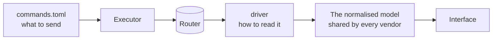

# Adding a vendor

## TL;DR

Two pieces: an entry in the command catalogue, which is a data file, and a
parser with fixtures. The API layer never changes. The fixtures are the part
that matters — every serious bug in this project was found by writing one, not
by reading code.

## What a vendor is made of

**The catalogue** lives at `crates/looking-glass-core/src/catalogue/commands.toml`.
One block per vendor: the paging command, the prompt pattern, and one command
template per query. Placeholders are filled with typed values, never with text a
visitor typed, and the loader refuses at startup any template containing
something that could chain commands.

**The driver** lives in `crates/looking-glass-core/src/vendors/`. It implements
one trait: a vendor name and four parsers. Traceroute, BGP summary and — for
platforms that print the IOS-style table — BGP routes already have shared
readers, so a new vendor often needs only a ping parser and a route parser, and
sometimes neither.

## The rules that are not negotiable

1. **Read-only commands only.** Anything that changes router state is out of
   scope, including "just for testing".
2. **Never invent a value.** A field the router did not print is `None`. A
   parser that cannot read something returns an error; it does not return an
   empty result that reads like "no data".
3. **Raw output is always preserved**, so a visitor can read what the router
   actually said when the parse is imperfect.
4. **Fixtures come from real output**, with addresses and AS numbers replaced by
   documentation ranges: RFC 5737 and RFC 3849 for addresses, RFC 6996 for AS
   numbers. A test walks the mock fixtures and fails if anything falls outside
   them.

## Write the fixture first

This is not a style preference. Writing the first fixture for a driver has
found, in this project: a ping parser returning a perfect result for any input,
an origin hardcoded to IGP, an AS path silently dropped, three vendors marking
every route as best, and a continuation line attributed to a /32 of its own next
hop. All of it in code that looked fine.

A good fixture has more than one path, at least one **empty column**, and a case
that should fail. The empty column is where parsers break: platforms leave MED
blank routinely, and a parser reading by position shifts every field after it.

## The steps

1. Open an issue describing the vendor and the platform versions you have.
2. Branch as `feat/<issue>-<vendor>`.
3. Add the catalogue block. Check it with `/api/catalogue/<vendor>` before
   pointing anything at a real device.
4. Add the driver with fixtures, including the awkward cases.
5. Run `cargo fmt --all --check`, `cargo clippy --workspace --all-targets` and
   `cargo test --workspace`.
6. Add the read-only account recipe to `docs/operations/router-users.md`.
7. Open a pull request with a Conventional Commits title and `Closes #<issue>`.

`CONTRIBUTING.md` has the full process. The one thing worth repeating: say in
the pull request whether the fixtures came from real hardware or from
documentation, because that is the difference between "tested" and "plausible",
and reviewers cannot tell from the diff.
