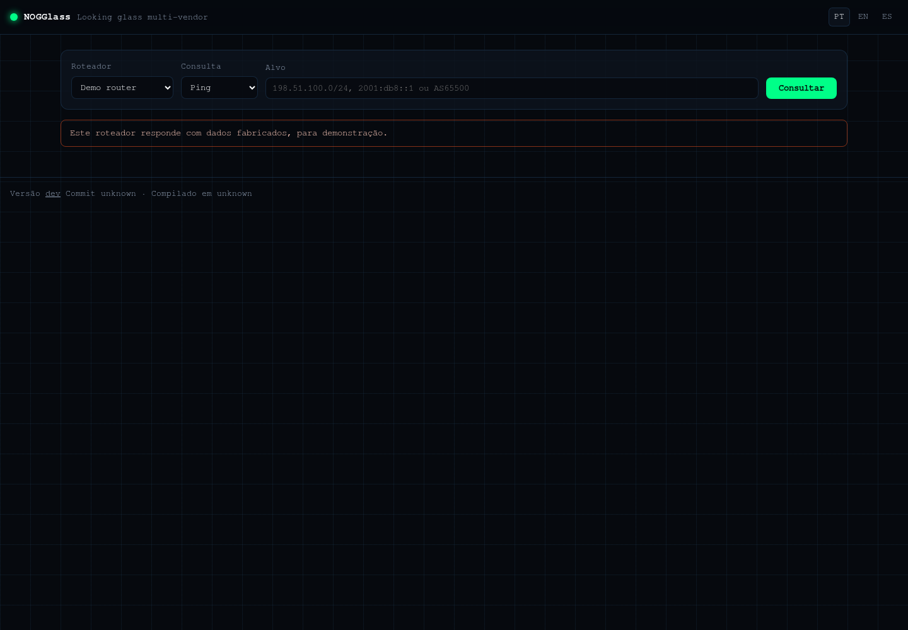
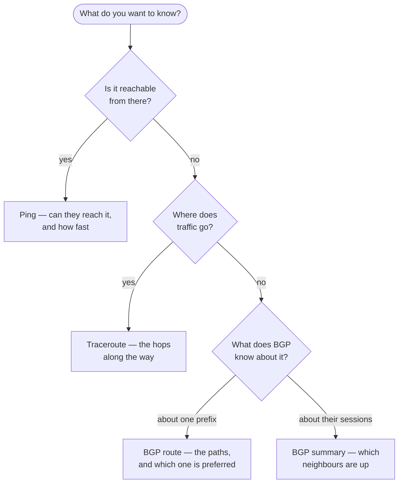

# Running your first query

## TL;DR

Pick a router, pick a question, type a target, read the answer. The four
questions are ping, traceroute, BGP route and BGP summary; the target is an
address, a prefix like `198.51.100.0/24`, or an AS number like `AS65500`. Every
result is a link you can paste into a ticket.

## The form



**Router.** Networks publish several, usually one per city or data centre. It
matters: a route can look different from São Paulo and from Frankfurt, and that
difference is often the whole answer. The list shows a name and a place, never
an address — where the router lives on the management network is nobody's
business but the operator's.

**Query.** Only the questions that router answers are offered. An operator can
publish BGP lookups on their border routers and nothing else.

**Target.** What you are asking about:

| You type | It means |
|---|---|
| `198.51.100.1` | One address |
| `198.51.100.0/24` | A prefix, in CIDR form |
| `2001:db8::/32` | An IPv6 prefix |
| `AS65500` | An autonomous system number |

If the target is refused, the message says why: a prefix with host bits set
(`198.51.100.5/24` — you probably meant `.0/24`), a prefix too short to be
worth asking about, or something that is not an address at all.

## Which question to ask



A useful order when something is wrong: **BGP route first**, then traceroute.
If the router has no route, traceroute has nothing to tell you — the packets
were never going to leave. People do it the other way round and spend twenty
minutes reading stars.

## Try it against the demo

Most instances publish a **demo router** with fabricated data, marked as such.
Nothing is queried on a real network, so it is the safe place to learn the
interface. Good targets:

- `198.51.100.0/24` — two paths, one preferred, RPKI valid
- `203.0.113.0/24` — RPKI **invalid**: what a possible hijack looks like
- `198.51.100.10` with traceroute — four hops, one of which does not answer

## Every result is a link

Once a query runs, the address bar carries it:

```
https://lg.example.net/en/?router=edge-01&type=bgp_route&target=198.51.100.0/24
```

Copy it into a ticket, an email or a chat and the other person sees exactly what
you saw. This is the normal way to have a conversation about a route: paste the
link rather than a screenshot of a terminal.

## Next

[Reading a BGP result](3-reading-a-bgp-result.md) — the page that makes the
rest useful.
