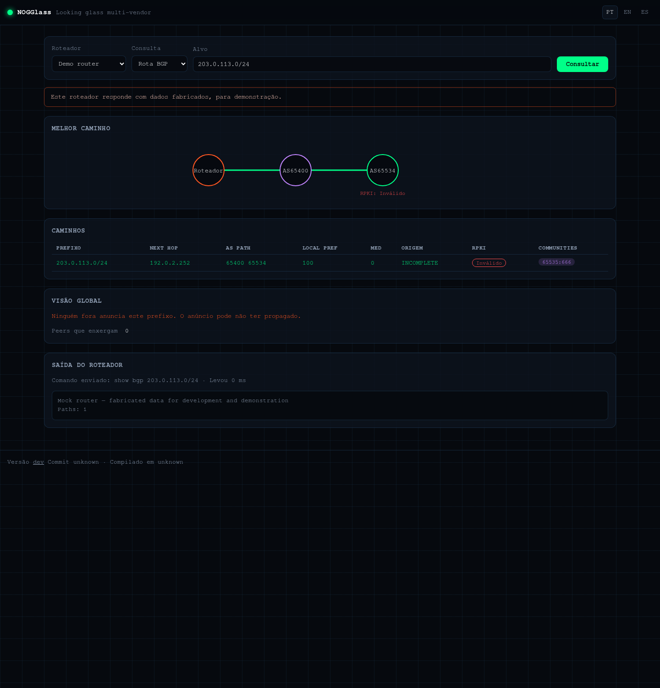
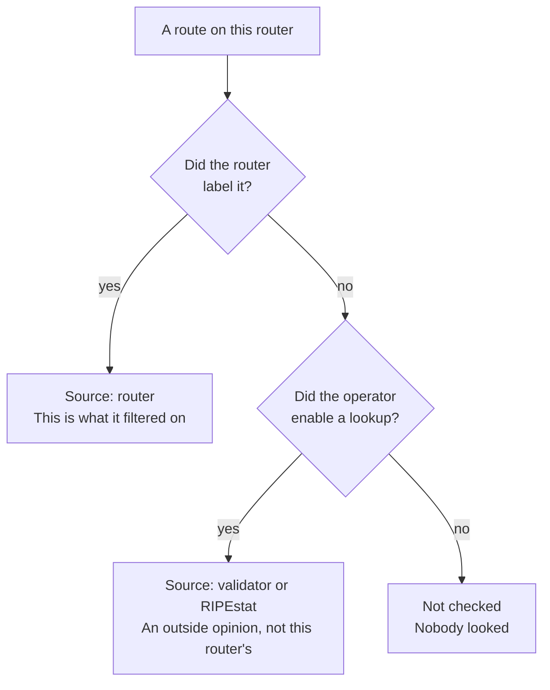

# RPKI: four states, and who said so

## TL;DR

RPKI answers one question: **is the network announcing this prefix allowed to?**
The four answers are valid, invalid, no ROA and not checked — and the fourth is
not a mild version of the first. NOGGlass also shows **who** answered, because
"my router validated this" and "a public API says so" tell you different things
about whether that operator actually filters.

## What is being checked

The owner of a block of addresses can publish a signed statement: *"AS65500 is
allowed to originate 198.51.100.0/24, up to /24."* That statement is a **ROA**.

A router with RPKI enabled compares every route it learns against those
statements and labels it. That is all RPKI does. It says nothing about the rest
of the AS path, nothing about whether the traffic will arrive, and nothing about
whether the announcement is *wise* — only whether the origin is authorised.

## The four states

| State | What it means | What to think |
|---|---|---|
| **Valid** | A ROA exists and this origin matches it | The announcement is authorised. Not a guarantee of anything else |
| **Invalid** | A ROA exists and this origin **contradicts** it | Either a hijack, or — more often — the owner's own misconfiguration |
| **No ROA** | Nobody published a statement about this prefix | Unknown, not bad. Much of the Internet is still here |
| **Not checked** | Nobody validated it at all | Says nothing about the prefix. It is a statement about the *checker* |

**Invalid deserves a second look before alarm.** The common causes, in order of
how often they happen:

1. The owner published a ROA with a maximum length that is too short, and then
   announced a more specific prefix. Their own route, their own ROA, invalid.
2. The owner changed which AS originates the prefix and forgot the ROA.
3. Someone is actually announcing addresses that are not theirs.

The third is the one everybody thinks of and the least frequent. If it is your
prefix showing invalid, check your own ROAs first.

## Who said so, and why it matters

Every state comes with a source. Hover the badge and it tells you which.

| Source | Means |
|---|---|
| **The router** | This router has an RTR session with a validator and labelled the route itself |
| **The operator's validator** | The router said nothing; NOGGlass asked the operator's own validator |
| **RIPEstat** | The router said nothing; NOGGlass asked a public API |
| **Nobody** | Not checked |

This distinction is the reason not to over-read a badge. **A prefix showing
invalid on a looking glass does not mean the operator is dropping it.** Two
different things have to be true for that:

1. The router evaluated the route — which is what "source: router" tells you.
2. The operator configured a policy to reject invalid routes — which no looking
   glass can show you, because it is in their configuration.

If the source is RIPEstat, all you have learned is what a public API thinks. The
router in front of you may not have an opinion at all.

## What to do with each answer

**Your prefix shows invalid.** Check your ROAs — especially the maximum length —
before assuming a hijack. Most invalids are self-inflicted.

**Someone else's prefix shows invalid.** It may be their misconfiguration. It is
not evidence of an attack on its own, and it is worth an email before an
accusation.

**No ROA.** Consider publishing one for your own prefixes. It is the cheapest
protection against a mis-origination there is.

**Not checked everywhere on an instance.** That network has no RPKI validation
in its routers, or the operator did not enable the fallback lookup. Worth
knowing when you are choosing an upstream.

## Next

[When the router and the Internet disagree](5-router-versus-internet.md).
