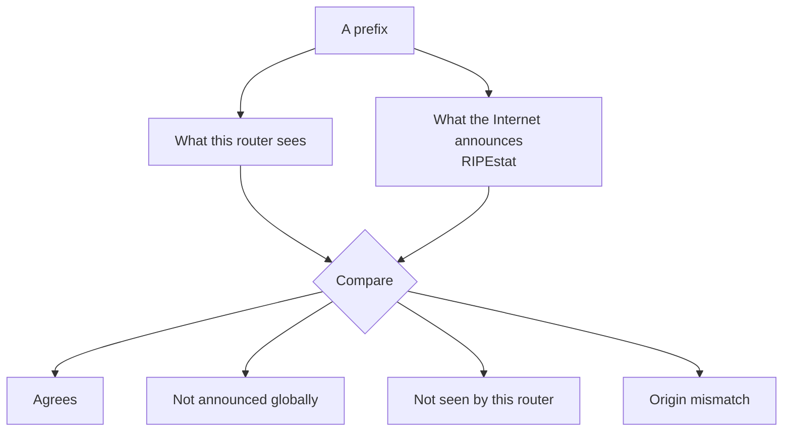
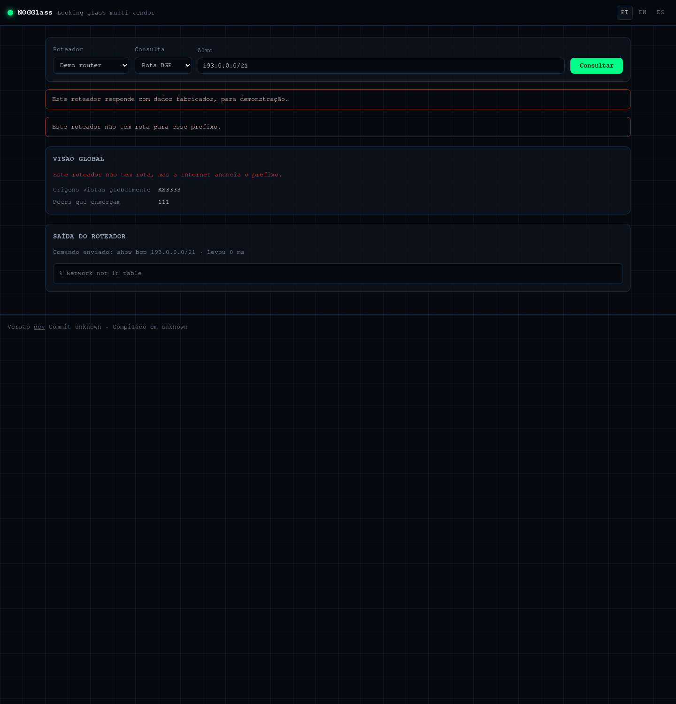

# When the router and the Internet disagree

## TL;DR

Beside what the router answered, NOGGlass can show what the rest of the
Internet announces for the same prefix. Four verdicts come out of that
comparison, and each one is a different day: agreement, an announcement that
never propagated, a route this router is missing, and an origin that does not
match — which is what a hijack looks like.

## Why compare at all

A router tells you what it has been told. That is useful and incomplete: if an
announcement never reached them, their answer is "no route" and you cannot tell
whether the problem is at their end, at yours, or somewhere between.

The global view comes from RIPEstat, which watches the routing table from
hundreds of vantage points. Putting the two side by side turns "no route" into
a diagnosis.

This panel appears only when the operator enabled it. It is off by default,
because asking RIPEstat sends the prefix you typed to a third party.

## The four verdicts

### Agrees

The origin AS this router sees is among the origins the Internet sees. Nothing
to investigate. With several origins listed, that is normal for anycast and for
multihomed customers — the check is membership, not an exact match.

### Not announced globally

**The router has a route, and nobody outside sees the prefix.**

This is a propagation problem, and the route you are looking at is usually a
local one: a static route, an internal announcement, or an announcement that an
upstream accepted and did not pass on.

If it is your prefix: check that your upstreams are actually announcing it, and
that your announcement is not being filtered for lacking a route object or a
ROA. Prefixes longer than /24 in IPv4 are filtered almost everywhere, which
surprises people every week.

### Not seen by this router

**The Internet announces it and this router has no route.**

The announcement did not reach here, or it reached here and was filtered. Either
way it is specific to this network, which is worth knowing: if their looking
glass cannot see your prefix while the rest of the world can, the conversation
is with them.

Common causes: a prefix-list on their side that has not been updated, a maximum
prefix limit that tore down the session with your upstream, or a route object
missing in the registry they build filters from.

### Origin mismatch

**The router sees one origin AS, the Internet sees another.**

This is what a hijack looks like. It is also what a leak looks like, and what a
customer announcing addresses they no longer hold looks like. Before concluding
anything:

1. Check [the RPKI state](4-rpki-four-states.md) — an invalid on top of a
   mismatch is a strong signal.
2. Check whether the other origin is a network you have a relationship with. A
   transit provider announcing on your behalf is a configuration, not an attack.
3. Query another vantage point if the operator publishes several. A mismatch
   seen from one place and not another is usually a leak with limited spread.

## The other numbers

**Peers seeing it.** How many of RIPEstat's collectors observe the prefix. A
healthy, well-propagated prefix is seen by most of them. A handful means the
announcement is not travelling far — often exactly the point.

**More specifics.** Smaller prefixes announced inside the one you asked about.
Sometimes yours, deliberately, for traffic engineering. Sometimes somebody
else's, which is a more specific hijack and is far more effective than
announcing the same prefix, because the longer prefix always wins.

## When it says unavailable

The comparison could not run: RIPEstat was slow, unreachable, or returned
something unreadable. **That is not agreement.** It means nobody checked, and
the router's answer stands alone.

## Next

[Reading a traceroute that stops](6-traceroute-that-stops.md).
