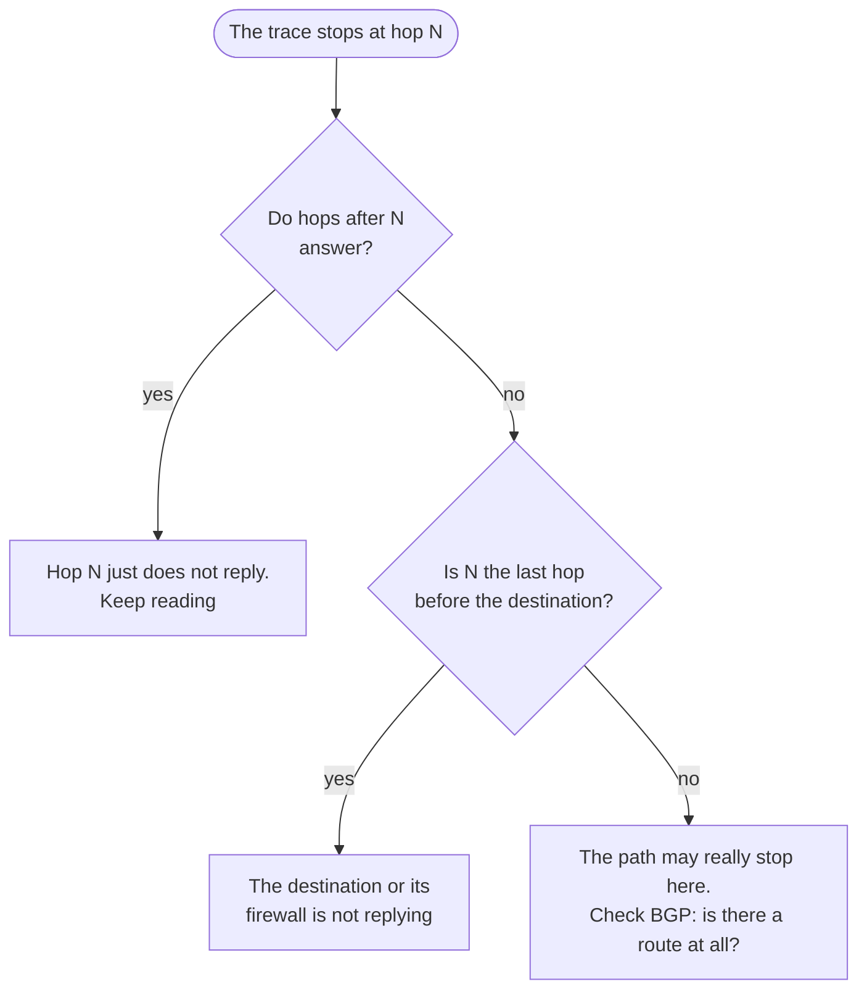

# Reading a traceroute that stops

## TL;DR

A hop that does not answer is usually **not** where the problem is. Routers are
allowed to ignore traceroute, and many do it deliberately. NOGGlass keeps
silent hops in place with their number, because removing them moves where the
path appears to stop — and a path that appears to stop in the wrong place has
started more wrong investigations than any other output in networking.

## What traceroute actually does

It sends packets with a deliberately short lifetime and collects the complaints.
The first packet is allowed one hop, so the first router discards it and sends
back an error saying so; that error reveals the router. Then two hops, then
three.

So traceroute does not follow your traffic. It collects **error messages from
routers about your traffic**, and error messages are optional.

## The three reasons it lies

### 1. The router is not answering on purpose

Generating an error message costs a router's processor, which is busy doing the
job it was bought for. Most platforms rate limit those messages, and many
operators disable them entirely on core routers. A row of stars in the middle of
an otherwise healthy path is normal and means nothing.

**The test:** do later hops answer? If hop 5 is silent and hops 6, 7 and 8 reply
normally, hop 5 is fine. Traffic passed through it — you just were not told.

### 2. The return path is different

The error message has to come back to you, and it takes whatever route the
replying router has towards *your* address. That route can be broken while the
forward path is perfectly fine.

A traceroute is two paths pretending to be one. When it looks wrong in the
middle, run one from the other side before believing it.

### 3. The times are not what you think

A hop showing 200 ms does not mean traffic is delayed by 200 ms there. It means
*that router* took 200 ms to produce an error message, which is a low-priority
task it does when it has nothing better to do.

**Latency only counts when it stays high for every hop after it.** A single high
hop followed by lower ones is a busy processor, not congestion.

## How to read one properly

The question at the bottom is the important one. **If the router had no route,
the traceroute was never going to arrive**, and the stars tell you nothing about
where the trouble is. Run the BGP route query first; it answers in one screen
what a traceroute only hints at.

## What NOGGlass shows

- **Each hop keeps its number**, including the silent ones. Numbering that skips
  is numbering that misleads.
- **A silent hop reads "no answer"**, not a blank row that could be mistaken for
  missing data.
- **Every probe is listed**, not averaged. Three probes of 1 ms, 1 ms and 400 ms
  describe a router that is occasionally busy; an average of 134 ms describes a
  problem that does not exist.
- **The destination hop** is where the trace ends normally. If the last hop that
  answers is not your destination and nothing follows, the destination or its
  firewall is discarding the probes — which is a configuration, not a failure.

## Next

Operator side: [connecting your first real router](7-connecting-a-router.md).
